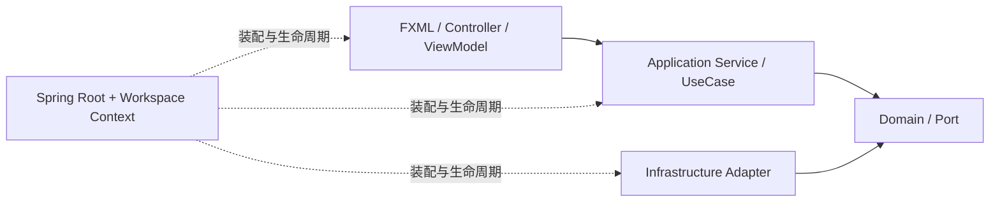

<div align="center">

# JavaClaw

**基于 JavaFX、Spring Framework 与 AgentScope 的多智能体桌面工作台**


</div>

JavaClaw 将对话、方案研讨、自动循环、长时托管任务和可视化工作流放在同一个桌面应用中。
智能体可以调用浏览器、代码工程、命令行、邮件、系统与桌面自动化等工具，并使用长期记忆、
知识库、技能、MCP、插件和定时任务扩展能力。

## 界面


主界面整合会话列表、对话区、知识库、主题、Token 用量和任务入口。侧边栏可以进入记忆、技能、
MCP、插件、定时任务、工作流和诊断等中心页面。

## 核心能力

| 能力 | 摘要 |
|---|---|
| 五种工作模式 | 普通对话、规划研讨、循环推进、SDD 托管任务、状态图工作流 |
| 多智能体编排 | 内置与自定义专家、目标拆解、能力路由、执行监控、评估和主动澄清 |
| 工具执行 | 浏览器、代码、命令、文件、桌面、邮件、通知、媒体 OCR 和站点登录 |
| 记忆与知识 | 长期事实、情景、人格、纠错、图谱、全局/工作区知识库和 RAG |
| 技能与扩展 | 技能沉淀与审阅、MCP Server、Plugin API 3.0 和定时任务 |
| 桌面体验 | FXML 界面、原生 Markdown、附件、主题、字体、快捷键、托盘和单实例 |
| 安全与审计 | 工具风险审核、能力授权、项目围栏、凭据加密、执行轨迹和结果导出 |
| 工作区隔离 | 配置、聊天、凭据、知识、记忆、浏览器状态、任务和插件状态隔离 |

完整说明见 [整体功能](docs/features.md)。

## 架构概览

JavaClaw 3.0 使用 Presentation → Application → Domain/Port ← Infrastructure 分层。Spring 根
Context 管理进程级基础设施，每个工作区使用可关闭的子 Context；JavaFX 页面由 FXML、Controller
和 ViewModel 组成。阻塞 I/O 使用虚拟线程，CPU、浏览器和进程任务使用独立配额。



详细设计见 [3.0 架构](docs/architecture/README.md)。

## 技术栈

| 类别 | 技术 | 版本 |
|---|---|---|
| 运行环境 | JDK | 25 |
| 桌面 UI | JavaFX | 25 |
| 对象装配、JDBC、事务 | Spring Framework | 7.0.8 |
| 智能体 | AgentScope Java | 1.0.12 |
| 记忆与向量 | EclipseStore + JVector | 4.1.0 |
| 结构化数据 | H2 | 2.3.232 |
| 浏览器 | Playwright Java | 1.52.0 |
| 文档与 Markdown | PDFBox + CommonMark | 3.0.4 / 0.30.0 |
| 构建 | Maven | 3.9+ |

## 快速开始

环境要求：JDK 25、Maven 3.9+。

```bash
git clone https://github.com/CogniCodeGen/JavaClaw.git
cd JavaClaw

mvn clean compile
mvn javafx:run
```

在 IDE 中运行时，主类必须选择 `com.javaclaw.app.Launcher`，并添加：

```text
--add-modules jdk.incubator.vector --enable-native-access=ALL-UNNAMED
```

首次启动会引导配置模型提供商、地址、模型和 API Key。默认运行数据保存在带格式标记的 `data/`，
测试数据保存在 `target/` 下，不会写入真实数据。

已有 2.x 安装或旧插件时，请先阅读 [升级到 3.0](docs/upgrade-3.0.md)。3.0 不自动迁移旧数据，
Plugin API 2.x 也没有兼容适配器。

## 验证

提交代码前运行：

```bash
mvn clean -Pui-test verify
```

该命令执行单元测试、JavaFX/FXML 测试、ArchUnit、源码卫生、规模和 JaCoCo 覆盖率门禁。

## 文档

- [文档中心](docs/README.md)
- [整体功能](docs/features.md)
- [升级到 3.0](docs/upgrade-3.0.md)
- [3.0 架构](docs/architecture/README.md)
- [Plugin API 3.0](docs/architecture/plugin-api-3.md)
- [质量门禁](docs/architecture/quality-gates.md)

## 贡献

欢迎提交 Issue 与 Pull Request。Java 标识符使用清晰英文，用户文案与业务说明保持中文；注释解释
约束、原因和不变量，不复述代码。

## 许可证

本项目基于 [MIT License](LICENSE) 开源。

欢迎打赏赞助：


Copyright (c) 2026 CogniCodeGen
