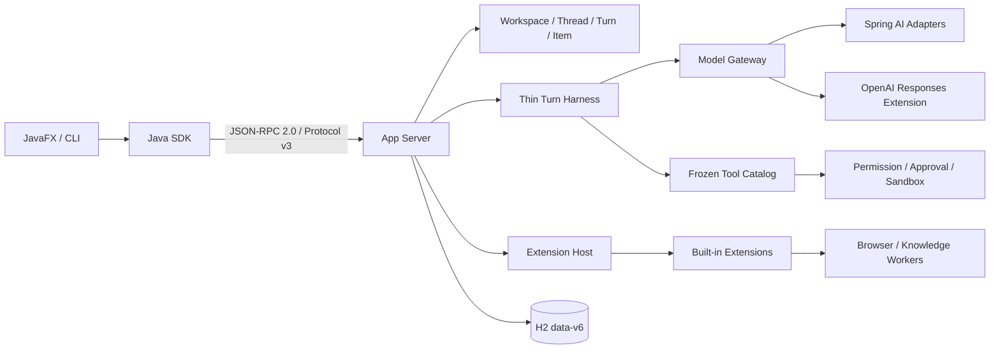

# JavaClaw 6

JavaClaw 是本地优先的 Java Agent 平台。6.0 以 Thread / Turn / Item 为核心，用 Thin Turn Harness
掌握模型调用、工具审批、预算、取消、背压和副作用恢复；Plan、Workflow、Schedule、Memory 等产品能力均由扩展提供。

6.0 将胖 Profile 拆分为 Agent Role 与独立执行配置，是破坏性基线：只读取 Protocol v3 与 `data-v6`。
不探测、导入、迁移或修改 `data-v5`，不解析旧协议，也不提供旧 Profile 兼容 Adapter。
本版不包含远程/多租户部署、Rust/Codex 后端或 Plugin 兼容层，也不恢复 Ollama、本地模型、邮件/Webhook、宿主输入
控制、Raw Cookie 导出或 `HOST_FULL_ACCESS`；完整范围见[明确排除](docs/architecture/full-design.md#12-明确排除)。

## 架构



详细边界见 [架构总览](docs/architecture/README.md) 与 [仓库目录](docs/repository-layout.md)。

## 环境与构建

- JDK 25
- Maven 3.9+
- macOS 原生隔离使用 Seatbelt；Linux 使用 bubblewrap

```bash
mvn spotless:check checkstyle:check
mvn clean verify
```

开发调试使用下文的 IDEA 共享运行配置；已打包产物使用发行目录中的 `bin/javaclaw`
（Windows 为 `bin\javaclaw.cmd`）。运行数据默认位于程序目录下的 `data-v6/`；开发时程序目录为工作目录，发行启动器
通过 `javaclaw.program.dir` 指定安装位置。显式 `-Djavaclaw.data.root=<absolute-data-v6>` 优先；可同步设置
`-Djavaclaw.log.dir=<absolute-data-v6>/logs`。数据根不可写、所有者不匹配或存在不安全路径时启动失败，不会静默改用 HOME
或旧数据目录。Provider 凭据不得直接写入配置 payload，只能保存 Vault `CredentialRef`。

### IntelliJ IDEA 一键调试

使用 JDK 25 从根 `pom.xml` 导入 Maven Reactor 后，在运行配置下拉框选择 `JavaClaw Local Debug`，点击
Debug 即可同时调试 App Server 与 JavaFX Desktop；两个进程中的断点都会生效。Compound 配置会并行启动进程，
Desktop 最多等待 App Server 15 秒，不依赖人工控制启动顺序。

共享配置只使用 macOS / Linux 的 Unix Domain Socket，开发数据和日志隔离在项目内的
`.javaclaw/idea/data-v6`。`JavaClaw App Server` 与 `JavaClaw Desktop` 可用于分别调试单个进程。Provider 与凭据
必须通过设置与管理中心写入 H2 和 Secret Vault；生产链不会读取环境变量或 JVM property 作为模型配置，也不要把
API key 写入或提交到 `.run` 配置。

三份共享运行配置已纳入自动架构测试，持续校验模块入口、主类、Unix Domain Socket 和隔离 `data-v6` 参数，防止
IDEA 一键调试链随模块重构失效。

IDEA 直接调试没有发行启动器 supervisor，因此“修复登录启动项”会明确显示不可用原因，不会伪造成功。

## 本地协议

CLI 支持前台 `turn-start`、终端审批和单行 JSON 输入，执行到终态后输出最终 JSON。
非交互脚本的授权规则、退出码与全部参数见 [CLI 使用说明](docs/cli.md)。

同一会话可连续完成聊天、项目检查、依赖准备、修改与断网测试，无需新增聊天/编程模式。
环境与权限设置、托管工具链安装、输出和取消方式，以及当前平台限制见 [编程使用说明](docs/coding.md)。

- 严格 JSON-RPC 2.0，`appProtocolVersion=3`
- 连接必须先调用 `initialize/session` 完成 stable / experimental capability 协商
- 支持 stdio、Unix Domain Socket 与仅当前用户可访问的 Windows Named Pipe；TCP、WebSocket 不在范围内
- 写命令统一携带 idempotency key 与 expected revision
- 扩展业务统一使用 `extension/query`、`extension/command`、`extension/schema/read`、`extension/view/list`
- 扩展写入通过无正文的 `extension/event` 通知失效，SDK 持续接收后重新读取权威状态
- 当前 catalog 共 157 个 RPC 方法，每个方法都有独立且严格的 params/result JSON Schema
- Core ID 使用标量字符串，时间与 Duration 使用 ISO-8601 文本，不接受第二种 wire 表示
- 未知 Item schema 保留规范 JSON payload，供 6.x 前向演进

Schema 位于
[protocol-v3.schema.json](javaclaw-protocol/src/main/resources/schema/protocol-v3.schema.json) 与
[methods-v3.json](javaclaw-protocol/src/main/resources/schema/methods-v3.json)。

## 模型配置

App Server 从 H2 中的版本化 Provider 配置建立热更新 registry。每个模型独立声明 Chat/Embedding 用途；聊天入口只认
服务端解析并冻结的执行配置，Embedding 则使用独立的精确 `ProviderRef` 绑定。Agent、Provider/模型、推理强度和
PermissionProfile 分别选择；模型切换不创建或复制 Role。安装、Workspace、Thread 和单次调用逐级覆盖，Role 显式
模型/推理约束最后应用并显示锁定原因。CredentialRef 仅在构造
候选 Adapter 的受控 callback 内从 Secret Vault 解封；Vault 产生的临时字节和字符缓冲区会在 callback 返回前清零，厂商
SDK 内部凭据表示则随 Adapter generation 生命周期存在。Vault 变化按顺序执行，并在变更前关闭带 epoch 的运行时门闩；
新调用取得 Adapter lease 后仍需复核 epoch，重建失败时门闩保持关闭。旧客户端只在调用租约释放后关闭。

子智能体可通过 `execution/subagent/read`、`execution/subagent/update` 和 SDK
`client.executions().readSubagentDefaults(...)` / `updateSubagentDefaults(...)` 单独配置安装级或 Workspace 级
Provider 与推理默认值。该入口只接受这两个字段；模型按 Role 固定值、显式 spawn 值、子智能体默认值、父模型解析，
权限、审批与预算仍受父任务上限约束。缺省值不产生独立额度，更新只影响新的子任务。

模型目录发现使用 session-owned 的 `provider/model/discovery/start|read|cancel` 临时操作，最长 30 秒、最多 1000 条，
不执行推理也不持久化结果；页面、RPC session 或 App Server 关闭会取消真实 HTTP 调用。目录读取拒绝 redirect；使用
`API_KEY` 的自定义地址必须为 HTTPS，仅显式 loopback 可用 HTTP，`NONE` 只允许自定义 OpenAI-compatible 地址且不能
绑定 CredentialRef。首次设置按“禁用连接壳 → 凭据 → 模型用途 → 启用”恢复，确定性幂等键不包含 Secret，ID 冲突不覆盖。

通用语义由 Spring AI Adapter 统一，OpenAI Responses 的 reasoning summary、opaque state 与原生 compaction 使用专用
Adapter。JavaClaw 不使用 Spring AI 的自动工具循环；审批、Sandbox、预算和 EffectReceipt 始终由 Harness 控制。

Provider 普通配置按不可变 revision 提交。`provider/credential/*` 先预构造候选 Adapter；Vault 密文、Secret 元数据
revision、Provider 新 revision 与幂等回执在同一 H2 事务提交，成功后再通过无 I/O 的引用交换同步激活候选 generation。
候选构造或 H2 提交失败时旧 revision 和路由保持不变；数据库提交后的激活异常不能回滚 H2，而必须保持 fail closed。
非计费配置探测和可能计费的模型 round-trip 分开呈现，后者必须由用户显式确认。Prompt 优化通过正常、受预算的 Harness Turn 生成
Draft；只有用户显式采纳且 revision 仍匹配时才会更新可编辑的 Agent Role。

没有有效 Provider 配置或 Vault 处于锁定状态时，App Server 仍可启动并提供管理能力，但依赖模型或 Secret 的操作
会 fail closed，不会回退到环境变量或假模型。

## Desktop

Desktop 是纯 SDK 客户端，不连接 H2，也不读取 App Server 内部 Service。布局、CSS token 与交互语言沿用
`509f197` 的设计基线；扩展页面只能通过受限 ViewSchema 渲染，不能注入 FXML、CSS、Controller、JavaScript
或本地 URL。详见 [UI 设计系统](docs/ui-design-system.md)。

齿轮入口和 `Ctrl/Cmd+,` 打开单实例、非阻塞的设置与管理中心。外观、Provider、Agent Studio、Prompt 预览/优化、
PermissionProfile、Vault、授权、MCP、Bundle、Workspace、项目约定、Worktree、生命周期与诊断使用强类型 SDK 页面；
Plan、Loop、Workflow、SDD、Schedule、Memory、Knowledge、Skill 与 Site 使用受限 ViewSchema v2。连接失败时仍可使用本机
外观与连接页面，底层 `Connection refused` 不直接显示给用户。

Agent Studio 只编辑职责、developer instructions 和能力收窄；内置 `default`、`worker`、`explorer`、
`software-engineer` 只读并支持 clone。创建 Workspace 默认选择 `default`。Role 文件导入先预览字段差异并确认，
模型映射不明确时由用户选择；导出提供 Codex portable 与 JavaClaw lossless 两种模式。

当前设置与管理中心的生产导航入口均已接入强类型 SDK 或 ViewSchema v2 权威数据源。扩展写入后的
`extension/event` 只触发按 revision 重新读取；快速通知会合并，dirty 草稿遇到冲突时不会被后台刷新覆盖。
设置中心冻结自己的 Workspace 选择，不跟随主窗口切换；目录重载或目标失效时保留页面与草稿，但在确认其仍可用前
暂停写入。dirty 或 pending 时会阻止重载和切换，旧 epoch 的异步响应不会进入新 Workspace。
macOS 参考集包含设置中心壳与外观页在九主题、三密度、100% 字号和两种窗口下的 54 张生产 Scene，并在独立 JVM
中执行逐字节回归。29 个入口的目录完整性由同一测试另行断言；29 页正文、多状态和其余三档字号仍需补充视觉证据。

## 恢复语义

Turn 和 Extension Job 在外部模型或工具调用前持久化意图、冻结目录、已消费预算和执行阶段，成功结果与 checkpoint
在同一事务推进。App Server 重启后恢复输入与审批等待；已有 EffectReceipt 的工作不会重放，无法确认结果的在途
副作用进入 `UNKNOWN_OUTCOME` 并停止自动重试。

## 发布边界

2026-09-07，macOS aarch64、JDK 25 的 v6 完整 `clean verify` 通过：15 个构建项目、1952 项测试，
0 失败、0 错误、8 项条件跳过；格式、严格 Schema、覆盖率与打包门禁均通过，详见[构建证据](docs/evidence/v6-build-validation.md)。
Desktop 274 项单测和独立 JVM 的 54 图 Golden 全部通过。本轮修复没有更新参考图；此前 Agent 导航文案的更新已审阅，框外像素完全一致；
[审阅记录](docs/evidence/v6-settings-golden-review.md)保留前后哈希与范围，逐字节比较门禁未变。

正式标签必须通过 macOS arm64/x64、Linux arm64/x64、Windows x64 原生 Runner、真实 Chromium Sandbox/OAuth、
三平台签名、macOS 公证与 GitHub provenance/SBOM attestation。Windows Job Object 不提供打开文件数硬限制。
本轮配置与 Prompt 准备基准的 v6 p50/p95 约为 154/170 ms，Git v5 已记录对照约为 503/608 ms，
仅表示所测准备路径未超过 10% 增量目标。它不包含最终 Turn 写入、Harness、模型完成、UI 或原生沙箱，
不代表完整 Turn 端到端性能；本轮候选为两个 JVM 的 200 个计时样本，详见[性能记录](docs/evidence/v6-review-fixes-performance.md)。
三平台完整验收仍未完成，也未调用付费模型证明 Role 质量提升。

六项审查修复、CLI 终端检查与平台限制见[修复验收](docs/evidence/v6-review-fixes-validation.md)。

发布验收见 [验收矩阵](docs/architecture/acceptance-matrix.md)。项目使用 [MIT License](LICENSE)。

## 文档

- [代码规范](docs/coding-style.md)
- [仓库与模块边界](docs/repository-layout.md)
- [完整架构设计](docs/architecture/full-design.md)
- [实施清单](docs/architecture/implementation-checklist.md)
- [威胁模型](docs/architecture/threat-model.md)
- [Prompt 来源与边界](docs/architecture/prompt-provenance.md)
- [发布与供应链](docs/release.md)
- [现行 ADR](docs/architecture/adr/)
