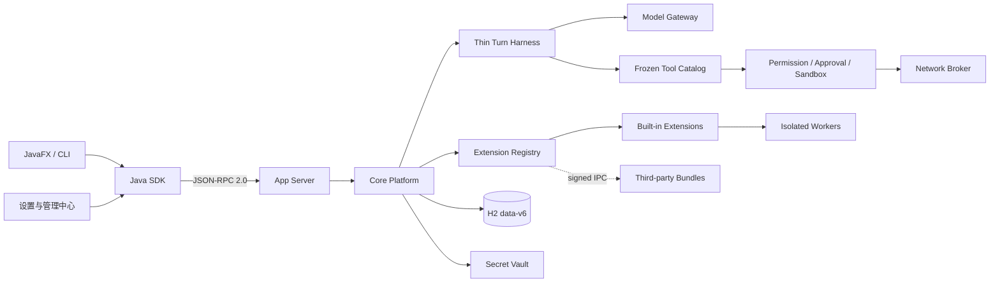
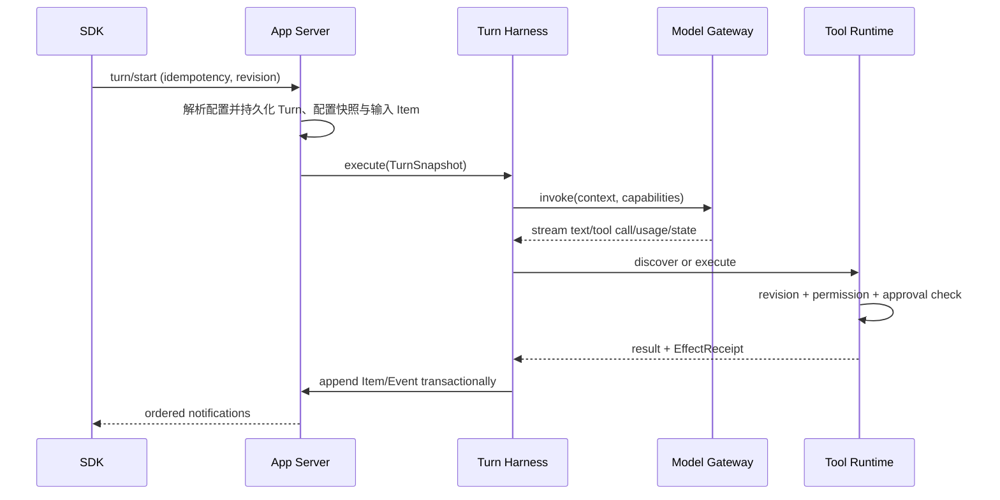

# JavaClaw 6 架构总览

本目录是 6.0 的权威架构说明。代码、Schema、ADR 与验收矩阵不一致时，先停止发布并修正不一致；不能通过兼容
分支同时保留两种事实。

## 不变量

1. App Server 是唯一组合根和 H2 owner；Desktop、Worker、扩展进程不得直接访问数据库。
2. Harness 只执行单个 Turn，不识别 Plan、Workflow、Schedule 或其他业务阶段。
3. 每个可观察事实都是有序 Item/Event；副作用完成后必须先写 EffectReceipt，再允许恢复流程继续。
4. 服务端逐级解析独立执行配置并冻结 `ResolvedTurnConfig`；执行前仍检查实时撤权与 PermissionProfile。
5. 模型 Provider 类型和 opaque state 不越过 `javaclaw-model-adapters`。
6. 内置扩展只使用 SPI port；第三方代码永远不能进入 App Server classpath。
7. Desktop 只使用 SDK，扩展页面只使用受限 ViewSchema。
8. 6.x stable wire contract 只允许兼容型扩展；experimental 内容必须经双方协商。
9. Core ID、时间和 Duration 只有一种规范 wire 编码；不解析对象包裹 ID 或 timestamp 旧表示。
10. Role 只承载职责、developer instructions 与收窄约束，不能授予权限、绑定凭据或拥有预算。
11. Secret 只允许写入、轮换、清除与查看元数据；正文不得经 RPC、日志、Item、Rollout 或诊断返回。

## 一次 Turn 的主链

## 进一步阅读

- [统一聊天与编程智能体](unified-coding-agent.md)
- [Agent Role、Protocol v3 与 data-v6 决策](adr/0009-agent-role-v6.md)
- [程序目录与运行数据](adr/0010-runtime-directories.md)
- [受控 WebView 与记忆学习](adr/0011-web-surfaces-and-memory-learning.md)
- [完整设计](full-design.md)
- [实施清单](implementation-checklist.md)
- [威胁模型](threat-model.md)
- [验收矩阵](acceptance-matrix.md)
- [Prompt 来源与边界](prompt-provenance.md)
- [仓库边界](../repository-layout.md)
- [现行 ADR](adr/)
