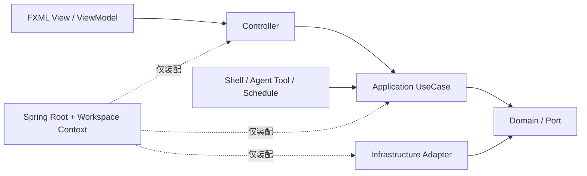

# JavaClaw 3.0 架构

JavaClaw 3.0 采用分层桌面架构：FXML View 与 Controller 属于 Presentation，
Application 用例承载业务入口，Domain 保存规则，Infrastructure 实现数据库、文件、
HTTP、进程和外部模型端口。依赖只允许从外层指向内层。

根 Spring Context 管理进程级基础设施；每个工作区使用一个可关闭的子 Context。
页面 Controller 由 `SpringFxmlLoader` 创建并随 `ViewHandle` 销毁，不使用静态
ApplicationContext 或全局 `getBean()`。

## 分层与调用方向

Presentation 不引用 JDBC 或 Infrastructure；Application 不依赖 JavaFX、Spring 或具体
适配器。JavaFX、Shell、Agent Tool 与 Schedule 共享同一组 UseCase，预期失败统一使用
`ValidationException`、`NotFoundException`、`ConflictException` 和 `RejectedException`。

## 生命周期

1. `Launcher` 解析并验证 `DataRoot`，随后抢占单实例锁；旧格式目录在 JavaFX 启动前被拒绝。
2. `JavaClawApp.init()` 通过 `ApplicationContexts.createRoot()` 创建根 Context。
3. 根 Context 创建 DataSource、Schema、JDBC/事务、执行引擎、JSON、HTTP、安全、事件和窗口服务。
4. `WorkspaceSpringContextFactory` 为当前工作区创建子 Context；候选创建成功后才替换旧 Context。
5. 页面由 `SpringFxmlLoader` 加载；`ViewHandle.close()` 反序销毁本次 FXML 树中的全部 Controller。
6. 退出时先关闭页面和工作区作用域，再关闭根 Context；托盘退出仍保留五秒 watchdog 与最终兜底。

## 平台能力

| 边界 | 公共能力 | 约束 |
|---|---|---|
| 后台任务 | `ManagedTaskExecutor`、`TaskScope`、`TaskHandle` | 显式选择 workload；可取消、超时、登记与限流 |
| JavaFX | `FxDispatcher`、`UiAsyncAction` | 唯一通用 FX 调度入口；丢弃迟到结果 |
| FXML | `SpringFxmlLoader`、`ViewHandle` | Controller 构造注入；显式销毁 prototype |
| 外部进程 | `ProcessRunner` | argv/shell、输出上限、超时、中断、进程树清理 |
| 工具调用 | `ToolInvocationPipeline` | 来源、授权、审计、执行、异常和结果格式统一 |
| 数据交换 | `JsonCodec`、`HttpGateway`、`AtomicContentStore` | 共享配置；仅幂等 HTTP 自动重试；原子落盘 |
| 领域通知 | `DomainEventPublisher` | Application 发布，Presentation/Infrastructure 订阅 |

对话编排由有序 `TurnPipeline`/`TurnStage` 组合；稳定边界使用组合和端口，不引入
`BaseManager` 或 `BaseCrudView` 这类弱约束继承层次。

## 决策记录

- [ADR-001：Spring 生命周期与分层边界](adr/ADR-001-spring-lifecycle.md)
- [ADR-002：JavaFX FXML MVC](adr/ADR-002-fxml-mvc.md)
- [ADR-003：执行与取消模型](adr/ADR-003-execution-model.md)
- [ADR-004：3.0 数据格式](adr/ADR-004-data-format-v3.md)

## 平台契约

- [Plugin API 3.0](plugin-api-3.md)
- [FXML MVC 约定](fxml-mvc.md)
- [执行与取消模型](execution-model.md)
- [数据格式与升级边界](data-format-v3.md)
- [质量门禁](quality-gates.md)
