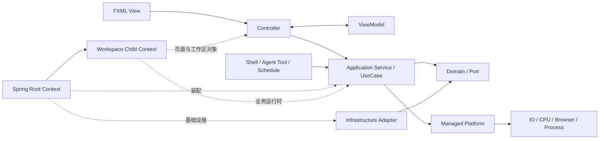
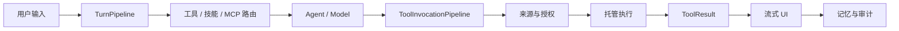

# JavaClaw 3.0 架构

JavaClaw 3.0 是分层 JavaFX 桌面应用。FXML 与 Controller 属于 Presentation，Application
Service/UseCase 提供业务入口，Domain 保存规则和端口，Infrastructure 实现数据库、文件、HTTP、
进程及外部模型适配。Spring 只负责组合和生命周期，不进入领域模型。

## 架构全景

依赖方向是 Presentation → Application → Domain/Port ← Infrastructure。Application 不依赖
JavaFX、Spring 或具体适配器；Infrastructure 不依赖桌面页面；Controller 不访问 JDBC、Repository
或旧 Manager 单例。这些边界由 ArchUnit 和源码卫生测试固定。

## 包职责

| 区域 | 主要包 | 职责 |
|---|---|---|
| 启动与组合 | `app`、`platform.spring`、`runtime` | 数据根、单实例、根/子 Context、工作区切换、退出顺序 |
| Presentation | `chat`、`ui.javafx`、`presentation`、`resources/fxml` | 页面结构、事件协调、ViewModel、窗口和渲染器 |
| Application | `application.*` | Chat、Workspace、Settings、Memory、Knowledge、Skill、MCP、Schedule 等用例 |
| Domain | `agent`、`loop`、`task`、`workflow`、`memory`、`mode` | 编排规则、状态机、验收、记忆和领域模型 |
| Infrastructure | `infrastructure.*` 及外部能力适配包 | JDBC、文件、模型、邮件、浏览器、MCP、通知和持久化适配 |
| Platform | `platform.*` | 执行、FX 调度、FXML 生命周期、HTTP、JSON、进程、原子存储和对话框 |
| Extension | `plugin`、`plugin.api`、`skill` | 插件运行时、能力授权、任务作用域和技能生命周期 |

部分历史功能包仍保留领域实现名称，但跨层调用必须经过 `application` 接口或明确端口。新代码不应
因为旧包位置而绕过依赖方向。

## 启动、工作区与退出

### 启动

1. `Launcher` 解析并执行 `DataRoot.prepare()`，验证 `.javaclaw-format`；
2. `SingleInstanceCoordinator` 抢占 `data/` 下的单实例锁，已有实例则只发送唤起请求；
3. `JavaClawApp.init()` 通过 `ApplicationContexts.createRoot()` 创建 Spring 根 Context；
4. 根 Context 初始化 DataSource、schema、JDBC/事务、执行器、JSON、HTTP、安全、事件和全局服务；
5. `WorkspaceSpringContextFactory` 创建当前工作区子 Context；
6. `SpringFxmlLoader` 创建主页面及嵌套 Controller，JavaFX 显示 1200×700 主窗口；
7. 首启向导、主题、字体、托盘和第二实例唤起处理在桌面基础设施就绪后接管。

### 工作区切换

工作区对象不注册进根 Context。切换时先基于目标工作区路径快照创建候选子 Context；只有候选
完整刷新成功才替换当前 Context。失败时关闭候选并恢复原工作区，避免页面同时持有两套路径或
半初始化服务。

旧工作区关闭时先拒绝新任务，再取消在途任务并最多等待五秒，然后释放 MCP、浏览器、Store、
调度器、页面句柄和其他 `AutoCloseable` 资源。根 Context 的全局执行器最后关闭。

### 退出

页面 `ViewHandle`、工作区运行时、根 Context、托盘和单实例协调器按所有权反序关闭。托盘触发与
JavaFX `stop()` 共用幂等清理路径；退出 worker、五秒 watchdog 和最终 `Runtime.halt` 是唯一允许
直接线程的退出边界之一。

## 应用层与失败语义

JavaFX、Shell、Agent Tool 和 Schedule 调用同一组 Application Service。用例输入优先使用不可变
record，输出是领域值或不可变快照，不把 JavaFX Node、JDBC Row 或 Spring Bean 暴露给调用者。

可预期失败统一为：

| 异常 | 语义 |
|---|---|
| `ValidationException` | 输入缺失、格式或业务校验失败 |
| `NotFoundException` | 目标不存在或已被删除 |
| `ConflictException` | 版本、状态或并发写入冲突 |
| `RejectedException` | 权限、生命周期、配额或策略拒绝 |

Controller 将这些失败映射为页面状态或用户提示；未知异常进入统一错误处理和诊断记录。

## 对话与工具调用链

对话由有序 `TurnPipeline` 和 `TurnStage` 组合视觉输入、纠错、能力路由、RAG、上下文、流式处理、
记忆与技能。阶段可以单独测试和替换，不再把所有轮次逻辑堆叠到一个大型服务方法。

`ToolInvocationPipeline` 统一调用来源、能力授权、风险确认、审计、执行、异常和 `ToolResult` 格式。
高风险工具不能通过直接复用工具对象绕过管线。

## JavaFX MVC

生产页面、弹窗、设置分区、聊天气泡、复用控件和 Cell 的静态结构都由 FXML 描述。Controller
构造注入 Application Service，只协调事件；ViewModel 保存 JavaFX Property，不引用 Service、
Repository 或 Spring Context。Markdown、Canvas 和图形算法可以生成动态 Node，但只能填充 FXML
声明的容器。

`SpringFxmlLoader` 通过 Spring 创建主 FXML 与 `fx:include` Controller。一次加载返回一个
`ViewHandle`，页面关闭时反序执行 `AutoCloseable.close()` 和 Spring 销毁回调。高频 Cell 使用
嵌入式 FXML，在构造期加载一次，复用时只更新状态。详细规则见 [FXML MVC](fxml-mvc.md)。

## 执行与平台能力

所有普通后台任务显式选择 workload，不使用默认 `@Async` 或业务私有线程池：

| Workload | 默认策略 | 用途 |
|---|---|---|
| IO | virtual-thread-per-task，全局并发 256 | 模型、HTTP、MCP、JDBC、文件和 RAG |
| CPU | `max(1, CPU-1)` 平台线程，队列 256 | 本地 embedding、解析和计算 |
| BROWSER | 虚拟线程，全局并发 4，同对象串行 | Playwright Page/Context |
| PROCESS | 虚拟线程，全局并发 8 | `ProcessRunner` 和短进程 |

`ManagedTaskExecutor`、`TaskScope`、`TaskHandle` 提供状态、结果、取消、超时、配额、上下文传播和
关闭回收。`FxDispatcher` 是通用 FX 调度入口，`UiAsyncAction` 管理 busy、失败、取消和迟到结果。
详细规则见 [执行与取消](execution-model.md)。

## 数据与持久化

默认数据根是 `data/`，格式文件内容为 `3`。根 Context 持有 `H2DataSource`、`JdbcTemplate` 与
`DataSourceTransactionManager`；`SchemaInitializer` 在根 Context 启动时幂等执行一次。H2 优先
使用 `AUTO_SERVER`，仅在明确的套接字能力错误时回退 embedded。

结构化数据存入 `data/javaclaw.mv.db` 并通过 `workspace_id` 隔离；知识、记忆、日志、截图和其他
文件资产按工作区目录保存。3.0 不自动迁移 2.x 数据。详见 [数据与存储](data-storage.md)。

## 稳定平台边界

| 能力 | 作用 |
|---|---|
| `JsonCodec` | 共享 ObjectMapper 与稳定 JSON 错误语义 |
| `HttpGateway` | 共享 HttpClient、超时和仅幂等请求重试 |
| `ProcessRunner` | argv/shell、输出限制、超时、中断和进程树清理 |
| `AtomicContentStore` | 临时文件、原子替换和内容落盘 |
| `DialogService` | 页面无关的对话框入口 |
| `DomainEventPublisher` | Application 发布领域事件，外层订阅 |
| `SpringFxmlLoader` | Spring Controller 创建和页面级销毁 |
| `ManagedTaskExecutor` | 统一 workload、配额、任务登记和取消 |

只在生命周期、线程、持久化、授权和结果映射等稳定边界抽象公共接口，不创建无约束的
`BaseManager` 或 `BaseCrudView`。

## 扩展方式

| 需求 | 扩展入口 |
|---|---|
| 新页面 | FXML + Controller + ViewModel + Application Service；由 `SpringFxmlLoader` 创建 |
| 新业务入口 | 在 `application` 定义服务接口、Command/Query 和 UseCase，通过 Port 连接适配器 |
| 新对话阶段 | 实现 `TurnStage` 并在组合配置中按顺序注册 |
| 新工具 | 进入 `ToolInvocationPipeline`，声明来源、能力和风险，返回 `ToolResult` |
| 新外部 I/O | 复用 `HttpGateway`、`ProcessRunner`、`JsonCodec` 或定义 Application Port |
| 新工作区服务 | 在子 Context 显式 `@Bean` 装配并声明销毁方式 |
| 新插件 | 使用 Plugin API 3.0、能力声明和宿主任务执行器 |

## 专项规范

- [FXML MVC](fxml-mvc.md)
- [执行与取消](execution-model.md)
- [数据与存储](data-storage.md)
- [Plugin API 3.0](plugin-api-3.md)
- [质量门禁](quality-gates.md)
- [3.0 升级指南](../upgrade-3.0.md)
