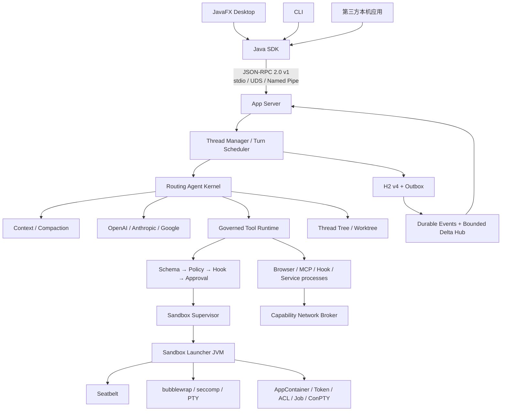

# JavaClaw 4.0 总体架构

状态：4.0 本轮旧能力、原风格 UI 与提示词调用链已接入，提供本机预发布测试版。
本文描述实际架构；能力证据见 [验收矩阵](upgrade-acceptance.md)，目标见 [完整设计](full-upgrade-design.md)。
Linux/Windows 等非本机架构以及正式签名，仍需对应原生 Runner 和凭据，不能由本机结果代替。



## 1. 进程与权限所有权

| 进程 | 权限 |
|---|---|
| App Server | 唯一 H2 写连接、Thread/Turn 调度、模型 Adapter、Secret 解密、审批与安全 ceiling |
| Desktop / CLI / SDK 应用 | 仅协议权限；无 Store、Agent Kernel、Spring Context、JDBC 或 Provider 实现 |
| Sandbox Launcher | 从继承管道读取一次性 nonce/策略，降权并监督一个执行树 |
| Windows Transport Host | 唯一 Named Pipe FFM 调用者；App Server 和 SDK 只处理有界 mux 帧 |
| Browser / Plugin / MCP / Hook / Service | 第三方或高风险进程；只持有策略交集后的文件/网络能力 |

服务仅限本机当前用户；没有 TCP/WebSocket RPC、远程、多租户或水平扩展。
OAuth 使用一次性 127.0.0.1 回调，不承载 App Server RPC。

## 2. 模块依赖

Reactor 按功能领域收敛为 `api`、`protocol`、`agent-runtime`、`app-server`、
`native-hosts`、`browser-service`、`client`、`desktop`、`packaging` 9 个模块。技术分层改由
模块内包边界与架构测试约束：

- `agent.kernel`、`agent.runtime` 只使用公共 API，禁止 Spring、JavaFX、JDBC、Jackson、H2、
  Protocol、Server 和 Provider 实现。
- Tool、Automation、Knowledge 分别拥有 Jackson、Quartz、POI/PDFBox 的包级使用权。
  文档解析入口实际在受控 Worker JVM 中执行，不因共享 JAR 而进入 App Server 处理恶意文件。
- App Server 负责 DTO 映射、H2、Cloud Model、Plugin/MCP 与进程级装配。
- Desktop 的唯一 JavaClaw Maven 依赖是 Client；CLI 与公开 SDK 同属 Client，但包边界分离。
- `JavaClawLauncher.main()` 是 IDE、终端脚本和安装包共用的唯一桌面产品入口；它位于 Packaging
  组合根，因此开发调试不需要发行目录。Desktop 只保留 JavaFX 生命周期，不提供另一个 `main`。
- 原始 `java.lang.foreign` 代码只存在于 `javaclaw-native-hosts` 的未导出
  `nativehost.ffm` 包；Launcher 与 Windows Host 仍是不同 JVM 和权限上下文。
- Agent 可控进程创建点只允许 Sandbox Launcher/Supervisor；SDK 只可创建 App Server/Host；
  Windows Host 只可创建其受监督 App Server 子进程。
- 根 3.x `src` 和 Plugin 3 示例不存在；架构测试阻止其回归。

`ArchitectureBoundaryTest` 同时解析 Reactor POM，检查精确 9 模块依赖图、包级外部库归属、
进程创建白名单、JNA/JNI 禁令、发行碰撞与签名门禁。

### 2.1 单向调用链

```text
Desktop / CLI → SDK 领域客户端 → SDK Protocol Mapper → JSON-RPC
→ AppServerSession → RpcRouter → 8 组领域 Handler → UseCase
→ Runtime / Server Service → Repository / Model / Extension Adapter
```

- `AppServerMain` 只创建 `server.bootstrap.ServerComponentGraph`；只有该组合根知道具体 H2、
  Cloud Model、Plugin/MCP 与进程实现。
- `server.transport` 只处理连接、会话、路由、请求校验和显式 `ProtocolMapper`，禁止引用 H2 或
  `ProfileService`、`KnowledgeService`、`AutomationRuntime`、Provider/Plugin/MCP 等具体 Service。
- 八组 Handler 固定为 Workspace、Thread、Model、Automation、Knowledge、Extension、Attachment
  和 Administration；Handler 只依赖窄 `*UseCases` 接口。
- Server Discovery 返回类型化领域快照，不构造 JSON；领域值和 Item/Event payload 到
  `Wire*`/JSON 的转换只发生在 `ProtocolMapper`。

## 3. Thread → Turn → Item

```text
Workspace
  └─ Thread
      └─ Turn
          └─ Item
              ├─ userMessage / agentMessage / reasoningSummary
              ├─ plan / progress / commandExecution / fileChange
              ├─ mcpToolCall / dynamicToolCall / approvalRequest
              ├─ userInputRequest / subagentCall / diff
              ├─ webSearch / imageView / compaction
              └─ error / 未知未来 kind
```

一个 Thread 至多一个活动 Turn。`ExecutionAttempt` 仅用于重试/诊断。Thread 的持久 sequence
严格递增；Item delta 使用逐 Item `deltaSequence`，不写 H2、不消耗 Thread sequence。
STARTED/COMPLETED/FAILED 生命周期与最终内容持久化。崩溃恢复把非终态 Turn 变为 INTERRUPTED、
未完成 Item 变为 FAILED。Compaction 追加 Item，不删除历史；只保存 reasoning summary。

## 4. JSON-RPC v1

协议使用标准 `"jsonrpc":"2.0"`，通过 `initialize` 协商独立版本。公共方法覆盖 Workspace、
Thread、Turn、附件、Provider/Profile、Automation/Schedule、Knowledge/Memory/Skill、
Plugin/MCP、配置与诊断。方法 catalog 与 JSON Schema 是 golden files。

- 所有资源变更接受 `idempotencyKey`；重复键必须匹配请求 hash。
- 更新/删除使用 `expectedRevision`。
- SDK 只自动重放带幂等键的请求。
- 附件最大 256 MiB、解码块最大 1 MiB，校验 offset/size/SHA-256，支持续传与 24 小时会话。
- 每客户端通知队列最多 1,024 条或 8 MiB；超限先丢 delta，再合并 `resyncRequired`，必要时断开。
- 恢复响应包含 durable snapshot、`afterSequence` 事件和仍存内存的活动 Item 快照。
- 未知 Item kind 保留原始 JSON，旧客户端可忽略后继续恢复。
- config/query/diagnostics 只返回 Secret metadata，不返回明文。

## 5. H2 v4 与 Secret

H2 是唯一权威数据源；表覆盖 threads/turns/attempts/items/events/outbox、approval/input、
Workspace/Profile、Automation/Schedule、Memory/Knowledge/Skill、Plugin/MCP、Credential、
Worktree、Attachment/upload owner ref 与 diagnostics。编号 SQL migration 由共享 `H2Database`
事务执行器运行。

未显式覆盖路径时，运行数据统一位于程序目录的 `.javaclaw` 下：`data-v4` 保存 H2、附件和插件，
`config-v4` 保存凭据主密钥与滚动日志，`cache-v4` 保存 Worker、Browser 和工作树缓存。IDE 入口以项目
工作目录为程序目录，开发脚本固定使用仓库根，发行启动器使用发行根。程序目录不可写时启动失败关闭，
不得静默回退到用户主目录或系统缓存；`JAVACLAW_PROGRAM_DIR` 和三个分项目录变量只作为显式覆盖。

投影、事件和 Outbox 同事务。附件按 SHA-256 内容寻址，启动 reconciler 修复移动/引用中断，
孤立 blob 延迟回收。AES-256-GCM 主密钥不在 H2；配置目录文件必须当前用户独占
（POSIX 0600、Windows 当前 SID ACL），否则拒绝持久化凭据。环境变量 Secret 只作进程内覆盖。

H2 访问由 Workspace、Thread Journal、Outbox、Interaction、Attachment 和 Configuration 六个
窄 Adapter 暴露。Workspace、Outbox、Interaction、Configuration 已直接使用共享 `H2Database`；
Thread Journal 仍以内部事务协调器原子写入 Thread/Turn/Item、Event 与 Outbox，Attachment 聚合
继续复用同一内部引擎。该引擎包级私有，源码门禁只允许 `H2Persistence`、Thread Journal 和
Attachment Adapter 引用。

v4 数据根必须为空或有格式标记；3.x/未标记非空根只拒绝，不读取、迁移、覆盖或删除。

## 6. 工具、网络与扩展

```text
Schema → 参数校验 → 来源/Capability → 风险 → PreTool Hook
→ Approval → Sandbox Policy 交集 → 执行 → 限流/脱敏
→ PostTool Hook → Item/Event
```

PreTool/安全 Hook 同步、默认 2 秒且最大 5 秒、失败关闭；审计 Post Hook 异步、失败开放并生成
Error Item。审批只能申请更宽策略，不能越过 permanent protected roots。

每个 Turn 通过 `CompositeToolProvider` 创建不可变 `TurnToolSession`。第一方、协作、Browser 和
MCP 工具共享同一治理链；外部 Provider 发现失败只排除该来源并记录 Error Item。执行前再次校验
enabled、revision 与权限，Plugin/MCP 禁用会立即阻止旧 Turn 快照继续调用。

Network Broker 在每次 DNS、连接和重定向重新验证 host/port/IP，默认拒绝私网/链路本地，限制超时
与响应大小。准确私网授权绑定工作区/用途/origin/IP/期限/revision，云元数据和控制地址不能授权。
普通 sandbox 子进程无原始 ALLOWLIST 网络；Shell 任意网络只能请求交互式
HOST_FULL_ACCESS，无人值守 Schedule 永远不能获得。

Plugin 4 使用声明式 Manifest、分平台入口、权限/网络/健康/超时/输出上限。ZIP 先 staging，
校验路径、符号链接、数量、大小与压缩比，再原子安装。Ed25519 签名覆盖规范 JSON 与排序文件
hash 清单；来源信任、签名和权限审批相互独立。进程由 SandboxSession 常驻监督，协议握手和
health 失败进入退避，10 分钟 5 次失败后 QUARANTINED；卸载移动到应用 Trash。

### 6.1 MCP 2026-07-28

MCP 客户端只位于 `server.extension.mcp`，固定支持 `2026-07-28`，不兼容旧 initialize/session。
官方 Schema 固定到提交 `271ecc9accafdd9b83a3c869fa67c22953b2af80`，SHA-256 为
`ef70b61f99b6d2e5e3b46863822eab08dff6a45bedc7a08914e0e5b133f40203`。

- 支持 Tool、Resource、Resource Template、Prompt、Completion、Pagination、TTL/cacheScope、
  Subscription、Progress、Cancellation、MRTR 与 Tasks 扩展；未知扩展字段前向保留。
- 非 Tool 能力全部显式工具化，不自动进入 Agent Context。
- stdio MCP 由 Sandbox Supervisor 启动、原始网络为 DISABLED；HTTP JSON/SSE、OAuth metadata、
  DNS、连接和每跳重定向全部经过可取消的有界 Network Broker。
- Elicitation 映射用户输入，Sampling 共享 Turn 模型调用预算且禁止工具递归，Roots 只返回策略允许
  的 Workspace；MRTR 最多 4 次。
- OAuth 使用 PKCE S256、issuer/resource/scope 约束、刷新轮换和 issuer-token 绑定；Secret 只进入
  SecretStore，协议、事件、日志与诊断只返回 metadata。

## 7. 三平台安全

- macOS：内联 Seatbelt profile；系统运行库只读；protected deny 最后应用；独立进程组整树回收；
  `posix_openpt` 创建真实控制终端，slave 路径被精确加入 profile，支持输入、resize、signal 与取消。
- Linux：bubblewrap `--unshare-all`、cap drop、无网络 namespace、ro-bind protected roots；在 namespace
  内先设置 no-new-privileges 与架构校验的 seccomp BPF，再 exec 目标；PTY 使用同一 seccomp 路径。
  无 bwrap/seccomp 或策略不等价时失败关闭。
- Windows：一次性 AppContainer SID；Restricted Token/Low IL；Workspace 临时 grant ACE 与
  protected deny ACE；保存并恢复 DACL；继承句柄白名单；挂起目标先加入 Job Object再 resume；
  Job 限制 CPU 时间、内存、进程数、UI 并 kill-on-close。ConPTY 与 SECURITY_CAPABILITIES 同时
  写入 `STARTUPINFOEX`，控制桥支持输入、resize、Ctrl+C、取消与合并输出。ACL 恢复失败永久锁 Workspace。
- macOS/Linux UDS 在 accept 后用 `SO_PEERCRED` 比对用户；Windows Named Pipe DACL 仅当前
  SID、拒绝远端并 impersonate 后复核客户端 SID。
- PTY 在 macOS/Linux 使用 POSIX 控制终端，在 Windows 使用 ConPTY；pipe session 仍不会伪装
  PTY，且不接受 resize 或无法精确表达的信号。

## 8. 协作与自动化

子智能体是独立子 Thread，拥有自己的上下文、预算与沙箱；每父 Thread 最多 4 个、每 Workspace
最多 8 个活动 Turn。非 Git Workspace 单写者。Git 写任务创建 cache 下 detached linked worktree，
用临时 `GIT_INDEX_FILE` 合成 tracked + non-ignored untracked 基线，不修改用户 index。结果生成
有界 binary patch；父 Turn 审批后三方应用，冲突保留备份、冲突信息与 worktree。

子预算由活动父 Turn 预留，不创建额外根额度，未消费余额退出后归还；取消和截止时间随父作用域收窄。
用户对话 fork 与受管子智能体不同，不继承父任务的取消生命周期。

AutomationExecution 在同一 AgentLoopKernel 上实现有限 Loop、Workflow 八种节点与 SDD 阶段策略。
EvaluationService 以退出码、明确结果字段和用户确认核验，不把源码存在或助手自述当作通过。
V003 保存定义版本、步骤、预算、检查点和 EffectReceipt；UNKNOWN 副作用不自动重发。
Schedule 使用 H2/Quartz RAMJobStore，手动/定时触发共用稳定 Thread 和 SKIP 规则，不补跑 misfire。
SDD 规格/任务确认绑定内容哈希，OpenSpec 只作显式交换格式；暂停或耗尽后新 Turn 根据检查点恢复。

工作树恢复通过 ThreadClient 的 typed 方法和原风格管理页进行；支持查看父子执行、导出补丁/备份、
取消与确认清理。Runtime 的目录维护租约与 Turn 启动共用调度门闩，覆盖共享路径的 fork，
但外部 Git 不持有全局调度锁。清理意图与备份在文件移除前持久化，结果与幂等记录原子提交。
不会提供绕过父 Turn 审批的直接 UI apply；冲突保留父文件、子目录与备份，真实 Git index 不变。

## 8.1 提示词和原 UI

PromptCatalog 校验二十一份中文模板的版本与 SHA-256。PromptCompiler 按模式、人设、
实际工具、来源资料和输出契约编译；缓存的 AGENTS.md 作为独立 USER 片段位于真实对话前。
Memory/Knowledge/历史摘要和外部 MCP 请求不进入 SYSTEM，隔离 MCP sampling 不注入宿主项目指令。
ModelInvocationService 统一有限预算、取消、输出上限和调用快照；结构化结果最多修复一次。
V007 保存不可变模板档案与调用引用；V009 在备份后删除旧规则表并新增原子 ConversationWindow；
V001/V002 保持原校验和。

Agent Studio 预览不调用模型；优化是无工具的独立 Turn，只生成 PromptDraft，用户采用后另行保存 Profile。
AGENTS.md 从 JavaClaw 配置目录及 Thread 实际工作目录按 override/默认/fallback 层级解析；
每个 Thread 按工作目录、可读根和配置修订缓存，不建立正文副本。自定义 Prompt 原文不静默覆盖。
PNG/JPEG 与 UTF-8 附件发送真实内容；新消息保留结构化引用，跨轮与 fork 不丢失图片。
PDF/DOCX 等通过隔离 Worker 解析；OCR 最多 20 页并计入同一预算。官方 OpenAI Responses 保存并重放
opaque compaction item；其他端点使用 Codex 风格自由文本摘要。只有压缩成功才原子替换活动窗口，
原始 Thread transcript 永不删除；系统策略、工具与缓存 AGENTS.md 每次从原快照重新注入。

V004/V005 保存 Memory/Persona/Skill 的版本、来源、提案与审阅，Knowledge 使用可重建的索引 generation。
V008 维护 inbox 在空闲时运行有限预算的同一 Turn；仅从真实用户/工具证据提取，默认 Skill 学习为建议模式。
私有正文只进入模型请求，默认诊断保留标识、哈希及统计。OpenAI Responses JSON 与 Anthropic/Google SSE
均使用真实 SDK 连接本地假 HTTP 服务验证，
Provider 专用 options 和 SDK 资源所有权明确，第三方 stdout 不得污染 JSONL 协议。

Desktop 恢复 509f197 原主题令牌、侧栏和主窗口布局，继续只依赖 SDK。领域页面提供实际编辑、版本、
审批、运行、回滚和导入导出入口；Markdown/附件受边界限制，外链由用户确认。
真实窗口测试打开十二个管理页面并校验 SDK 流式 transcript、重连与退出。Prompt 来源与清理决策见
[提示词适配记录](prompt-provenance.md)。

## 9. 发行

`javaclaw-packaging` 生成 jlink runtime、碰撞安全的 group-prefixed lib、内部启动器、SBOM、
THIRD-PARTY、SHA-256 与平台安装包；匹配 driver 的浏览器可执行文件、许可证与哈希随包归档，
ZIP 保留可执行位和安全符号链接，运行时不自动下载浏览器。PR 可构建未签名包；正式 Release 缺少任一平台签名/公证凭据
即失败。五个原生架构 Runner 必须全部通过原生沙箱/PTY、500 慢订阅者和 p50/p95 协议开销门禁后，
Release job 才能汇总同版本产物。

详见 [迁移与发布状态](migration-status.md)、[威胁模型](threat-model.md)、
[领域模块 ADR](adr/0011-domain-module-consolidation.md) 与
[干净调用链/MCP ADR](adr/0012-clean-call-chain-and-mcp-client.md)。
