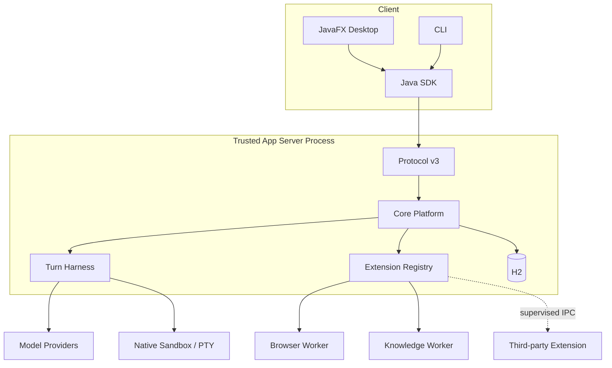

# JavaClaw 6 完整架构设计

## 1. 系统上下文

JavaClaw 是单用户、本地优先的 Agent 平台。客户端和 App Server 是独立生命周期；App Server 持有数据库、
Turn 执行和受治理的外部副作用。Browser、Knowledge 与第三方扩展作为受监督子进程运行。远程部署、多租户和
水平扩展不在 6.0 范围内。

## 2. Core 模型

Workspace 是权限和配置范围；Thread 是长期会话；Turn 是一次受预算和取消控制的执行；Item 是 Turn 中的有序
事实。`ItemEnvelope` 只保存身份、sequence、kind、schema、producer、状态、时间与规范 JSON payload。
`ItemSchemaRegistry` 负责 schema 所有权，`ItemPayloadCodec` 负责强类型转换。未知 schema 原样保存但不执行。

Core payload 仅包含消息、工具调用、命令、文件变更、审批、输入、子智能体、压缩、EffectReceipt 与错误。计划、
检查点、评估和 Artifact 等领域 payload 归对应内置扩展。

## 3. Thin Turn Harness

Harness 接收不可变 `TurnExecution`，组装上下文并驱动模型/工具循环。它负责窗口压缩、流式事件、usage、审批、
预算、超时、取消、背压、子 Thread 配额和 EffectReceipt 恢复，不包含领域状态机。

编排由 `TurnOrchestrationPort` 发起新的 Turn。父 Turn 创建子 Thread 时必须先预留预算；并发配额固定为普通 4、
高配 8，不能由提示词扩大。取消是协作式信号：先停止新模型/工具调用，再等待在途持久化完成，超时后才中断进程。

Harness 在外部模型或工具调用前持久化 phase、intent digest、已消费 usage、冻结工具目录与当前 tool batch。模型结果、
ToolResult、EffectReceipt、Item 和下一 checkpoint 在同一事务提交。重启时只有能由该快照唯一重建的阶段自动续跑；
存在调用意图但无法确认结果时写入 `UNKNOWN_OUTCOME` 并终止该 Turn，不猜测重试。等待输入与审批的 Turn 保留原请求、
期限和冻结边界，恢复时重建 lifecycle lease，不因进程重启机械拒绝。

## 4. Protocol v3

Wire 层严格使用 JSON-RPC 2.0。连接第一条业务消息必须是 `initialize/session`，声明
`appProtocolVersion=3`、客户端信息、stable capabilities 与请求的 experimental capabilities。未协商的实验字段、
方法或枚举不得发送。

平台方法按 Workspace、Thread、Turn、Item、Attachment、Agent Role、Execution Configuration、Provider、Credential/Vault、Permission/Grant、
Approval、Extension/Bundle/Job、MCP、Tool、Worktree、Lifecycle、Diagnostics 与 Rollout 分类。Plan、Workflow、
Memory 等业务领域统一通过四个 Extension 方法访问，不把领域命令扩散进平台目录。所有写命令携带 idempotency key
与 expected revision；服务端在同一事务内检查 revision、记录幂等结果并写 outbox。

当前 `methods-v3.json` 是包含 157 个 RPC 的唯一平台方法目录。每个方法绑定严格的 params 和 result Schema；
通知没有 result，普通方法
不得省略 result Schema。catalog、Java contract 和示例由测试逐方法对齐，不能用一个宽松对象 schema 掩盖遗漏字段。

stdio、Unix Domain Socket 与 Windows Named Pipe 均已进入当前实现；TCP 与 WebSocket 不实现。Named Pipe 使用
仅允许 SYSTEM 与当前登录 SID 的安全描述符并拒绝远程客户端。Framing 使用有界 length prefix，超限、截断、
重复字段和非法 JSON 都在进入 handler 前拒绝。

Core ID 在 wire 上统一编码为标量字符串，时间统一使用 RFC 3339 `date-time`，Duration 使用 ISO-8601 文本。
对象包裹 ID、数字时间戳和数组 Duration 均不是 6.0 输入格式。成功的扩展写命令只发布
`extension/event` 失效通知；通知仅携带 Workspace、扩展、资源、操作与 revision，客户端收到后重新读取权威状态，
业务 payload、Secret 与正文不得进入通知。

## 4.1 设置数据与强类型契约

Desktop 本机只保存主题、字号、密度、窗口位置和最后打开页面。设置中心的 Workspace 作用域只属于当前 Desktop
窗口会话：切换主窗口 Workspace 不会改变已打开设置中心的目标。作用域将 frozen selection 与 available selection
分开；目录重载、断线或 Workspace 失效时保留前者及页面草稿，但清空后者并暂停写入。dirty/pending 时禁止重载或
切换，切换会取消旧读取、递增请求 epoch，并丢弃迟到响应。

Agent Role 是带不可变 revision 的职责配置，只包含名称、说明、developer instructions、可选模型/推理约束、
capability/skill 收窄与 permission constraint。Role 不持有 PermissionProfile、凭据、审批策略或预算。Provider、
PermissionProfile、Vault 与 Embedding 的现有纵切继续独立。`default`、`worker`、`explorer`、`software-engineer`
是内置只读 Role；用户通过 clone 创建可编辑副本，Workspace 创建默认选择 `default`。

执行配置由 `ExecutionDefaults`、`ExecutionOverrides` 和 `ResolvedTurnConfig` 表达。安装默认 → Workspace →
Thread → 显式调用逐字段继承，随后应用 Role 中明确设置的模型/推理约束；未设置代表继承。所有 ID/revision 必须精确，
字段来源和模型锁定原因进入 provenance；Desktop 只显示服务端权威结果。模型切换不产生 Role，也不改变权限。

`execution/subagent/read` / `execution/subagent/update` 独立管理安装与 Workspace 的子智能体默认值，SDK 对应
`client.executions().readSubagentDefaults` / `updateSubagentDefaults`。写入仅允许 `provider` 与 `reasoning`，
其他 ExecutionOverrides 字段必须为空；未配置时回退父 Turn。子模型优先级为 Role 固定值 → 显式 spawn →
子智能体默认值（Workspace 覆盖安装）→ 父模型。此入口不能修改父权限、审批、预算、角色或能力上限，更新仅影响新子 Turn。

App Server 的单一解析器验证 lifecycle、模型用途、凭据可用性、权限、预算与 capability/skill 交集，生成不可变
`ResolvedTurnConfig`。Turn、子任务与 Automation 冻结该结果及 Prompt/工具目录摘要；启动失败时不创建部分配置，
幂等重放返回原结果，恢复执行不重新读取 latest。Role narrowing 中 absent 继承当前可用集合，显式空集合禁用；
权限始终受系统、Workspace、父任务/自动化上限和实时撤权约束，Role 只能收窄。explorer 的 READ_ONLY 由代码约束。

Provider 普通配置按不可变 revision 独立提交。每个模型声明 `CHAT`/`EMBEDDING` 用途，Embedding 由独立精确
`ProviderRef` 选择，不按名称推断。涉及 Secret 的 `provider/credential/*` 命令先构造候选 Adapter，再在同一 H2
事务提交 Vault 密文、Secret 元数据 revision、Provider 新 revision 与幂等回执；提交成功后同步交换 generation，
旧实例等待在途调用释放后关闭。精确历史 Provider 引用仍受最新 lifecycle、当前 CredentialRef 和 Vault 可用性检查。
配置变化不会静默改写既有引用；禁用、归档、清除 Secret 或 Vault 锁定使依赖它的新调用 fail closed。

Prompt 优化通过受预算的普通 Harness Turn 生成 Draft，发起前显式确认可能计费；只有用户采纳且 Role revision 匹配
时才更新可编辑 Role，内置角色需先 clone。Role 文件仅通过显式 SDK/RPC preview、confirm、export 工作流交换：
严格 UTF-8 TOML、单文件最多 1 MiB、显示差异与摘要；未知模型必须明确映射，不监听文件或自动覆盖运行时配置。
Codex portable 只导出允许的可移植字段，JavaClaw lossless 保留受控扩展；运行权威仍在 H2，文件不是第二配置源。

模型目录发现只能读取已保存的精确 Provider revision，不执行推理，也不持久化远端结果。它通过 session-owned 的
`provider/model/discovery/start|read|cancel` 操作提供最长 30 秒、最多 1000 条的有界读取；页面、RPC session 或服务关闭
会取消真实 HTTP 调用，所有 redirect 均被拒绝。`API_KEY` 自定义地址只允许 HTTPS 或显式 loopback HTTP；`NONE` 仅允许
自定义 OpenAI-compatible 地址且不得绑定 CredentialRef。首次配置按“禁用连接壳、凭据、模型用途、启用”四步恢复，
使用不含 Secret 的确定性幂等键，已有不同内容的相同 ID 不会被覆盖。厂商 SDK 与目录解析留在
`javaclaw-model-adapters`，App Server 只负责有界协调和安全校验，Desktop 仍通过 SDK 使用。

内置 Role 文本有固定公开源码 commit、原文 SHA-256、模板 SHA-256 和改编说明，见
[Prompt 来源](prompt-provenance.md)。角色名称不证明源仓库存在相同正文；空模板不作为已实现行为证据。

配置探测只检查 adapter、URI、模型目录和厂商选项的非计费可用性；真实模型 round-trip 是独立命令，必须携带用户的
显式计费确认。Provider 普通配置按不可变 revision 提交；`provider/credential/*` 的候选构造发生在写事务前，Vault
密文、Secret 元数据 revision、Provider 新 revision 与幂等回执在同一 H2 事务提交，随后才激活候选 registry。
候选构造或 H2 提交失败时活动 Adapter 与原 revision 保持不变；提交后的激活或清理异常不能回滚 H2，运行时必须保持
fail closed 并交由下一次权威重建恢复。

Secret Vault 在 H2 中只保存 AES-256-GCM 密文、随机 nonce、版本和元数据；AAD 绑定版本域、namespace、opaque
CredentialRef ID 与 Secret revision。主密钥由 macOS Keychain、Windows 系统凭据设施或 Linux Secret Service 封装。
连接初始化协商会话级 X25519 公钥，PasswordField 内容必须密封后才进入 JSON-RPC。面向 SDK/RPC 的管理 API 只能写入、
轮换、清除和查看“已配置”状态，不提供读取、复制或导出；服务端只在受控 callback 中解封。Vault 变化串行化，并在
修改前关闭运行时 epoch gate；调用取得 Adapter lease 后仍要复核 epoch，防止旧 generation 在并发变化中重新进入。
运行时重建失败时 gate 保持关闭。系统凭据设施不可用时进入 `VaultState.LOCKED` 并 fail closed。

## 5. 模型边界

`ModelGateway` 是 Harness 唯一模型端口。Spring AI Adapter 负责通用 prompt、stream、tool call、structured output、
usage 和 Provider options。`ModelCapabilities` 使 Harness 根据事实选择能力，不根据 Provider 名称猜测。

OpenAI Responses 的 reasoning summary、opaque output item 与 native compaction 由专用 Adapter 和官方 SDK 实现。
Provider opaque state 只由 `ProviderStateCodec` 解析，在 Core 中按密文/不透明字节保存，并绑定完整指令层。
`ModelInstructions` 分开传递 system、developer 和 response contract；Responses 使用独立 developer message，
不支持 developer role 的 Spring AI 路径只在 Adapter 边界按固定顺序合并。推理强度按厂商明确映射，不支持的值拒绝，
不静默降级或扩大预算。JavaClaw 不使用自动工具循环、
自动 Memory Advisor 或自动 MCP 注册，因为这些路径会绕开审批、Sandbox、预算和收据。

## 6. 工具与权限

Turn snapshot 保存工具 ID、来源、schema hash、revision 与权限 ceiling。模型初始只看到核心工具和搜索入口；搜索仅
展开冻结目录。相同 ID、非法 schema 或 revision 冲突会使目录冻结失败。

最终权限是 system ceiling、Workspace、PermissionProfile、Role 收窄、父任务上限、Turn grant 和工具声明的交集。
调用前再次检查 enabled、revision、实时撤权和风险级别。文件、命令、PTY、网络与资源上限都走同一安全链；网络访问由
broker 解析目标并防止 DNS rebinding。完成外部副作用后，执行器必须在返回模型前提交 EffectReceipt。

## 7. 扩展信任层

内置扩展随发行版编译、签名并在进程内通过稳定 SPI 注册，不使用动态 ClassLoader。它们拥有平台分配的 H2 schema，
并通过 `ManagedExtensionStore` 与 Core Item/Event/Outbox 同事务提交。

第三方 Bundle 经过 staging、逐文件哈希和签名验证、权限审阅、健康检查后，由 Sandbox Supervisor 进程外启动。
它只能使用有限额的 namespaced document/blob API 和显式 IPC capability。安装、升级、禁用、实时撤权、退避、
隔离与可恢复 Trash 具有持久化状态和故障恢复测试；任何验证失败都不能回退成进程内加载。

Plan、Loop、Workflow、SDD、Schedule、Memory、Knowledge、Skill、MCP 与 Site 都是可停用的内置扩展。停用立即阻止
新的 Tool、View、Timer 与 command，但不删除数据。每个复杂领域以显式资源、状态机与生命周期组件组合，不继承
通用文档或自动化抽象基类。Managed Extension Store 保存当前值、不可变历史、tombstone、活动执行索引、Outbox 与
幂等结果；领域实现不能引用 App Server 具体 Service。

Extension Job 把 Definition 与 Execution 分离。启动命令只在事务中建立 Execution 和 Outbox 后返回；Supervisor 每次
推进一个工作单元，持久化 intent、checkpoint、Turn 与 EffectReceipt 后才进入下一单元。状态固定为
`QUEUED/RUNNING/WAITING_APPROVAL/WAITING_INPUT/PAUSED/COMPLETED/FAILED/CANCELLED`，定义的新 revision 不改变活动
Execution 的冻结快照。

当前 Plan、Loop、Workflow、SDD、Schedule、Memory、Knowledge、Skill、MCP、Site 与第三方 Bundle 都具备从契约、
持久化、运行时、SDK 到管理页面的纵向入口。领域页面读取各自权威资源；停用扩展只阻止新的调用、View 和 Timer，
保留其历史与 tombstone。

## 8. 原生隔离与网络 Broker

macOS 使用 Seatbelt，Linux 使用 bubblewrap。Windows 由受信任 Java helper 通过 FFM 创建唯一 AppContainer、
Restricted Token、kill-on-close Job Object 和受控 handle list，再以显式 executable、引用后的 argv 和清理后的
Unicode environment 启动断网目标。Coding 的 `PROXY_ONLY` 路径由固定网络辅助服务独占根 Job，目标保持挂起，
待持久默认拒绝、动态精确代理例外及 Job 绑定完成后再恢复；Java helper 不另行持有可延长该根 Job 的句柄。
PTY 使用 ConPTY；关闭顺序先终止 Job、排空或关闭 pipe，再关闭 Pseudo Console，
避免遗留子进程和旧版 Windows 的关闭死锁。

Windows AppContainer 不授予通用网络 capability。普通联网工具调用 App Server 的 Network Broker，原生包管理器使用
绑定当前 Turn 的 Command Proxy 租约；二者不把项目进程改为可直接联网。Broker 在连接前
固定已解析地址，限制 scheme、host、port、重定向、响应大小和 deadline，以阻止 SSRF 与 DNS rebinding。Windows Job
Object 能强制进程数、Job committed memory 和进程树生命周期，但没有等价的“打开文件数”硬限制；该项必须在
Windows Runner 验收记录中作为平台限制保留，不得宣称已强制。

MCP 固定协议 `2026-07-28`。用户配置只允许 HTTPS，stdio 仅可来自签名 Bundle；NONE、Bearer、API Key 与 OAuth
2.1/PKCE 的凭据都只保存 Vault 引用。OAuth metadata、授权导航、loopback callback 和 token 交换均经过固定 DNS
Broker；Desktop 不接收 URL、state、challenge、code、token 或 CredentialRef。Browser 登录与 OAuth 分别要求
独立原生能力回执，任一缺失都不能用另一回执兜底。Resource list/read、Prompt list/get 和多帧 SSE 通过强类型契约
进入 SDK；progress 只接受与当前请求关联的有界通知，elicitation 与 sampling 分别复用受治理 InputRequest 和 Turn，
所有远端 Prompt、Resource 与 instruction 始终按外部数据处理，不自动进入 system context。

私网访问必须经过 preview-confirm 的 `PrivateNetworkGrant`，绑定 Workspace、用途、精确 HTTPS Origin、DNS 地址集合
与过期时间；loopback、link-local、metadata 和 multicast 永不授权。Schedule 的 `UnattendedToolGrant` 绑定定义
revision、工具来源/catalog revision、schema hash、固定参数模板、次数和期限。Origin、Secret、命令、Browser、PTY、
Worktree 与网络参数不能作为可变槽位；不确定结果消耗额度且禁止重试。

Site 将精确 HTTPS Origin、允许来源、CredentialRef 与私网授权绑定到单调 authority revision；凭据、Origin 或授权
变化会立即关闭旧 Browser 会话并使旧 authority 失效。人工登录得到的 Cookie/storage state 在 Worker 边界直接密封
入 Vault，RPC、日志、截图和 Artifact 都不能返回原始值。

## 9. 数据与 Rollout

程序目录下空的 `data-v6/` 由版本 1 baseline 初始化；会话、配置、扩展、MCP 和协作领域 SQL
按固定顺序拼接为一个脚本，使用单一摘要和 history 记录。显式 `javaclaw.data.root` 优先。
启动前校验目录所有者、权限、符号链接与实际写入能力，不可写时明确失败。任何入口都不得探测、读取、迁移或修改
`data-v5`，也不能回退到 HOME 中的历史数据。Core 和每个内置扩展分别维护 schema history；任何
migration 只服务于 6.x 的前向演进。Blob 使用内容地址与限额，数据库只保存元数据和引用。

Rollout export 从一致性快照按 sequence 输出 JSONL；每行包含前一行哈希，manifest 包含记录数、首尾 sequence 与
整体 SHA-256。Rollout 只用于 verify 和离线只读 replay，不接受导入，也不作为在线写源。

项目约定从受管全局层和 Workspace 根到 execution root 逐层解析，每层优先 `AGENTS.override.md`，正文按 UTF-8 边界
有界截断并冻结到 Prompt manifest。设置页只展示相对路径、层级、hash、字节数与错误，不通过管理 RPC 返回正文。

写型子 Thread 自动获得绑定父子 Thread 的 managed worktree，权限只覆盖 worktree root。Patch 包含 tracked、staged、
unstaged、rename、binary 与非忽略 untracked 文件且不修改用户真实 index。只有父 Turn 的受治理 `worktree_apply` 工具
可以审批合并；冲突不做部分写入。cleanup 前必须生成可验证 Attachment 备份，运行中、冲突中或备份失败时拒绝清理。

## 9.1 内置业务状态机

- Plan 的步骤拥有稳定 ID 与验收条件；模型只能通过受治理工具提交不可直接执行的 Proposal，人工采纳在同一事务中
  复核目标 Definition revision 与候选 hash。开放问题必须由显式决策绑定内容 hash 后才能执行。
- Loop 只接受用户确认、工具退出码或工具字段断言作为完成证据，模型自述不算验证。
- Workflow 的安全 Graph 仅允许 START、END、TURN、TOOL、CONDITION、TRANSFORM、USER_INPUT 与 OUTPUT，要求唯一
  START、至少一个 END、全图可达和有界 `maxVisits`，禁止 eval 与任意脚本表达式。
- SDD 固定经历 Proposal、规格审批、Design、任务审批、Implement、Verify、Remediate 与 Archive；审批绑定内容
  SHA-256，验收不通过不能归档。
- Schedule 使用 Cron+IANA Zone 或固定间隔，固定 `SKIP_IF_RUNNING` 与 `DO_NOT_CATCH_UP`。每次触发、手动运行、跳过、
  失败和取消都生成 Occurrence；Quartz 只投递，H2 和 Outbox/Reconciler 是权威状态。

Memory 保存来源 Item、历史、纠错、固定与 tombstone。学习策略默认为 `SUGGEST`；`AUTO_LOW_RISK` 只允许同 Workspace、
可逐字核验来源的新增低风险 FACT，敏感、冲突、推测和不确定工具结果必须成为 Proposal。Knowledge 导入先进入 Core
Attachment，隔离 Worker 无网络地解析 PDF/Office；新 Generation 完成后原子切换，失败保留旧索引，Embedding 不可用
时明确降级关键词检索。Skill 使用 Draft/Published 双阶段，只有 Published revision 可 Enable；Turn 冻结目录摘要后按
精确 revision 读取，禁用或 revision 改变立即阻止旧调用。可执行资源只允许绑定 digest 的 Java/JShell，并以
PROCESS 风险进入 Native Sandbox。Skill 的导入与导出只接受 v5 Markdown 或确定性 Bundle，内容先进入 Core
Attachment 并校验 digest、UTF-8、资源路径与大小；旧 Bundle 和一般 ZIP 不进入兼容解析。

## 10. 客户端与后台生命周期

SDK 直接复用 Core 值类型，并为内置扩展提供 typed facade。连接层负责 framing、initialize、通知排序和重连；领域
client 只表达方法契约。`extension/event` 到达时只产生资源失效，Desktop 合并重复通知后重新读取权威状态；回调失败
会关闭连接，不能静默丢失。重连使用最后确认 sequence 恢复，不推测丢失事件。

Desktop 由 Shell、Presenter 和不可变 state 组件组成，只调用 SDK。活动 Turn、等待审批/输入和启用 Schedule 各持有
lifecycle lease；无客户端且无 lease 后等待 60 秒退出。首个 Schedule 启用时注册用户登录启动，最后一个禁用时注销。
托盘只显示和控制 Server 状态，不执行调度。

设置与管理中心是单实例、非阻塞 Stage。外观、Provider、Agent Studio、Permission、Workspace、连接与诊断使用强类型
Presenter；业务扩展页面由 ViewSchema v2 渲染。ViewSchema 只允许平台节点、数据源、binding、校验、分页、请求
epoch、revision 冲突和安全 Graph，不允许 FXML、CSS、Controller、JavaScript、脚本表达式或本地 URL。连接失败时
本地外观与连接页面仍可打开，传输异常由可行动的错误卡展示，不直接暴露底层异常文本。

当前 29 个生产管理入口均连接到强类型 SDK 或 ViewSchema v2 数据源。异步 Presenter 使用请求 epoch 丢弃旧响应；
通知刷新不能覆盖 dirty 草稿，revision 冲突必须保留草稿并等待用户显式选择重新加载或继续编辑。

macOS 设置中心 Golden 固定设置中心壳和外观页的九主题、三密度、100% 字号与两种窗口，共 54 张生产 Scene；测试另行
断言导航目录包含 29 个入口。Golden 由 Failsafe 在独立 JVM 中运行并逐字节比较，隔离 JavaFX 进程级字形缓存与普通
窗口测试的执行顺序；普通 `verify` 不得改写参考图。本次参考集接纳了经审阅的 Agent 导航标题/描述更新，54 图
框外像素完全一致，[差异与哈希记录](../evidence/v6-settings-golden-review.md)保留审阅依据；比较门禁未变，最终
Golden 已在 2026-09-07 本机完整门禁通过，见[构建证据](../evidence/v6-build-validation.md)。29 页正文、多状态和
其余三档字号仍需由后续视觉参考集补证。

## 11. 失败语义与可观测性

边界错误使用稳定类型：INVALID_REQUEST、REVISION_CONFLICT、IDEMPOTENCY_CONFLICT、PERMISSION_DENIED、
UNSUPPORTED_VERSION 和 INTERNAL_ERROR。内部异常只写诊断日志，不把 SQL、路径、token 或凭据内容发给客户端。

日志不得占用 stdout，因为 stdio transport 独占该流。诊断快照公开版本、数据库、队列、Extension 启停/隔离计数和
launcher/tray 脱敏可用性，不公开 Secret、环境变量、绝对路径、Prompt、Item 正文或 Browser state。
Release 必须保留 CycloneDX SBOM、许可白名单清单、包内及包外 SHA-256 清单、平台签名、GitHub provenance/SBOM
attestation、原生 Runner 和 UI Golden 作为可追溯证据。正式标签必须与非 SNAPSHOT POM 版本完全一致。

App Server 重启时先恢复输入、审批、Extension Job、Schedule occurrence 与持久化 Turn。已存在 EffectReceipt 的工作
单元只能推进 checkpoint，不能重放副作用；已记录调用意图但结果无法确认时必须进入 `UNKNOWN_OUTCOME` 并等待人工
处理。只有能从冻结快照、已消费预算和持久化边界唯一重建的工作单元才允许自动续跑。

本机 [Turn 准备性能记录](../evidence/v6-turn-preparation-performance.md) 对比固定 Git v5 源码与 v6：
最终候选 p50/p95 为 159.929/174.969 ms，旧版为 502.831/607.918 ms。计时只覆盖配置读取、权限解析、空目录冻结、
项目约定读取与 Prompt 快照编码，不包含 Turn 最终 INSERT、Harness、模型完成、UI 或 Sandbox。最终候选只重测
一个 JVM、100 个样本，不能据此声明完整 Turn 端到端或跨平台性能通过，统一 verify 仍须独立完成。

## 12. 明确排除

JavaClaw 6.0 不引入 Rust、Codex app-server 后端或 Codex Plugin 格式，不实现远程部署、多租户或水平扩展，也不恢复
Ollama、本地模型资产、Plugin 4、旧业务 mode、SMTP/IMAP/Webhook、宿主鼠标键盘控制或测试数据清理功能。权限体系
不提供 `HOST_FULL_ACCESS` 配置；Browser Cookie 与 storage state 只能直接密封入 Vault，不能读取、复制或导出。
以上能力不预留兼容 Adapter、feature flag 或隐藏入口。
