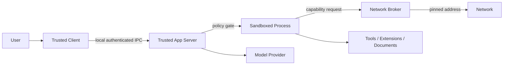

# JavaClaw 6 威胁模型

## 资产与信任边界

受保护资产包括 Provider 凭据、Workspace 文件、命令执行权、浏览器会话、数据库、Extension 状态、Rollout 完整性和
用户审批意图。可信计算基只包含签名发行物中的 App Server、内置扩展、SDK 与 Native Host；模型输出、MCP 响应、
网页、文档、Skill 内容和第三方 Bundle 都是不可信输入。

## 威胁与控制

| 威胁 | 主要控制 | 失败语义 |
|---|---|---|
| 本地进程伪装客户端 | UDS 文件权限；Named Pipe 仅允许 SYSTEM/当前 SID 且拒绝远程；initialize 与连接身份绑定 | 连接拒绝 |
| Role 文件暗含权限、凭据或模型映射 | 限长严格 TOML、导入预览与显式确认；未知模型必须人工映射；Role 只收窄能力 | 拒绝或保留待确认预览 |
| 继承配置变化污染既有执行 | 单一服务端解析器冻结精确 revision、权限、预算、Prompt/目录摘要，恢复不重新解析 latest | 保留原快照或拒绝失效能力 |
| 指令变化继续旧 Provider state | state 绑定完整指令层和 Prompt 摘要；跨层变更不续接旧状态 | 重新构造上下文或拒绝不匹配 state |
| 数据根回退读取旧数据 | 程序目录/data-v6、显式覆盖、目录打开前校验，禁止旧目录探测 | 启动失败 |
| Prompt injection 扩大权限 | Prompt 不授予能力；冻结目录与 PermissionProfile 决定实际权限 | 调用拒绝 |
| 工具在 Turn 内替换 schema | 冻结 ID/revision/schema hash，执行前复核 | revision 冲突 |
| 用户撤权后仍执行 | enabled 与权限实时复核，快照只能缩小权限 | 权限拒绝 |
| Secret 在本地 RPC 被旁路读取 | 会话 X25519 密封、Vault 仅写 API、AES-GCM AAD、脱敏通知与诊断 | Vault 锁定或请求拒绝 |
| Provider Secret 写入或 Adapter 替换失败 | `provider/credential/*` 先验证候选 Adapter；Vault 密文、Secret 元数据 revision、Provider 新 revision 与幂等回执在同一 H2 事务提交；Vault 变化串行化并先关闭 runtime epoch gate，Adapter lease 获取后复核 epoch | 候选构造或 H2 提交失败时保留旧 revision；提交后交换或重建异常时 gate 保持关闭并等待权威重建 |
| 配置探测意外产生模型费用 | 非计费探测与真实 round-trip 分离，计费验证要求显式确认 | 拒绝计费调用 |
| Prompt 优化静默改写 Role | 正常受预算 Harness Turn 只生成 Draft，采纳时复核 Role revision | 保留 Draft 或 revision 冲突 |
| 私网授权扩大到任意内网 | preview-confirm、精确 Origin、固定 DNS 地址集合、最长 24 小时、实时撤销 | Broker 拒绝 |
| Schedule 重放无人值守副作用 | revision/schema/固定参数绑定、次数与期限、EffectReceipt；不确定结果消耗额度 | `UNKNOWN_OUTCOME` 且不重试 |
| MCP 内容注入 system context | MCP prompt/resource/instruction 只作为外部数据，Catalog 冻结并在调用前实时复核 | 内容隔离或调用拒绝 |
| MCP OAuth 参数或 token 暴露给 Desktop | metadata/导航/callback/token 交换经固定 DNS Broker，loopback 本地截获，凭据直写 Vault | 取消会话并清零临时字节 |
| 路径穿越与 symlink escape | real path、受控根、打开时复核、Sandbox 文件规则 | 输入拒绝 |
| 命令逃逸或子进程泄漏 | 无 shell argv、清理环境、受控继承句柄、Sandbox、进程树监督、超时和资源上限 | 终止进程树 |
| Windows token 或 ACL 泄漏 | 唯一 AppContainer、Restricted Token、临时最小 ACL、逆序恢复；恢复失败锁定 Workspace | 拒绝后续执行 |
| SSRF / DNS rebinding | Network Broker 的 scheme/host/port allowlist、解析地址固定、重定向复核、大小和 deadline | 网络拒绝 |
| Browser 通过 Chromium 旁路 Broker | 独立 image、Native Sandbox 禁止原始网络、全请求 route、Service Worker/WSS/下载阻断 | 会话失败且不写能力标记 |
| Browser storage/Cookie 泄漏 | Worker→Server 私有二进制帧、Vault 直写、Secret DOM 遮罩、RPC/日志/Artifact 禁止返回 | 清零临时字节并取消会话 |
| 副作用重放 | idempotency key、expected revision、EffectReceipt | 返回既有结果或冲突 |
| App Server 重启后重放在途模型/工具 | 调用前持久化 intent/phase/usage/catalog，结果与 checkpoint 同事务；不确定结果 fail closed | `UNKNOWN_OUTCOME`，禁止自动重试 |
| 重启后丢失或擅自拒绝待审批动作 | 审批请求、期限与冻结边界持久化并恢复 lease；独立过期投影必须随最新总门禁验收 | 继续等待，达到原期限后过期 |
| 数据库部分提交 | Core、Item、Event、Outbox 与托管扩展状态同事务 | 全部回滚 |
| 第三方代码获得宿主权限 | 进程外、签名、最小 IPC capability、无 JDBC/classpath | 隔离或禁用 |
| ViewSchema 注入可执行内容 | 固定节点集、长度/字段/命令校验、无脚本/本地 URL | schema 拒绝 |
| 扩展通知泄漏业务正文 | `extension/event` 只携带资源标识和 revision，客户端重新查询权威状态 | 丢弃通知并关闭慢连接 |
| 凭据经日志或 RPC 泄漏 | 凭据引用、redaction、稳定外部错误、stdout 专属 RPC | 仅内部诊断 ID |
| Rollout 被篡改 | sequence、逐行哈希链、manifest SHA-256 | verify 失败 |
| 发行包或依赖被替换 | 可再生时间戳、包内/包外 SHA-256、CycloneDX SBOM、许可白名单、平台签名与 attestation | 发布失败或校验失败 |

## 关键不变量

- 权限只能取交集，任何组件不能把缺失声明解释为全量允许。
- 模型和扩展输出只能提出调用，不能绕过审批或直接创建宿主进程。
- 外部副作用可能已发生但响应丢失时，恢复必须先查 EffectReceipt，不能盲目重试。
- 模型/工具调用意图必须先于外部调用持久化；只有结果和 checkpoint 同事务成功后才能推进执行阶段。
- secret 不进入 Item payload、Provider 普通配置、Rollout 和客户端可见错误。
- Prompt 优化只能产生 Draft；没有显式采纳和匹配 revision 时不得改变 Role。
- Browser login 能力只由目标平台真实 Sandbox smoke 写入只读 image 标记；旧标记必须在每次验证前删除，失败不得
  保留 available 状态。
- 第三方进程宿主完成前保持 fail closed；不能用进程内插件补齐产品功能。
- Windows Job Object 强制进程数、Job committed memory 与 kill-on-close；它没有打开文件数硬限制，文档和验收不得
  把宿主侧观测写成等价强制。
- ConPTY 关闭先停止并排空 pipe，再关闭 Pseudo Console；资源 owner 只能关闭一次，目标进程不得继承未声明句柄。

## 发布前安全证据

需要三平台 Sandbox 逃逸测试、PTY/取消/进程树测试、权限撤销竞态、DNS rebinding、Bundle 签名与隔离、数据库故障
注入、Rollout/发行清单篡改和 secret 扫描报告。Windows 还必须覆盖 AppContainer 网络拒绝、ACL 恢复、Job 子进程
终止和 ConPTY 背压。缺少对应 Runner 的结果等同未验证。

## 编程命令的准备阶段网络

依赖准备使用独立的 `CommandNetworkGrant`，绑定 Turn、操作记录、命令摘要、精确主机/端口、双向字节总量、
并发连接数和不可续期的期限。入口仅绑定 `127.0.0.1` 的随机端口，每次 CONNECT 都重新解析 DNS，所有返回地址
必须为公网，之后只向已验证的数值地址建连。租约关闭、取消、撤权或期限到达会关闭入口和既有流；系统时钟回退
不能延长单调截止时间。正在登记的连接与关闭共用生命周期锁，防止关闭快照后产生遗漏的 Socket。

首版仅支持无凭据公共仓库。CONNECT 保留客户端到仓库的端到端 TLS，Broker 不解密隧道、不检查 HTTP 方法/路径，
也不承诺 GET-only 或禁止上传；它校验的是允许连接的目标。私有仓库凭据注入需要服务端 repository relay，
不属于本次实现范围。HTTP 重定向发生在工具客户端中：跳转若创建新的连接，仍须通过精确主机/端口与公网 DNS 校验。
工具链归档下载走独立固定 DNS/TLS 的流式下载器，逐跳验证 HTTPS/443、重定向数量、总截止和字节上限。

代理环境变量与工具配置只负责 Maven、Gradle、npm、pnpm、pip 的协议兼容，不构成安全边界。准备进程及其生命周期
脚本均执行项目代码，必须受同一个文件/进程/网络授权约束；构建与测试默认使用 OFFLINE 沙箱。运行库、可执行根和
构建缓存是服务端冻结的受信配置，不能由模型任意补充路径。

| 平台 | PROXY_ONLY 强制边界 | 生命周期与限制 |
|---|---|---|
| macOS | Seatbelt 默认拒绝网络，仅允许精确代理端口的 IPv4 TCP 出站；运行库与工作根单独授权 | JVM 使用 IPv4 stack 兼容该规则；同端口 IPv6 和其他 IPv4 端口不得连通 |
| Linux | bubblewrap 独立网络 namespace，仅命名空间内 loopback relay 可用；经私有 UDS/IPC 转发至宿主 Broker | seccomp 禁止命名 AF_UNIX/packet/netlink Socket、跨进程窃取句柄及 io_uring 旁路；允许匿名 Unix stream socketpair 以支持运行库 |
| Windows | 签名固定网络服务按唯一 AppContainer SID 建立四层持久默认拒绝和精确 IPv4 TCP 代理端点的动态例外 | 服务唯一持有带 KILL_ON_JOB_CLOSE 的根 Job；目标挂起启动，规则、必要的本 SID loopback 授权和 Job 就绪后才恢复 |

Windows 辅助服务只接受固定的租约控制协议，验证本地调用者、SYSTEM 拥有的 Pipe、服务 PID、受保护发行路径中的
签名 Java 进程、父子进程/用户身份及 AppContainer SID。它不接收任意管理员命令、路径或可执行文件。正常关闭顺序为
撤销动态允许、关闭 Broker 隧道、终止并等待根 Job、清理本 SID loopback 授权；无法确认进程树已结束时保留持久拒绝。
服务或控制连接异常必须关闭进程树，启动恢复只操作自有 provider/SID 资源。修改 loopback 集合时重新读取现有集合，
不能用旧快照覆盖其他应用的授权。

安装/升级需要系统授权，发行要求 guard 与固定 runtime Java 的有效 Authenticode 签名、Program Files 路径与 ACL
保护。MSI 从内嵌的签名 Binary 执行固定 `--uninstall` 清理，安排在删除文件之前；不能从可覆盖的安装属性拼装提升权限
的程序路径。未取得 Windows MSVC、安装卸载与实际 WFP/Job 回执前，不得将上述代码路径视为平台验收通过。

## 管理目录与可写缓存

Coding 工具入口拒绝执行根、读根或写根与 `data-v6` 互相包含，包括 symlink 解析后的别名；显式选择项目也不能获得
数据库、托管制品、审批状态和代理配置的管理权限。唯一例外是 `ManagedWorktreeService` 真实绑定并校验的
ISOLATED_WRITE 工作树，且只允许它自身执行根及内部的权限，不能扩大到 `data-v6/worktrees` 父层或其他管理区域。
此检查返回结构化权限失败，不能通过扩大 Profile 或仅凭目录名称绕过。

宿主仅在从未授予项目写入权限的管理祖先中逐级创建缓存根，拒绝链接和重解析点。临时文件使用独立的
`coding/command-tmp/<TurnId>`，宿主不在可被项目改写的 `cache/tmp` 内创建目录，也不自动遍历清理正在使用的缓存子树。
最终目录根必须由 OS 保持不可删除/替换：macOS 对写根本身拒绝 unlink；Linux bind mount 锚定根；Windows 根 ACL
拒绝 DELETE/WRITE_DAC/WRITE_OWNER，而允许删除的子孙通过独立继承 ACE 授权。单纯在宿主做 NOFOLLOW 检查不足以替代
这些根与祖先不可替换的不变量。重启后的缓存/临时文件回收仍需在确认进程树终态后执行，不能沿项目留下的链接递归。

## 固定文件 Worker 的目录能力与恢复

文件 Worker 的项目路径边界独立于 Java/System 运行库读取许可。冻结根不得再次解析为新的授权目标；每级目录及
最终文件均从仍持有的目录能力打开，禁止“校验 Path 后再按绝对 Path 访问”。POSIX 使用逐段 `openat` / `O_NOFOLLOW`
与 `SecureDirectoryStream`；Windows 使用真实卷路径和 `NtCreateFile` 的 `RootDirectory` / `OBJ_DONT_REPARSE`。
文件分页、搜索和 inventory 复用同一能力，不为性能绕过有界读取。Windows ACL 授予和恢复针对同一仍存活句柄，
不能在恢复时重新查找可能已经替换的路径。较窄文件权限根也不允许在调用时跟随新链接并重新授权：它必须与冻结的
规范路径一致，否则失败；系统路径别名在创建/冻结阶段显式解析，调用时不得扩展到兄弟目录。

POSIX 修改原子交换提案与实际当前 inode，旧对象进入恢复槽且目标保持存在；创建和删除使用不可覆盖移动。
Windows 修改仍为两阶段移动，目标可能短暂缺失，不能冒称 Windows 原子替换已完成。跨文件系统移动失败，不回退到
存在性检查后普通 rename。多文件补丁及文件/数据库提交都不是一个原子事务，SHA-256 检查不是原子 CAS。

交换后发现旧摘要冲突立即停止并保留所有版本。回退前当前摘要已改变时不修改它；若最后预检后才发生竞态，实际
当前 inode 被保存在恢复槽，停止并要求核对，不反复交换追赶外部编辑。成功后也保留旧 inode，因为外部进程可能
继续通过早先打开的 fd 写入。恢复位置、映射和状态进入事实记录，不自动重放或清理。专用恢复目录从模型文件工具中
排除，但拥有整项目写权限的命令仍可修改它；内部原始快照与 Workspace 上的实际旧 inode 是两种恢复证据，不能互相
替代或被描述成相同的不可变保证。
