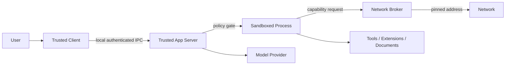

# JavaClaw 5 威胁模型

## 资产与信任边界

受保护资产包括 Provider 凭据、Workspace 文件、命令执行权、浏览器会话、数据库、Extension 状态、Rollout 完整性和
用户审批意图。可信计算基只包含签名发行物中的 App Server、内置扩展、SDK 与 Native Host；模型输出、MCP 响应、
网页、文档、Skill 内容和第三方 Bundle 都是不可信输入。

## 威胁与控制

| 威胁 | 主要控制 | 失败语义 |
|---|---|---|
| 本地进程伪装客户端 | UDS 文件权限；Named Pipe 仅允许 SYSTEM/当前 SID 且拒绝远程；initialize 与连接身份绑定 | 连接拒绝 |
| Prompt injection 扩大权限 | Prompt 不授予能力；冻结目录与 PermissionProfile 决定实际权限 | 调用拒绝 |
| 工具在 Turn 内替换 schema | 冻结 ID/revision/schema hash，执行前复核 | revision 冲突 |
| 用户撤权后仍执行 | enabled 与权限实时复核，快照只能缩小权限 | 权限拒绝 |
| Secret 在本地 RPC 被旁路读取 | 会话 X25519 密封、Vault 仅写 API、AES-GCM AAD、脱敏通知与诊断 | Vault 锁定或请求拒绝 |
| Provider 配置已写入但凭据或 Adapter 替换失败 | 服务端复合命令、候选 Adapter 先验证、配置/CredentialRef/registry 原子提交 | 旧 revision 与活动 Adapter 保持不变 |
| 配置探测意外产生模型费用 | 非计费探测与真实 round-trip 分离，计费验证要求显式确认 | 拒绝计费调用 |
| Prompt 优化静默改写 Profile | 正常受预算 Harness Turn 只生成 Draft，采纳时复核 Profile revision | 保留 Draft 或 revision 冲突 |
| 私网授权扩大到任意内网 | preview-confirm、精确 Origin、固定 DNS 地址集合、最长 24 小时、实时撤销 | Broker 拒绝 |
| Schedule 重放无人值守副作用 | revision/schema/固定参数绑定、次数与期限、EffectReceipt；不确定结果消耗额度 | `UNKNOWN_OUTCOME` 且不重试 |
| MCP 内容注入 system context | MCP prompt/resource/instruction 只作为外部数据，Catalog 冻结并在调用前实时复核 | 内容隔离或调用拒绝 |
| MCP OAuth 参数或 token 暴露给 Desktop | metadata/导航/callback/token 交换经固定 DNS Broker，loopback 本地截获，凭据直写 Vault | 取消会话并清零临时字节 |
| 路径穿越与 symlink escape | real path、受控根、打开时复核、Sandbox 文件规则 | 输入拒绝 |
| 命令逃逸或子进程泄漏 | 无 shell argv、清理环境、受控继承句柄、Sandbox、进程树监督、超时和资源上限 | 终止进程树 |
| Windows token 或 ACL 泄漏 | 唯一 AppContainer、Restricted Token、临时最小 ACL、逆序恢复；恢复失败锁定 Workspace | 拒绝后续执行 |
| SSRF / DNS rebinding | Network Broker 的 scheme/host/port allowlist、解析地址固定、重定向复核、大小和 deadline | 网络拒绝 |
| Browser 通过 Chromium 旁路 Broker | 独立 image、Native Sandbox 禁止原始网络、全请求 route、Service Worker/WSS/下载阻断 | 会话失败且不写能力标记 |
| Browser storage/Cookie 泄漏 | Worker→Server 私有二进制帧、Vault 直写、Secret DOM 遮罩、RPC/日志/Artifact 禁止返回 | 清零临时字节并取消会话 |
| 副作用重放 | idempotency key、expected revision、EffectReceipt | 返回既有结果或冲突 |
| App Server 重启后重放在途模型/工具 | 调用前持久化 intent/phase/usage/catalog，结果与 checkpoint 同事务；不确定结果 fail closed | `UNKNOWN_OUTCOME`，禁止自动重试 |
| 重启后丢失或擅自拒绝待审批动作 | 审批请求、期限与冻结边界持久化并恢复 lease；独立过期投影必须随最新总门禁验收 | 继续等待，达到原期限后过期 |
| 数据库部分提交 | Core、Item、Event、Outbox 与托管扩展状态同事务 | 全部回滚 |
| 第三方代码获得宿主权限 | 进程外、签名、最小 IPC capability、无 JDBC/classpath | 隔离或禁用 |
| ViewSchema 注入可执行内容 | 固定节点集、长度/字段/命令校验、无脚本/本地 URL | schema 拒绝 |
| 扩展通知泄漏业务正文 | `extension/event` 只携带资源标识和 revision，客户端重新查询权威状态 | 丢弃通知并关闭慢连接 |
| 凭据经日志或 RPC 泄漏 | 凭据引用、redaction、稳定外部错误、stdout 专属 RPC | 仅内部诊断 ID |
| Rollout 被篡改 | sequence、逐行哈希链、manifest SHA-256 | verify 失败 |
| 发行包或依赖被替换 | 可再生时间戳、包内/包外 SHA-256、CycloneDX SBOM、许可白名单、平台签名与 attestation | 发布失败或校验失败 |

## 关键不变量

- 权限只能取交集，任何组件不能把缺失声明解释为全量允许。
- 模型和扩展输出只能提出调用，不能绕过审批或直接创建宿主进程。
- 外部副作用可能已发生但响应丢失时，恢复必须先查 EffectReceipt，不能盲目重试。
- 模型/工具调用意图必须先于外部调用持久化；只有结果和 checkpoint 同事务成功后才能推进执行阶段。
- secret 不进入 Item payload、Provider 普通配置、Rollout 和客户端可见错误。
- Prompt 优化只能产生 Draft；没有显式采纳和匹配 revision 时不得改变 Profile。
- Browser login 能力只由目标平台真实 Sandbox smoke 写入只读 image 标记；旧标记必须在每次验证前删除，失败不得
  保留 available 状态。
- 第三方进程宿主完成前保持 fail closed；不能用进程内插件补齐产品功能。
- Windows Job Object 强制进程数、Job committed memory 与 kill-on-close；它没有打开文件数硬限制，文档和验收不得
  把宿主侧观测写成等价强制。
- ConPTY 关闭先停止并排空 pipe，再关闭 Pseudo Console；资源 owner 只能关闭一次，目标进程不得继承未声明句柄。

## 发布前安全证据

需要三平台 Sandbox 逃逸测试、PTY/取消/进程树测试、权限撤销竞态、DNS rebinding、Bundle 签名与隔离、数据库故障
注入、Rollout/发行清单篡改和 secret 扫描报告。Windows 还必须覆盖 AppContainer 网络拒绝、ACL 恢复、Job 子进程
终止和 ConPTY 背压。缺少对应 Runner 的结果等同未验证。
