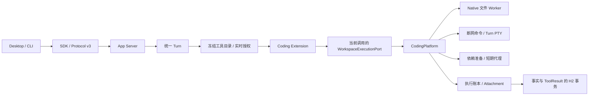

# 统一聊天与编程智能体

本文记录统一 Coding 执行链的实现边界。发行是否可用以验收矩阵的实际 Runner 证据为准；代码存在、工具注册、
条件跳过和测试替身成功均不代表三平台生产验收完成。

## 组织与权限

聊天、文件检查和开发命令继续使用同一个 `DefaultTurnHarness`。Role 只表达职责和收窄约束，
`CodingExtension` 提供工具目录，`CodingPlatform` 拥有真实 IO。没有新增第二个编程调度循环，也没有新增 Maven 模块。

`BuiltinExtensionHost` 仅为已经通过工具授权的 Coding 调用创建单次 `WorkspaceExecutionPort`。端口不接受新的
命令参数，捕获真实 Turn、工具身份、原参数、取消信号及有效权限；返回结果还须与平台封存的响应一致。
第三方扩展、普通管理 RPC 和离开 Handler 作用域的调用不能取得该执行能力。

扩展启用、软件开发 Role、环境配置和工具链安装均不授予权限。正在运行的命令持续复核扩展状态、Turn 状态、
执行根及有效权限；权限收窄后关闭资源，后续操作重新经过正常工具审批。

## 文件与外部副作用

`file_list`、`file_read`、`file_search` 和 `file_apply_patch` 只接受相对路径。Native Hosts 的固定 Worker 在
操作系统沙箱内执行文件访问。POSIX 逐段打开固定目录句柄，Windows 使用 `NtCreateFile` 的 `RootDirectory`
和 `OBJ_DONT_REPARSE`；读取、列举、搜索与摘要均相对于仍持有的父目录完成，不将验证后的路径重新打开。
Windows ACL 在同一对象句柄上读取、设置和恢复。文件扫描、返回条数、字节和运行时间都有上限。
UTF-8 分页保留完整字符边界；二进制不作为文本修改。

补丁使用完整目标 SHA-256 或不存在条件，不执行模糊匹配。全部目标预检完成后，原内容、新内容和完整 Diff
进入 Attachment 内容寻址存储。POSIX 修改使用 macOS `renameatx_np(RENAME_SWAP)` 或 Linux
`renameat2(RENAME_EXCHANGE)` 原子交换，目标持续存在，实际旧 inode 同时进入本次操作独占的
`.javaclaw-recovery-*` 目录。Windows 当前先保存旧 inode，再以不可覆盖移动安装新文件；两步之间可能观察到
目标暂时不存在，**Windows 尚未满足原方案的单次原子替换要求**。所有平台的摘要预检均不是 SHA-256 原子 CAS。
恢复目录保留旧 inode、提案和操作记录，`recoveryPaths` 回执公开位置；文件工具排除并拒绝直接修改这些内部目录。
当前没有自动清理恢复目录；完整 Workspace 命令写权限也不保证恶意项目脚本无法删除该目录，平台 CAS 中的原始备份独立保留。
移动在底层表现为有条件删除和创建，面向 SDK 的回执合并成移动记录。已应用事实由平台生成，不由扩展生成。

执行根租约协调 JavaClaw 内部写入，不能锁住用户编辑器。回退先核对当前文件是否仍匹配本次写入摘要，
POSIX 交换后再次检查实际捕获的 inode；外部编辑发生在最后检查与交换之间时立即保留双方材料并报告
`RECOVERY_REQUIRED`，不反复交换追逐当前路径。成功后也保留旧 inode，使持有旧 fd 的编辑器后续写入仍可找回。
H2 回滚不撤销文件修改；副作用已开始但结果或事实提交无法确认时记录 `UNKNOWN_OUTCOME`，
保留备份和意图，禁止自动重放。

`CodingOperationRepository` 的意图绑定 Turn、Workspace、调用 ID、执行根、参数、冻结环境和权限摘要。
同一调用异参拒绝。`H2TurnJournal` 在同一事务提交可信 Command / FileChange、ToolResult、EffectReceipt、
执行账本入账标记及 checkpoint。命令原始输出与终端分块输出保存 blob 引用和原始字节计数，展示解码不改变游标。

## 命令和终端

命令输入为逻辑可执行标识、argv、相对 cwd 和有限时限；不拼接 Shell、不从宿主 PATH 查找用户命令。
`ManagedCommandResolver` 将目录中已安装的精确版本解析为固定入口、必要运行库、解释器与缓存，平台批准的
`SandboxRuntimeAccess` 单独提供托管运行环境。模型不能通过参数增加文件根。

Maven 由冻结 JDK 直接启动发行版 ClassWorlds 入口。服务端安全读取 `-f` / `--file` 指定项目及执行根内的
`.mvn` 祖先，确定 `maven.multiModuleProjectDirectory`，并读取有界的 `.mvn/jvm.config`。首版接受明确的无引号
参数子集；有歧义的 shell 语法、参数数量或大小超限、与托管 home/tmp/JDK/代理冲突的属性均明确拒绝。
不继承宿主 `MAVEN_OPTS`。实际 argv、目录、配置存在性及摘要在进程启动前保存，原依赖准备计划仍完整保留。

每个 Turn 默认一个进程槽，batch 和 PTY 共用；隔离子任务仍受已有并发和累计预算约束。
命令期限取请求、进程权限与 Turn 剩余墙钟预算的最小值。读取输出不能续期。非零退出码表示失败，
PTY 创建成功只表示会话已启动。

batch 输出由 Native Hosts 在共享字节预算内同步观察，stdout/stderr 使用同一提交顺序的原始字节游标。
`CODING_COMMAND_STREAM` 和 `CODING_COMMAND_CHUNK` 保存冻结上限、观察状态及 CAS 引用；最终完整输出仍保留在既有
命令回执中。执行中的查询不要求模型工具已经返回，也不启动新的项目进程。迟到帧不能越过 Turn、操作或输出流的终态。
batch 与 PTY 均按原始字节推进游标，读取前至多取三个前缀字节完成 UTF-8 跨页解码；中文和 emoji 只在完整字符
到齐的页面输出。`terminal/output` 不将状态说明伪装为进程字节，未知结果由执行摘要说明；工具读取及元数据仍提供
未知原因。Turn 已终结但没有确认退出的执行显示未知，已有真实退出则保留其状态及退出码。

App Server 拥有所有会话、原生句柄和工具链租约。完成、取消、失败、结果未知、撤权、扩展停用和关闭服务
都经过幂等终结。清理必须收集有限输出、记录实际终态并释放资源。重启只将遗留活动命令标为未知，
不恢复裸 PID、不重发 stdin、不重新启动结果未知的操作。
PTY 终结同时等待权限监视器退出，避免作用域结束后继续访问权限数据库。batch 输出观察者可能正在持久化证据，
因此不能用 `Future.cancel(true)` 或 `shutdownNow` 强制中断；先回收自有进程和管道，再有界等待，超期明确记录
清理未完成和未知结果，不将未退出的观察者当成已释放资源。

Windows 使用应用私有的跨进程 ACL 租约序列化授权与恢复，修改前持久保存对象身份、原始 DACL 及 pending 标记。
辅助进程通过不可由项目进程写入的控制通道报告清理结果；命令退出码不能伪装 ACL 恢复成功。恢复无法确认时，
`WORKSPACE_SECURITY_EVENT` 保留隔离证据，并阻止当前执行根及重叠根的新执行。服务重启不会自动清除此状态。

PTY 输入先持久化单调序号及内容摘要，再发送原始字节，确认后标为已交付。相同已交付输入不重复发送；
交付结果未知时关闭会话并保留证据。Desktop 和 CLI 首版展示输出并提供 Turn 取消，人工 stdin 不作为管理 RPC 暴露。

## 环境和依赖

`coding/toolchains-v1.json` 是经审阅的发行目录，固定 Temurin JDK、Apache Maven、Gradle、Node/npm、pnpm
以及 python-build-standalone/pip 的版本、平台、架构、下载 URL、摘要、许可证和入口。目录中的容量是下载硬上限。
版本默认值来自发行顺序，不在运行时解析 latest。应用运行时与项目工具链分开管理。

`ToolchainManager` 通过 Extension Job 进行流式下载、摘要验证、安全解包、staging 检查和原子发布。
安装过程中不执行项目脚本。安装记录与作业、初始事件、幂等记录在 H2 同事务建立；失败留下真实状态。
同内容可被 npm/Node 等不同逻辑种类引用，活动租约禁止安装替换正在运行的制品。下载不能阻塞无关执行释放租约。

项目声明在 Turn 创建的数据库事务之前受限读取，选择结果与摘要在创建事务内冻结。显式环境版本优先，
默认版本只能选目录中兼容的条目。冲突按工具种类保存，实际调用该工具时报告，不阻断无关聊天。
恢复、子任务和自动化继承原始选择；缺少证据的 legacy 快照不能根据当前机器静默重建 Coding 环境。

`dependencies_prepare` 只由当前 Turn 的工具调用启动。执行前记录原生包管理器命令、锁文件和清单摘要、
工具链版本、缓存写入范围及允许仓库。Maven 预热依赖和插件；Gradle 使用目标或项目任务预热；npm 有锁用 ci；
pnpm 遵守锁和 store 策略；pip 安装到隔离缓存中的 venv。依赖图由原生包管理器解析，平台不实现替代解析器。

准备阶段的脚本、构建后端和子进程均属于同一授权进程树。关闭脚本策略时，npm/pnpm 传递原生禁用选项；
Maven/Gradle/pip 无法保证不执行项目逻辑时拒绝准备。准备结束关闭联网进程和代理租约，之后使用新的断网构建进程。
清单与锁文件变化不因安装失败而假装回滚。缺少编译器、系统库或其他组件时保留原生命令错误。

## 网络与平台

普通命令及 PTY 采用 `OFFLINE`。依赖准备采用 `PROXY_ONLY`，由 `CommandProxyBroker` 提供短期 HTTP CONNECT
租约，绑定 Turn、操作、命令摘要、权限、仓库 host:port、字节、并发和期限。每次连接校验 DNS、公网地址和授权，
直接连接固定解析地址。原 `NetworkBroker.exchange` 保留，用于结构化 HTTP 请求；工具链下载另有流式受控端口。

CONNECT 保持端到端 TLS，代理不承诺请求路径、HTTP 方法或禁止上传，也不能逐条审计隧道中的 HTTPS 请求。
仓库配置只覆盖公开 HTTPS 源和明确授权的公共镜像；私有源凭据需要额外 relay，不在当前协议内。

macOS 使用 Seatbelt，Linux 使用独立 network namespace 与受控 IPC relay，Windows 使用临时 AppContainer
和固定网络辅助服务。Windows 服务拥有唯一 `KILL_ON_JOB_CLOSE` 根 Job，使用 SID 持久默认拒绝和动态精确代理允许，
服务失败后不保留动态允许。清理顺序和安装、升级、卸载约束见威胁模型；真实 Windows 系统验证不可用跨编译替代。

## 长任务、迁移和客户端

模型容量按精确 Provider revision 独立版本化。每次调用前检查窗口，估算包括固定指令、消息、工具参数、
完整 Schema 和 Provider state；累计 TurnBudget 不因压缩返还。缺失容量时明确标记政策默认值，采用 32768 窗口
和 4096 输出容量。默认 85% 触发、60% 目标，并为输出和误差预留空间；一次调用前最多压缩一次。

历史摘要只作为有来源的历史参考数据，不能成为 SYSTEM 或 DEVELOPER。当前输入和完整工具调用/结果组保留，
未完成工具组不压缩。原生压缩包含旧 state 和未覆盖增量，独立记录意图、ordinal、checkpoint revision 和真实 usage。
窗口、usage、压缩结果和 checkpoint 原子提交；远端结果未知不重放，已提交 usage 不重复计费。

保留全部 V001 原文及 checksum；V002 增加容量与上下文账本，V003 增加 Coding 环境、执行、终端、工具链与网络授权。
V004 增加 batch 输出流与分块账本，已有 V001–V003 原文保持不变。
有序 migration 在执行前登记 pending checksum，DDL 部分完成后重复验证与续建，验证成功才登记版本。
程序拒绝高于自身支持范围的数据库。继续使用 data-v6，不读取 data-v5；回退使用升级前备份，不承诺旧二进制读取升级数据。

Protocol v3 既有严格 DTO 不变，通过新能力、模型容量 RPC 和独立 Coding v1 Schema 扩展。
`CodingExtensionClient` 管理环境、安装 Job 和资源查询。Transcript 使用真实回执展示命令、退出码、Diff、准备与终端，
`execution/list` 发现当前作用域的服务端操作标识，客户端通过 SDK 按游标读取后续输出，服务端重新核验每条记录的权限。
未知 Schema 有文本回退，终端控制字符不能触发宿主操作。Desktop 沿用既有布局、CSS 和 SDK 路径；CLI 保持最终 JSON、
诊断、审批和退出码约定。

## 验收与已知验证边界

默认测试使用固定模型替身、本地网络服务和小型制品；真实发行归档测试显式指定本地文件，不能宣称已验证生产下载链。
完整验收还要求同会话的聊天—查项目—准备—修改—断网测试—修复—Diff—聊天，以及 macOS arm64/x64、Linux arm64/x64、
Windows x64 五个 Runner 的原生隔离和安装验收。未执行或条件跳过的 Runner 记录为未验证。

实际 Gradle 9.1 构建在 macOS 严格网络策略下失败：原生锁协调器绑定动态 UDP 端口，Java 编译和测试 worker
还需要动态本机 TCP；`--no-daemon` 不能移除这些通信。当前 macOS 没有为项目提供私有网络命名空间，故尚未满足
完整 Gradle 构建目标。扩大本机网络权限会改变既定隔离边界，引入虚拟化执行环境也会改变原架构；范围选择尚待确认。
Linux 私有命名空间及 Windows AppContainer 的实际 Gradle 构建仍须各自验证，不能由 macOS 结果推定。
