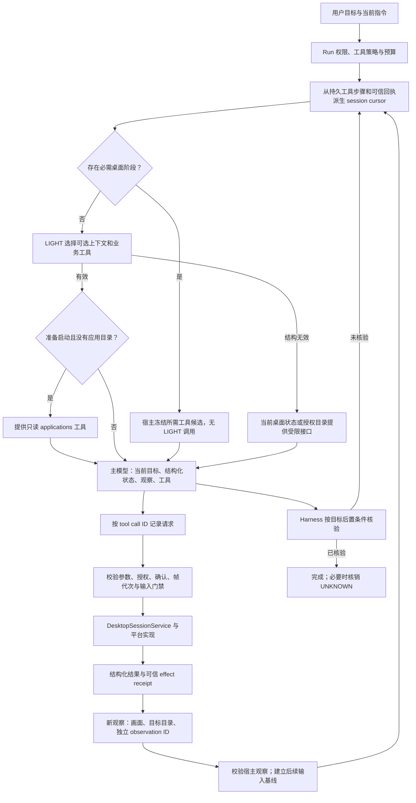

# Computer use 调用链与结构协议

## 本次故障

2026-09-30 18:46 的 `refine_v2` 收到轻量模型输出：一个 `<tool_call>` 前缀，随后是完整的规划 JSON，没有闭合标签。原始响应没有 native tool calls。直接按 JSON 解析时，第一个字符 `<` 导致 `INVALID_JSON`，随后规划异常使本轮暂停。

该轮启动应用和打开会话已经成功。桌面观察执行了四次；一次点击的可信回执为 `UNKNOWN / MAYBE_SENT / BACKGROUND_SEMANTIC`，随后进行了新观察。这个回执表示输入效果尚未确认；日志不能据此断言没有发送输入，也不能把它解释为缺少系统权限。最后失败的规划没有再次派发点击。

### 启动失败与应用身份纠正

2026-10-02 22:51 的启动请求使用“飞书”。本机系统登记的应用是 `Lark.app`，原生精确解析在调用系统启动 API 前返回 `-3`。旧链路把这个失败保存为缺少 `delivery` 的 `FAILED`，重复请求被非幂等保护拦截；后续权限探测还挤掉了主模型上下文中的原始启动失败。

现在启动前通过只读 `desktop_session_applications` 获取系统名称、显示名、别名、`applicationId` 和 `launchName`。主模型按用户目标选择真实应用，将 `launchName` 原样传给启动工具，不用展示名猜测系统标识。目录分页保留完整身份，`truncated` 表示目录不完整；缺项不能证明应用未安装。目录名称是未可信元数据，不提供操作授权。旧原生库缺少目录扩展时保留结构化失败，兼容已有精确名称启动接口。

启动前拒绝使用 `DesktopApplicationLaunchRejectedException`：参数、能力、权限和原生 `-1/-2/-3/-4` 拒绝记录 `FAILED / NOT_SENT`。这类失败可纠正参数后重试。系统调用之后的失败（包括 `-6`）、超时、进程未确认或未知 provider 异常保持 `UNKNOWN / MAYBE_SENT`，先发现窗口；不得通过换名称直接重发。已有缺少派发证明的历史记录继续保守保护，不从旧错误文字推断未派发。

`OnDemandApplicationRecovery` 读取工具步骤和 framework core 回执，绑定原请求、拒绝原因和本轮目录交换。后续 probe 不丢失这些证据。`ComputerUseContextSelection` 在首次可选规划选中启动时先冻结只读目录工具；明确名称拒绝进入目录恢复；结果未知进入窗口恢复。宿主选择工具 schema，实际操作仍由主模型请求。

## 设计依据

采用公开 computer use 实现共有的调用结构：宿主维护环境、模型请求明确的动作、宿主执行并返回新的观察、模型根据结果继续或完成。

- [OpenAI computer use](https://developers.openai.com/api/docs/guides/tools-computer-use)：结构化动作、call ID 与结果关联、动作后返回截图、环境状态与对话状态分别维护；已有 UI function tools 可继续使用。
- [OpenAI CUA 示例项目](https://github.com/openai/openai-cua-sample-app)：持久执行环境、输入处理和截图循环。
- [Anthropic computer use](https://platform.claude.com/docs/en/agents-and-tools/tool-use/computer-use-tool) 与 [官方示例](https://github.com/anthropics/anthropic-quickstarts/tree/main/computer-use-demo)：明确动作参数、tool use/result 关联、宿主负责工具实现。

这些接口的供应商 JSON 外壳并不相同。JavaClaw 保留现有 function tools，使用平台和模型无关的内部协议；不把某家供应商的字段形式称为统一行业 JSON 标准。未知输入不得直接重发是 JavaClaw 的恢复约束。

## 实际调用链

`OnDemandContextSession` 在可选规划之前通过 `ComputerUseContextSelection` 派生 `ComputerUseSessionCursor`。必需的 `applications / targets / open / observe` 通过已有 `OnDemandToolSelection.retrieveExact` 冻结成候选目录，使用原有回调、工具策略和预算校验，不自动执行操作。

可选规划的 `ModelTaskOutputException` 可以退回宿主接口选择。权限拒绝、未经授权的上下文来源、预算不足、持久步骤不一致以及结果未知的异常继续按原流程处理。固定必需上下文仍经过正常读取门禁。

### 任务切换与持久恢复

暂停后的新目标由 `InteractiveTurnRouting` 路由到新的 Run；继续、精确重试与等待输入的回答仍使用原 Run。`RunRecoveryCoordinator` 恢复原锁定期限和预算，过期任务直接终结为 `RUN_TIMEOUT`。它读取 `JdbcRunHistory` 的完整会话记录，按来源 Run 隔离并继承未解决的效果保护，避免取消或重启导致重复投递。审批和工具调用计数不跨新任务继承。

`PersistedToolCallCodec` 只解码持久调用、校验已冻结的工具可见范围与重放结果；`HarnessProtocolFeedback` 读取持久决策拒绝记录并生成有界的结构纠正反馈。`AgentEngine` 管理执行生命周期，`OnDemandContextSession` 管理可选规划，电脑操作阶段选择由 `ComputerUseContextSelection` 统一处理。

## 会话状态

| phase | 依据 | 提供的下一步 |
| --- | --- | --- |
| `BOOTSTRAP` | 当前 Run 没有可信桌面会话 | 正常可选规划；格式失败时只提供授权工具目录 |
| `DISCOVER_APPLICATIONS` | 首次准备启动，或真实应用身份尚未确定 | `desktop_session_applications` |
| `SELECT_APPLICATION` | 安装应用目录已返回，或目录扩展不可用 | 选择目录 `launchName` 启动；有更多目录页时可继续只读发现 |
| `DISCOVER_TARGETS` | 已启动应用但尚无窗口，或启动结果未知 | `desktop_session_targets`，避免重复启动 |
| `OPEN_SESSION` | 已获得对应窗口目标 | `desktop_session_open` |
| `OPEN_CONTROL` | 当前会话没有控制能力，且需要输入导航 | 同一目标的 `desktop_session_open(control=true)`；成功后重新观察 |
| `OBSERVE` | 已打开会话、动作已派发、帧已失效 | `desktop_session_observe` |
| `READY` | 当前会话有可信有效观察；未知输入已被新的宿主观察基线覆盖 | 主模型依据本次观察决定新动作；旧业务效果仍可能未知 |
| `RECONCILE` | 输入结果未知，尚无可用的可信后续观察基线 | 获取有效观察或请求 harness 核验；不重放旧输入 |
| `RECOVER_SESSION` | 完整、owner scoped 的目录证明句柄过期，或新 Run 需观察继承的未知输入但尚无当前句柄 | `targets → open → observe`；保留原操作与效果记录 |

内存会话目录未知或不完整时，不凭“目录中没有该 ID”推断会话过期。原生会话不随对话恢复自动重建。恢复阶段先提供所需工具，由主模型请求真实窗口目标并打开；应用名、历史会话名或猜测 UUID 不能作为原生会话 ID。句柄恢复、后续输入基线和业务效果验收分别判断。

系统输入权限与会话控制能力分别判断。Cursor 的 `controlAccess` 为 `UNKNOWN / READ_ONLY / GRANTED`，只接受配对的宿主 Open/Observe 原始结果与回执中的实际 `controlGranted`；`controlRequested`、屏幕文字及 probe 成功都不能授予会话控制能力。只读或能力未知的会话可继续观察，输入工具在本次 provider 投影中隐藏，包括先前已激活的输入工具。需要导航时按既有授权流程提升同一目标的会话，升级前的观察不能用于输入。

## 工具结果协议

机器数据仍使用 `schemaVersion: 1`，增加 `protocol: "computer-use"`，保留旧消费者读取的字段和 `kind`。

| kind | 主要字段 |
| --- | --- |
| `desktop.probe` | `available`, `providerId`, `capabilities`, `detail`, `nextStep` |
| `desktop.targets` | 有界窗口目录；每项独立 `targetId`、PID、所属应用与可见性 |
| `desktop.applications` | 有界安装应用目录、独立 `applicationId` / `launchName`、别名、分页和截断标记 |
| `desktop.launch` | 请求的应用、admission、delivery、拒绝原因或 PID、对应窗口、下一阶段 |
| `desktop.session` | `sessionId`, `target`, `controlGranted`, `nextStep` |
| `desktop.observation` | `sessionId`, `targetId`, `observationId`, `controlGranted`, 窗口代次、内容修订、帧尺寸、目标目录与不可信屏幕内容 |
| `desktop.action` | 动作类型、请求帧标识、`admission`, `delivery`, `effect`, `reason`, `nextStep` |
| `desktop.error` | 结构化错误分类、会话、输入派发状态与下一阶段 |
| `desktop.snapshot` / `desktop.state` | 有界截图描述或会话状态 |
| `computer_use.cursor` | 当前 phase、所需工具、会话/目标/观察、`controlAccess`、未决 invocation IDs、已观察的 pending IDs、可信 evidence refs |

这些数据实际经 `ToolEffectCapture.noteData` 接入工具结果，不仅存在于 DTO 中。`SpringAiToolCallback` 仍返回统一的工具结果 envelope。屏幕正文位于 `content`，标记为 `UNTRUSTED_SCREEN_CONTENT`，不参与授权。

### 动作语义

- `admission`：工具本次请求是否执行成功、失败、需重新观察或结果不确定。
- `delivery`：`NOT_SENT / SENT / MAYBE_SENT`。明确未派发的参数失败必须提供可信 `NOT_SENT` 证明；执行开始后丢失结果保守保持 `MAYBE_SENT`。
- `effect`：输入接口返回成功仍不证明用户的业务目标完成。动作结果保持 `UNKNOWN`，业务后置条件由可信任务核验确认。
- `reason`：区分系统权限不足、会话控制能力未取得、帧过期、不支持语义操作和输入效果未确认。`SESSION_CONTROL_REQUIRED` 表示会话只读，不表示系统权限被拒绝。
- `nextStep`：`OBSERVE / RECONCILE / CHECK_PERMISSIONS / OPEN_SESSION` 等类型；会话只读返回 `OPEN_SESSION`，真正系统权限拒绝返回 `CHECK_PERMISSIONS`。

每次输入都使用当前观察的 `observationId`。坐标空间为 `WINDOW_FRAME_PIXELS`，与帧宽高一致；显示缩放、窗口移动和平台转换仍由已有平台实现处理。目标成员、窗口代次与内容修订检查保持在服务门禁中。

### 编号与关联

工具候选 `tN`、上下文候选、历史交换、`sessionId`、`targetId`、`observationId` 和 `evidenceRefs` 分属不同目录和字段，不能互相代替。只有当前目录成员可被选择。工具请求通过 `model/<modelStepId>/<toolCallId>` 与持久工具步骤和回执关联。

Cursor 读取当前 Run 的 framework core 事件，并查询 `RunControl` 继承的输入保护。未决调用的 `pendingInvocationIds` 保留，`observedPendingInvocationIds` 表示已取得后续输入基线；它不表示原操作成功。

### 后续输入基线与业务验收

四层使用相同边界：`RunControl` 校验本次动作与宿主基线，`JdbcRunStore` 在持久预留时重新核对，`ManagedSession` 校验原生输入已结束及新画面提交，Cursor 按相同证据提供 `READY` 接口。基线要求完整的宿主 `core.tool.started / core.tool.completed / core.tool.receipt` 关联，原始观察与可信收据的目标、当前会话、`observationId`、窗口代次、修订号和采集时间一致。帧须在旧输入尝试之后采集；服务还要求原生调用结束、等待稳定时间并成功完成视觉解释与观察提交。

有效基线仅允许以该新观察决定后续输入。旧帧和旧调用不得重放，原动作的 `UNKNOWN / MAYBE_SENT` 及业务效果记录不改写为成功；`core.effect.reconciled / SATISFIED` 仍须严格的动作与任务验收证据。基线不证明原逻辑动作未生效，也不保证重复该逻辑动作没有副作用，模型应先检查当前状态。

可信、唯一、有序并绑定同一次输入的 `FAILED / NOT_SENT` 回执证明操作未发送，不消费所请求的观察；数据库预留与内存门禁均允许后续安全重试。缺失、冲突回执以及 `SENT / MAYBE_SENT` 继续保留保护。是否重新观察还取决于服务返回的恢复阶段：控制升级、帧过期等情况仍须获取新观察，不能仅凭 `NOT_SENT` 绕过会话或帧校验。

跨 Run 保留来源明确的历史保护，但不复用旧帧。当前句柄缺失时，恢复阶段按 `targets → open → observe` 建立新的宿主基线；重新打开可以产生新会话 ID，后续输入仍须绑定该新会话和同一实际目标。失效、外来、未配对的观察和展示文字均不能建立基线；清空历史、换名称或直接重发旧操作不能代替恢复。

## 模型输出格式边界

内部 ModelTask 接受一个完整 JSON 值、一个完整 JSON code fence，或单个精确 `<tool_call>` 包装（可缺最后闭合标签）。归一化后仍严格检查单值、重复键和输出 schema。不会从 HTML、任意正文、多个标签或工具调用 envelope 中抽取规划字段。

辅助 ModelTask 的 native tool calls 明确拒绝；业务工具仍通过主模型请求和宿主工具执行链。原始模型响应先持久记录，归一化不改写审计数据。

## 回归范围

- 原始 `<tool_call>` 格式及歧义/恶意格式反例。
- 跨应用、跨模型的启动、打开、观察、动作和再观察循环。
- 可选规划失败后的授权目录和当前帧恢复。
- UNKNOWN 与可信后续输入基线、严格业务核销、丢失收据、跨 Run 恢复及旧帧禁止重放。
- 当前 Run、owner、会话和目标绑定；完整/不完整会话目录与旧帧失效。
- 工具策略、调用预算、schema 预算和持久 provider prompt 恢复。
- typed payload 与可信回执派发分类一致。
- 应用目录名称/身份/启动标识、分页预算、旧原生库兼容、权限撤销与 scope 关闭。
- 未派发名称失败跨 probe 恢复，未知启动保留保护，原生启动返回码分类。

这些回归使用模拟桌面服务；真实应用是否展示目标页面仍需当前环境的观察证据，不能从单元测试或启动回执推断。
