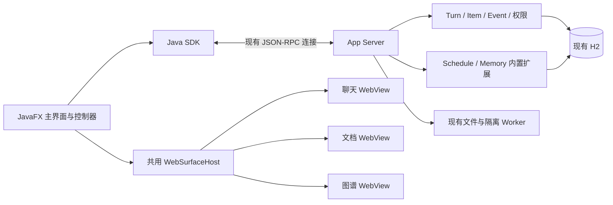

# JavaClaw 聊天、文档预览、后台任务与记忆图谱设计方案

版本：V2，2026-09-07。状态：设计提案，尚未实施。

本方案完整替代上一版以 150ms 增量轮询为主的设计。正常聊天使用 App Server 主动通知；
查询接口用于初始化、历史浏览与故障恢复。本文不代表相关能力已经完成，也不替代现行 v6 架构的实现状态记录。

## 1. 目标、边界与已确认决策

在保留现有 JavaFX 布局、CSS 令牌、交互语言和 SDK／App Server 分层的前提下，实现四组能力：

1. 聊天正文改用 WebView，支持可靠的真实流式输出。
2. 在聊天右侧提供统一文档预览，展示引用的文本、代码、图片和 Markdown。
3. 完善后台定时执行及其状态查看、管理和取消。
4. 按工作空间定时沉淀记忆，提供冲突处理，并使用 WebView 展示记忆图谱。

### 1.1 产品决策

| 项目 | 确定方案 |
| --- | --- |
| 主界面 | 保留 `509f197` 的 JavaFX 设计体系；不重新设计产品外观 |
| WebView 范围 | 聊天正文、文档内容、图谱画布；导航、输入、审批、工具栏和表单保持原生 |
| 消息传输 | App Server 经现有 JSON-RPC 连接主动推送，SDK 负责订阅与恢复 |
| 文档组件 | CommonMark＋项目自有 WebView 组件，不引入原指定的 JavaFX-Markdown-Preview 库 |
| 文档位置 | 复用聊天右侧区域，通过原生“待处理／文档”切换，保持审批提示和入口 |
| 首期格式 | 文本、代码、PNG／JPEG／GIF 图片、Markdown；只读 |
| 后台运行 | 复用 Schedule、Extension Job、用户级 App Server 和既有登录启动管理 |
| 记忆范围 | 按 Workspace 隔离；首次回扫固定的最近 30 天，随后增量处理 |
| 自动接受 | 仅可逐字核验且通过现有低风险规则的原文事实 |
| 人工确认 | 摘要、改写、推断、实体别名合并、语义关系和冲突决策 |
| 图谱技术 | Cytoscape.js；Memory 保存领域记录，图谱显示投影可重建 |

首期不新增 PDF／Office 阅读器、文档编辑器、任意 HTML 执行环境、独立浏览器服务、图数据库或第二个调度器。
代码高亮与代码编辑、Markdown 预览与 Office 渲染分别属于不同能力，不能混同交付。

### 1.2 已核实的工程基础

| 当前实现 | 本次扩展方式 |
| --- | --- |
| `StreamRpcConnection` 支持通知与响应共用连接，发送帧已有互斥保护 | 保留本地 socket／pipe／stdio 及长度前缀协议 |
| `ExtensionEventHub` 已有主动通知、每连接有界队列和慢客户端断连 | 复用连接与有界发送机制，新增聊天持久事件的订阅投递 |
| `RpcClientConnection` 有常驻 reader，可在无请求时接收通知 | 增加强类型聊天通知、连接失效通知和恢复协调 |
| SDK 同一连接当前只有一个在途请求 | 保留该限制；主动通知不要求请求多路并发 |
| `DesktopPresenter` 已有通知订阅与 connection epoch | 增加有界归并，避免每个 token 都提交一次 UI 调度 |
| 当前聊天主要展示持久 Item，附件投影不完整 | 补齐公开文字流、附件和类型化文件引用 |
| 已有 Schedule、Occurrence、Job、无人值守授权和管理页面 | 补齐状态关联、异步 Action 与活动执行控制 |
| 已有 Memory、Proposal、来源核验、版本历史、`AUTO_LOW_RISK` | 增加学习作业、证据扫描、冲突事务和图谱数据 |

既有 Extension 通知主要表达状态失效，并不等于已经实现高频、可恢复的聊天文本流。
本次补齐的是业务事件和可靠投递，不重建通信系统。

## 2. 架构与职责



- App Server 继续是唯一组合根和 H2 owner；扩展通过现有托管事务访问自己的数据。
- Desktop 只使用 SDK；不能直接查询数据库、调用 Runtime 或读取工作空间文件。
- WebView 只持有可重建的展示副本，不能调用模型、SDK、文件系统或任意 Java 对象。
- Harness 继续只执行一个 Turn，不识别学习阶段或调度业务。
- 模型调用、权限冻结、实时撤权、EffectReceipt 和 `UNKNOWN_OUTCOME` 恢复契约保持不变。
- 浏览器工具 Worker 继续服务工具执行，不承担聊天页面渲染。

### 2.1 三种进度必须分开

| 进度 | 责任与语义 |
| --- | --- |
| 服务端持久 cursor | 公开事件已经提交到数据库，能够重放 |
| SDK／Java 已应用 cursor | 事件已成功归并进 Java 展示状态，作为连接恢复起点 |
| WebView render revision | 页面已应用某个展示版本，仅用于绘制确认与恢复 |

收到网络帧或把事件排入队列，不代表事件已经应用。WebView 暂时隐藏或重建，也不应阻止 Java 侧继续归并状态。
页面丢失时重放 Java 快照；连接丢失时从已应用 cursor 恢复；客户端进程重启时重新读取权威历史和活动 Turn。
三种恢复均不能重新提交用户消息或重跑模型。

## 3. App Server 主动消息流

### 3.1 公共接口与能力协商

在现有协议中增加协商能力 `core.turn-stream-v1`，仅对已协商且显式订阅的连接发送聊天通知。

| 方法 | 类别 | 输入与输出 |
| --- | --- | --- |
| `turn/stream/subscribe` | COMMAND，连接内控制 | subscriptionId、turnId、afterCursor；返回订阅回执 |
| `turn/stream/event` | NOTIFICATION | subscriptionId、公开事件或水位控制消息 |
| `turn/stream/unsubscribe` | COMMAND，连接内控制 | subscriptionId；幂等释放订阅 |
| `turn/stream/list` | QUERY | turnId、afterCursor、limit；返回有界事件页与下一 cursor |

连接控制仍使用现有 WriteCommand 外层，expectedRevision 固定为 0，表示不修改持久领域版本；
幂等范围限定当前连接。相同 subscriptionId 与相同参数返回同一活动订阅；不同参数冲突返回错误。
客户端不复用已关闭的 subscriptionId。退订重复执行安全，断连清理所有订阅资源。

订阅由 AppServerSession 持有的专用对象管理，不给普通业务 Handler 注入任意连接或全局服务定位器。
协议类型、MethodCatalog、JSON Schema、SDK 解码和契约测试同步增加。

未协商能力时保留现有已提交 Item 的展示和查询，不发送新通知，不宣称支持实时 token 流。
旧 Turn 缺少新流身份时只展示持久消息，不按文本猜测旧事件关联。

### 3.2 公开事件模型

每条数据事件包含 Turn、cursor、previousCursor 和强类型 payload。
STARTED、TEXT_DELTA、COMMITTED、CLOSED 另带调用编号、attemptId 和预分配的 messageItemId。
TURN_FINISHED 允许在首次模型调用前发生，不能为它伪造调用身份。

| 事件 | 语义 |
| --- | --- |
| `STARTED` | 开始一次可观察的模型调用，建立临时消息身份 |
| `TEXT_DELTA` | offsetUtf16、text；只包含允许展示的助手正文 |
| `COMMITTED` | 最终 Item ID、Item sequence 与内容版本；正文通过权威内容引用获取 |
| `CLOSED` | 无持久正文、取消、失败或未知结果；关闭本次临时输出 |
| `TURN_FINISHED` | Turn 终态和最终 Item 水位，与终态事务一起提交 |

公开事件采用固定版本的显式投影，不直接序列化原始 `CORE.EVENT`。
隐藏推理、工具参数、模型 opaque state 和凭据均不进入公开流。
不能因为内部类型名包含 ReasoningSummary，就假设内容适合公开；首期思考阶段只显示状态。

messageItemId 在模型调用意图提交时预分配，最终助手 Message 使用同一 ID。
COMMITTED 到达后替换同一气泡的临时正文，不追加另一条消息。
空结果不创建空白气泡；失败或取消后的临时文字可标记“未完成”，但不冒充已提交消息，也不进入自动学习证据。

offsetUtf16 采用 Java String 和 JavaScript string 一致的 UTF-16 单位。
分块不能破坏代理对；重复事件按身份处理，不能按重复文本去重。

### 3.3 游标和提交顺序

继续以 `CORE.EVENT` 中的公开事件为唯一持久来源，不新增第二套每 Turn 序号账本。

- cursor 是包含投影版本、Turn 身份和 EVENT sequence 的不透明编码，由服务端验证。
- 客户端只使用相等判断，不解析 cursor，不把全局 sequence 跳号当作丢包。
- previousCursor 指向同一 Turn、同一固定公开投影中的上一条事件；首条指向 START。
- 内部事件和其他 Turn 可以占用全局序号，不影响公开前驱链。
- 同一 Turn 所有公开事件写入先取得同一 Turn 行锁，再分配 EVENT identity，并持锁至提交。
- Message、checkpoint 与 COMMITTED 同事务；Turn 终态与 TURN_FINISHED 同事务。
- 增加 `(TURN_ID, SEQUENCE)` 查询索引，读取只前进到实际返回的已提交事件。

数据库自增序号本身不保证事务提交顺序，必须维护上述锁序。
模型完成前先排空本次调用的增量缓冲，不能在 COMMITTED 或 CLOSED 后追加旧调用文字。
模型已产生可见输出后不得静默重试并续接同一个 attempt；恢复继续遵守未知结果不自动重跑的规则。

### 3.4 无空窗订阅与投递

1. SDK 先生成 subscriptionId，登记本地处理器，再发 subscribe；因此可以接收早于 RPC 回执的通知。
2. 服务端验证权限、Turn、能力与 cursor，先登记提交唤醒监听，再从 afterCursor 开始读取日志。
3. 每个订阅只有一个 drain。历史重放与实时投递使用同一个日志读取循环，不切换两条数据路径。
4. 事务提交回调只标记“有新数据”，不直接发送 delta；发送器始终按持久日志顺序读取。
5. drain 结束前原子复查工作标记，避免最后一次唤醒落入退出竞态。
6. 客户端成功应用 TURN_FINISHED 并归并最终 Item 后退订，不能仅看到 turn/read 已结束就提前停止。

这样，即使两个事务的提交回调调度顺序相反，实际投递仍遵循持久事件顺序。
连接内重复订阅不会创建第二个发送循环；退出工作空间或切换会话取消旧订阅，旧 epoch 的通知不得覆盖新状态。

### 3.5 背压、丢失与重连

- 服务端最多每 50ms 合并一次模型文字，单个文字片段上限 16KiB；结束事件前立即 flush。
- 每页最多 128 条事件且序列化内容不超过 256KiB。大正文使用内容引用，不提高 RPC 帧上限。
- 订阅主要保留 cursor 和可合并的唤醒标记，不为每个客户端复制无界的 token 队列。
- 复用连接发送互斥；通知和响应帧不能交错。慢客户端发送超过 5 秒时关闭连接，让 SDK 进入恢复。
- SDK 增量缓冲同时限制 256 条事件和 1MiB；达到上限不能静默丢弃后继续，必须停止订阅并重同步。
- 活动订阅每 5 秒安排 WATERMARK，捕获持久水位 H，经同一 drain 先发完截至 H 的事件再发送水位和终态标志。
- WATERMARK 不能越过重放数据独立发送；Java reducer 按同一顺序处理控制帧，该通知不推进已应用 cursor。
- 前驱不匹配、缓冲溢出，或前序事件处理完后仍未达到 WATERMARK 的末端，触发游标恢复。
- 连续 15 秒没有订阅数据或水位时判定连接可能失活，进入重连；使用 1、2、4、8、15 秒上限及抖动退避。
- 连接恢复后重新校验权限，从 Java 已应用 cursor 建立新订阅并重放；服务端重启同样如此。

正常消息输出没有周期性查询。`turn/stream/list` 仅用于显式历史补拉和恢复诊断；
不允许为修复丢失偷偷恢复成持续高频轮询。WATERMARK 能发现末尾事件丢失且没有后续 delta 的情况。

如果 cursor 已不适用于当前日志或投影版本，返回明确的重新同步结果，SDK 从权威 Item 和可用活动流重建。
首期不新增独立流日志清理策略；沿用现有数据保留规则。不可重放的未提交片段不能被伪造为最终消息。

### 3.6 SDK 与 UI 调度

当前 SDK reader 会等待通知消费者返回，消费者超时会导致断连。因此通知回调只能校验、入队并安排处理，
不能同步调用 SDK 补拉，也不能进行 Markdown 解析或渲染。

由独立的恢复协调器发起 RPC；事件 reducer 顺序归并 Java 展示状态，成功后更新已应用 cursor。
WebView 更新按展示版本合并，最多保留一个待执行 UI drain。
允许跳过中间绘制版本，不允许跳过尚未归并的文本事件。

SDK 记录已处理的近期事件身份处理重复通知；遇到无法判定的新旧 cursor，不猜测顺序，
而是关闭当前订阅并从已应用 cursor 恢复。断线必须通知上层，不能等下一次用户发请求才发现。

## 4. 共用 WebView 宿主与白屏治理

### 4.1 生命周期和组件边界

新增 Desktop 内部共用 `WebSurfaceHost`，只负责页面生命周期、主题、窄桥接、状态确认、诊断和原生降级。
ChatRenderer、DocumentPreviewPane、GraphRenderer 分别管理自己的展示模型和用户操作。
接口只用于实际的模块边界及 WebView／原生可替换实现，不机械包装全部内部类。

三个区域各按需创建并持续复用一个 WebView，正常最多三个；不能每条消息、每个附件或每个节点创建浏览器实例。
页面尺寸跟随容器，正文在页面内部滚动，不把 WebView 高度扩展为整段聊天或整篇文档。

启动状态顺序为：

```text
WAITING_FOR_LAYOUT → LOADING → BRIDGE_READY → VIEW_READY → APPLYING_SNAPSHOT → VISIBLE
                                                              ↓ 超时／失败
                                                        RECOVERING → FALLBACK
```

- 容器已挂载且尺寸有效后初始化，避免在零尺寸节点上反复触发布局补丁。
- JavaFX 容器、WebView pageFill、HTML 背景使用同一主题令牌，不出现默认白底切换。
- SUCCEEDED 仅代表页面加载完成；安装强引用 Java 桥后执行页面 bootstrap，并等待 ready 和数据版本确认。
- 所有交互包含宿主代次、上下文身份和 render revision，拒绝旧页面／旧文档回调。
- 初始化或可见页面绘制确认超过 5 秒，显示原生状态并重建一次；再次失败进入原生简版。
- 页面隐藏时暂停布局和绘制确认计时，Java 状态仍可归并；恢复可见后发送最新快照。
- 关闭时取消任务、注销监听、释放桥接强引用和图片资源，不调用不存在的 WebEngine dispose API。

页面确认不证明操作系统合成器已经绘出像素。真实窗口截图、焦点切换、最小化、跨屏和 HiDPI 验收不能省略。
FX 线程死锁或原生 WebKit 崩溃不在进程内降级的可靠修复范围内，不能承诺“彻底杜绝所有白屏”。

### 4.2 降级与诊断

原生简版使用同一 Java 展示状态，保留正文、复制、引用入口、审批和停止生成。
图谱降级为原生列表和详情，仍可处理冲突；文档降级为分页文本、图片或文件状态卡。
提供原生“简版显示／重试显示”入口，恢复不触发业务重执行。

日志记录宿主状态、代次、加载／绘制耗时、数据量、DOM 数量、重建与降级原因。
不默认记录完整聊天、文档、模型隐藏数据或凭据。诊断区可以显示运行环境与版本，普通阅读界面不堆放技术信息。

### 4.3 主题、资源与安全

- 主题适配器从现有 AppearanceManager 及语义令牌生成 CSS 变量，覆盖外观预览、保存和取消，不维护另一套调色板。
- 模板、CSS 和脚本随安装包交付，离线可用，不依赖 CDN。
- Markdown 原始 HTML 默认转义；正文不能插入脚本、事件属性或 iframe。
- CSP 只允许受信任应用脚本和受控图片资源；图片、代码和文档内容不作为脚本执行。
- Java 通过固定函数及序列化数据调用页面，不拼接业务文本执行 JavaScript。
- 桥接只接受复制、引用预览、节点选择、消息定位等固定动作；Java 再验证 ID、上下文与动作参数。
- 桥接包按 JPMS 最小开放，保留桥对象强引用，所有 WebEngine 操作遵守 FX 线程约束。
- 外部 HTTP(S) 链接经用户操作交给系统浏览器；有 Java 桥的页面不导航到外部网页。

## 5. 聊天展示和文档预览

### 5.1 聊天展示

保留导航、原生输入区、键盘交互、审批和停止操作，仅替换消息列表的显示区域。
从 Item 投影生成类型化文本、工具状态、文件变更和附件卡，不依赖消息正文中的任意字符串猜测业务类型。

- ItemId 是稳定身份；流式临时状态与最终 Item 合并，不全量 setAll 整个列表。
- 首次读取最近 100 条历史记录，向上分页；条数和响应字节数同时受限。
- DOM 最多保留视口附近 128 条消息；Java 展示缓存最多 500 条且正文缓存不超过 32MiB。
- 超大正文用内容引用与分页读取；完整聊天不在首屏一次性加载。
- 只有用户位于底部时自动跟随；向上阅读后保留滚动锚点和新消息提示。
- 保存会话滚动位置；插入历史、图片完成和最终排版不能强制拉回底部。
- 原生输入框继续承担中文输入法、发送和取消快捷键，WebView 不自动抢焦点。

首段文字立即安排显示，后续绘制每 50ms 最多合并一次。
正在变化的消息每 200ms 最多解析一次 Markdown；完成消息按内容摘要缓存 AST／HTML。
流式正文超过 64KiB 后，新增长尾先用纯文本显示，最终再排版；单条完整排版上限 2MiB，超出交给文档分页组件。
代码高亮仅在代码块闭合或消息结束时执行，超长代码使用受控的源码阅读模式。
解析和序列化离开 FX 线程，DOM 仅更新变化部分并保留滚动锚点。

### 5.2 文档组件与交互

复用聊天右侧现有默认宽度和视觉令牌，增加原生“待处理／文档”切换。
查看文档时持续展示待审批数量及返回入口；文档加载不阻止处理输入请求或审批。
同一个组件承载聊天附件、文件引用、代码围栏和图谱证据。

| 内容 | 首期能力 |
| --- | --- |
| Markdown | 阅读／源码切换、表格、列表、引用、链接、查找 |
| 代码／文本 | 高亮、行号、行定位、水平滚动、分页和复制 |
| 图片 | PNG、JPEG、GIF 首帧；适应区域和缩放 |
| 未支持文件 | 文件元信息、明确原因和已有导出／外部打开入口 |

引用通过 `DocumentReference` 表示：

- Attachment：Workspace 与已有 AttachmentRef。
- WorkspaceFile：Workspace、Thread、规范相对路径、可选预期摘要和行区间。
- MessageContent：来源 Item、正文或代码围栏位置；超大正文也可按该引用分块读取。

引用从受信任的类型化 Item／工具结果或用户点击的相对链接生成。
客户端草稿片段只在本地展示，不能伪装为已持久化的来源 Item。

### 5.3 读取与版本

新增只读 DocumentPreviewClient：resolve、readChunk、resolveResource、close。
resolve 返回显示元信息、不可变版本句柄和摘要；readChunk 返回有界字节与后续游标。
同一预览的各页来自同一个版本，避免读取中途变更导致混版。

- Desktop 通过 SDK 获取内容；服务端复用 ThreadExecutionScope 和原生文件 Worker 的受控读取。
- Thread 的隔离 Worktree 与 Workspace 主根正确区分；客户端不能指定绝对根。
- 校验相对路径、根边界、符号链接、保留目录、读权限和 Worktree 生命周期，不使用宽松无权限构造路径。
- 工作空间文件由后端创建有界不可变预览快照；创建中检测到变化重试一次，仍变化则提示文件正在更新。
- 快照放入服务端受控临时缓存，空闲 5 分钟回收，总预算 128MiB；活动句柄不会被静默换成新版本。
- 每次读取重新检查来源归属和当前权限，缓存命中不授予访问权；关闭句柄释放引用。
- 有历史附件快照时标记“引用时版本”；没有历史快照的文件标记“当前文件”，不假装能还原旧版本。
- 当前摘要与引用摘要不同则提示变化；刷新显式创建新版本。

Attachment 增加 metadata 和真正的 channel 分块下载，保留原接口。
不能先整包读取再切片，不能靠提高 16MiB RPC 帧上限绕过大附件问题；完成下载时校验整体摘要。

### 5.4 资源和限制

| 参数 | 初始值 |
| --- | --- |
| 内容分块 | 256KiB |
| Markdown 完整排版 | 最大 2MiB，超过转分页源码 |
| 单个预览源 | 最大 64MiB，超过显示超限状态 |
| 文本显示页 | 最多 500 行，并受分块和单行预算约束 |
| 单行显示 | 超过 16KiB 分段显示，保留真实行号，不将片段冒充新行 |
| 图片压缩内容 | 最大 10MiB |
| 图片解码像素 | 最大 2000 万像素 |

默认识别 UTF-8 及带 BOM 的 UTF-16；无法可靠解码时显示明确状态，不静默替换成乱码。
图片检查实际格式与像素大小，不能只信 MIME 或扩展名；不直接执行 SVG。
Workspace Markdown 相对资源由服务端按父目录和同一权限范围解析。
独立上传 Markdown 只有存在明确关联附件时才解析相对图片；缺失或歧义显示占位，不猜测宿主路径。
不允许页面读取 file://，不自动下载远程图片。受控 data／blob 资源在切换或关闭时释放。
每次切换使用请求代次和取消信号，旧请求的迟到结果不能覆盖新文档。

## 6. 后台定时任务

### 6.1 执行模型

继续使用 Schedule → Occurrence → Extension Job → 工作单元 → Turn／已注册 Action。
H2 是权威数据源，Quartz RAMJobStore 继续作为可重建触发投影，沿用启动恢复和现有对账。
不增加第二个线程池调度体系，也不改变当前单线程 Supervisor 的任务执行模型。

固定间隔、Cron、IANA 时区、目标版本、参数、执行配置、权限和预算都沿用现有契约。
保留 SKIP_IF_RUNNING 和 DO_NOT_CATCH_UP，不隐式改成并行执行或大量补跑。
需要无人值守工具授权的操作在授权不匹配时明确失败，不生成无人处理的交互审批。
没有实际工具调用的纯模型执行不凭空要求工具 grant。

关闭 Desktop 后由用户级 App Server 和后台租约继续运行；登录启动沿用用户设置及现有管理机制。
不承诺关机、休眠或用户会话不可运行时执行，不自动唤醒机器。
开发用 stdio 子进程与安装包后台服务的生命周期需要在诊断和使用说明中区分。

### 6.2 管理与状态

扩展现有“定时任务”“后台任务”页面，保留原生表格、表单、按钮和状态样式。
显示工作空间、目标、启停、时区、下次触发、最近结果、排队／运行耗时及失败／跳过原因。
支持创建、修改、未来五次预览、立即执行、启停、删除和执行历史。
建立 Schedule／Occurrence／Job／Turn 的类型化关联，活动 Turn 在创建时立即持久关联。

复用 extension/event 做状态失效通知，合并后通过 SDK 读取权威状态；
可见页面每 15 秒低频对账，隐藏页面停止查询。这里的对账不承担聊天文本流。
时间线按稳定时间游标分页，添加活动记录及时间索引，不扫描全历史。

| 操作 | 语义 |
| --- | --- |
| 停用计划 | 停止未来触发，当前执行继续 |
| 停止当前执行 | 持久化取消请求，显示“正在停止”，安全收敛后提交终态 |
| 暂停作业 | 在工作单元边界暂停，不将活动单元伪装为已暂停 |
| 删除计划 | 停止后续调度，保留执行审计 |
| 重试 | 显式创建关联原记录的新 Occurrence，不自动重放未知副作用 |

活动取消采用独立的持久控制请求，不能提前改写活动单元 revision 或终态。
Supervisor 通过 jobId 对应取消句柄传播到现有 Turn 取消机制。
工作单元返回并完成 EffectReceipt／未知结果收敛后，才写入 CANCELLED；取消不得统一记作普通失败。

### 6.3 异步可调度 Action

为 SchedulableAction 声明同步／异步结果模式；既有 Action 默认同步，保持原行为。
异步 Action 返回强类型 ScheduledActionResult，其中包含 ExtensionExecutionReceipt，
不从任意业务 JSON 推断 jobId，不让通用命令端口阻塞等待子 Job。

记忆学习 Action 使用 Occurrence 派生的幂等键提交子 Job 后立即返回。
Schedule 持久关联子 Job，Occurrence 保持 RUNNING；父工作单元交还唯一执行线程。
现有对账器根据子 Job 终态收敛 Occurrence，期间保持重叠门禁。
若子 Job 已创建而父关联未提交便崩溃，恢复必须获得同一个子 Job，且不能把终态回退成 RUNNING。

## 7. 工作空间学习、冲突和记忆图谱

### 7.1 数据归属与配置

Memory 继续保存当前有效记忆、Proposal、来源、固定状态、版本历史和删除记录。
知识文档索引继续负责文档检索，不把它改造成记忆数据库。

| 新增领域记录 | 用途 |
| --- | --- |
| LearningDefinition | 工作空间学习参数、模型执行选择、预算、固定回扫边界、关联 Schedule ID |
| LearningRun／Batch | 冻结证据清单、处理进度、消费、状态及恢复回执 |
| EvidenceReference | Item 身份、来源类型、原文范围、内容摘要和时间 |
| Entity／Assertion | 实体与经确认关系，关联 Memory ID、revision、证据和适用条件 |
| ConflictCase | 候选、相关旧版本、判定原因、状态和用户决议 |
| Workspace Memory head | 同一工作空间有效记忆及学习策略的共同 revision，保护跨记录条件 |

Memory 正文是事实权威；经人工确认的关系与冲突决议是版本化领域记录。
图谱节点、边和查询索引是上述记录的可重建投影，不维护第二份可独立改写的记忆正文。

学习频率和启停只由唯一关联的 Schedule 保存，Memory 不再保存一份可独立漂移的定时配置。
初始化可重入：先保存学习参数，再建立关联 Schedule；未建立成功时显示未启用，不假报后台已运行。
修改 LearningDefinition 后，旧 revision 的目标不能继续按新配置名义执行；更新关联目标并校验执行条件后生效。
领取学习任务和提交结果时均检查当前策略：OFF 停止新的模型调用和发布，SUGGEST 只允许创建待审提案，
不能只依赖作业启动时冻结的旧值。

### 7.2 默认值

- 工作空间默认不启动后台学习，由用户明确启用；已有 OFF／SUGGEST 设置不静默升级。
- 首次启用固定扫描启用时刻之前 30 天的合格对话，后续不会滚动删除尚未处理的历史范围。
- 默认每 6 小时触发；每个 Workspace 最多一个排队或运行中的学习 Job。
- 每个 Job 只处理一个有界批次，不立即自提交下一批，剩余内容留待下一周期。
- 每批最多扫描 200 个 Item，最多 1 次模型 Turn，整次输入 16000 tokens、输出 2000 tokens、工具调用 0 次。
- 模型 Turn 最长 120 秒；输入预算包含系统提示、输出 Schema 和其他上下文。
- 模型通过现有执行配置解析并冻结；有效模型、Workspace 明确启用和受限配置是执行前提，界面说明缺项。
- 本学习作业禁止工具调用，不为纯模型提取新增通用放权 grant；实际工具操作仍遵守现有无人值守授权门禁。
- 显示初始回扫进度、未处理范围、消费与失败，允许通过同一关联计划显式立即执行一次。

首次启用表单默认展示“低风险原文事实自动生效，其余待处理”，用户保存该选项才设为 AUTO_LOW_RISK。
自动写入不等于自动改写摘要；摘要、推断和语义关系即使无明显冲突，也需人工确认。

### 7.3 证据端口与完成水位

增加窄的 ConversationEvidencePort，由 App Server 实现；内置扩展仅获得授权、分页、固定上界的证据，
不获得 JDBC、任意查询接口或 Server Service。

服务端在成功 Turn 的完成事务中登记工作空间内提交顺序及固定证据边界。
完成顺序在短事务行锁内分配，不能采用可能先分配后提交的普通自增水位。
晚开始或晚完成的 Turn 按实际完成登记进入后续范围，不因旧消息序号较小而被漏掉。
历史完成记录通过幂等迁移／回填建立索引；初次回扫下界固定，分页不能依赖会漂移的 offset。

只读取允许的已完成对话文本；未完成 Turn、隐藏推理、工具参数、未知结果及学习自身产生的 Turn 排除。
来源区分用户原文、平台可核验观察和助手陈述，助手陈述不能仅因出现在聊天里就自动发布为事实。
来源使用原始文本范围与摘要验证，不从渲染后的 HTML 或截断摘要反推证据。

### 7.4 学习与恢复流程

```text
冻结上界与批次清单
→ 按预算装入完整证据
→ 通过既有 Turn 编排提取候选
→ Schema／来源／风险／冲突校验
→ Memory 事务提交候选、结果与游标
→ Job checkpoint 引用提交回执
```

批次保存固定来源 ID、摘要、实际纳入内容、游标和跳过原因。模型调用在存储事务之外执行。
模型 Turn 的幂等键由 batchId 和学习执行 attemptId 派生；自动恢复保持同一 attemptId，使用原 Turn／原结果。
人工明确重试时先记录前次处置，再创建新的学习执行 attemptId，沿用冻结证据并保留原 Turn 和消费审计。
提示词随仓库版本化，只要求结构化候选，模型不能直接写数据库、修改 Profile 或授予权限。

200 Item 是扫描上限，16000 token 是完整请求预算，两者同时限制。
下一条本批装不下但单独可容纳时，留到下一批。
单条独自仍超预算时记录 DEFERRED_OVERSIZE、来源和原因，推进扫描并进入待处理清单，
不能标记已学习，也不静默截断后生成完整结论。
暂时性读取失败保留游标；永久不支持的数据记录可审计处理原因。

所有影响有效记忆、固定／删除状态和学习策略的写入，以及批次提交和冲突决议，共同更新 Workspace Memory head。
批次提交事务重读最新策略和记忆，再次判定自动接受、去重和冲突；不能沿用模型返回时的一次性判断。
共同 head 的 CAS 失败时整体回滚，从已完成的模型结果重新做本地校验，不重新调用模型。
用户命令自身目标记录的 expected revision 冲突仍要求刷新，不能通过内部重试覆盖用户的更新。

Memory 事务原子写入 Proposal、自动接受的 Memory、处理／跳过记录、head 与下一游标，生成批次回执。
如果该事务已提交而 Job checkpoint 未提交，恢复只读取相同回执。
Workspace 持久保留未决 batchId、冻结清单及游标占用，不能仅因原 Job 进入终态便清除。
后续周期先恢复同一个未决批次，不能用新 batchId 和新上界绕过它重新学习同一证据。
确认失败留存记录；UNKNOWN_OUTCOME 阻断该 Workspace 后续学习，直到用户明确重试或跳过并记录处置。
任何重试保留原批关联和消费审计，不自动重新调用未知结果的模型执行。
批次完成只表示证据已处理，不代表其中待审核摘要或关系已获批准。

### 7.5 接受、去重与冲突

AUTO_LOW_RISK 继续遵守现有保守规则：候选必须与可核验原文一致，且无 Persona、敏感、推测、
来源不确定或冲突风险。原文核验说明“这段话有可追溯来源”，不证明其客观真实性。
模型改写、摘要、别名合并和语义关系进入人工审核；固定与人工修改过的记忆不自动覆盖。

冲突识别按以下规则实施：

1. 同一事实、实体及上下文的相同值：去重并增加证据。
2. 同一已确认实体、单值属性与重叠适用条件出现不同值：建立 ConflictCase。
3. 仅标签重叠、实体身份不明或模型推测关系：标记待核验，不直接宣布事实矛盾。

标签只用于候选筛查；同名实体不能自动合并，多值属性不能作为单值冲突处理。
无法确定的属性或条件进入审核，不承诺完整识别自然语言的一切冲突。
候选未解决前不进入有效记忆检索，已有记忆保留并显示冲突提示。

### 7.6 冲突处理与检索生效

在现有“记忆”入口内提供图谱、记忆、待处理、学习记录、学习设置视图，不新增另一套导航语言。
冲突显示旧内容、候选、各自证据、适用条件、时间和原因，使用已有警示样式。

| 用户决策 | 事务结果 |
| --- | --- |
| 保留原记忆 | 拒绝候选，记录原因，关闭冲突 |
| 使用新记忆 | 旧记忆标记被替代，新记忆生效，历史和来源保留 |
| 编辑合并 | 发布用户确认的合并正文，关联证据并替代相关旧版本 |
| 按条件并存 | 用户明确拆分适用条件／有效期，条件写入检索正文和图谱属性 |

仅改标签不能解除同一条件下的冲突。检索结果必须携带并存条件；可判定的时间条件按当前上下文过滤，
未满足的条件不能被当作无条件事实注入。待审关系、候选和冲突原因不能冒充已确认事实。

决策命令携带 ConflictCase、Proposal 和相关 Memory 的 expected revision。
同一事务复核证据与版本、更新有效记忆、记录决议并推进图谱版本；版本变化时返回冲突供用户重新查看。
用户拒绝或删除的候选保存去重指纹，后续周期不重复提出相同内容。
有效记忆与图谱变化使后续检索缓存失效；已经开始的 Turn 继续使用其冻结上下文。

### 7.7 图谱画布

保留 ViewSchema.Graph 的节点／边数据源契约，由平台 GraphRenderer 替换原生展示。
扩展现有选择处理对 Graph 节点来源和 ID 的校验，详情及所有业务修改仍走原生表单与 SDK。
桥接不能通过任意节点内容执行命令。

展示实体、记忆、来源与已确认关系，支持搜索、筛选、缩放、拖动、节点详情、邻居展开及来源跳转。
默认最多 200 个节点，每次展开最多 50 个，单画布最多 500 个节点和 1000 条边。
采用有限 breadth-first 初始布局，保存用户位置，隐藏后停止布局，不全量加载整个工作空间图谱。
节点详情显示事实与关系的证据和状态；来源可定位聊天原文或复用文档组件。
原生降级列表仍能完成查看和冲突处置。

## 8. 依赖、兼容与交付组织

### 8.1 锁定依赖

| 依赖 | 用途 | 版本 |
| --- | --- | --- |
| JavaFX | 原生界面及 WebView | 26.0.2，保留 JDK 25 |
| CommonMark Java | Markdown AST、表格／删除线／自动链接扩展 | 0.30.0 |
| highlight.js | 受限语言集合的代码高亮 | 11.11.1 |
| Cytoscape.js | Canvas 图谱 | 3.33.1 |

JavaScript 静态资源、版本摘要与许可证随包交付，不增加运行时 Node 服务。
使用显式语言映射；未知代码语言按纯文本显示，不对大文件做自动语言探测。
引入依赖前校验现有许可和依赖门禁，不通过关闭规则引入新库。

JavaFX 26.0.2 是本方案调研日的稳定版，最低 JDK 24；本项目 JDK 25 满足要求。
它提供所需浏览器能力，但更换引擎本身不能证明性能提高。

### 8.2 模块落点

| 模块 | 主要变化 |
| --- | --- |
| api／protocol／client | 公开流 DTO、能力协商、内容引用、预览与 SDK 订阅恢复 |
| agent-runtime／app-server | 有身份的公开事件提交、订阅投递、完成证据索引、受控内容读取 |
| extension-spi | ConversationEvidencePort 与可调度 Action 的结果契约 |
| builtin-contracts／builtin-extensions | 学习、冲突、图谱查询和后台任务闭环 |
| desktop | 共用宿主、三种渲染器、右侧预览和现有管理页面扩展 |
| native-hosts | 在既有权限和 Sandbox 内复用有界文件读取 |
| packaging | WebView 依赖、资源和各平台原生库 |

不增加顶层业务模块，不恢复旧 Runtime／Spring 读取链，也不更换数据存储。
新增公共类型、SPI 和方法时同步更新准确的中文契约，避免把业务状态放入前端脚本。

### 8.3 数据与协议兼容

- 新协议经能力协商启用；旧方法和已有消息格式继续可读。
- 新增事件索引、完成索引、活动执行关联通过新 migration 引入，不回写历史 migration。
- 新 Memory 记录使用既有托管存储和 revision 机制；历史记忆先生成基础节点／来源关系，不自动补推断关系。
- Action 默认同步语义保持兼容，异步结果显式声明；固定参数 Schema 和授权校验随变化更新。
- 现行权威设计、Schema、ADR、实施清单和验收矩阵在对应实现阶段同步更新，不能把提案直接当作已完成证据。

### 8.4 打包与平台

保留“裁剪 JDK＋应用依赖目录”的拓扑，增加 javafx.web 及相关依赖和原生库。
用 jdeps 核对真实运行闭包，补齐包括 jdk.xml.dom 在内的缺失模块，并验证 JavaScript 桥依赖。
不能假定 JavaFX 已进入 jlink 模块路径，也不能仅添加一个模块名就宣布安装包可用。

正式平台目标为 Windows x64、Linux x64、macOS x64、macOS arm64。
Linux arm64 继续保留现有 Runner 和门禁，但按 JavaFX 上游情况标注实验性验证；不伪报正式支持。
Windows arm64 不纳入本次标准发行承诺。
必须验证安装包、原生库加载、字体、输入法、DPI、焦点和真实窗口渲染；不降低已有原生安全门禁。

## 9. 实施阶段与验收

### 9.1 实施顺序

| 阶段 | 交付与退出条件 |
| --- | --- |
| P0 基线与契约 | 保存当前工作树边界、UI 基线和测量方法；完成公开事件／订阅／文档／异步 Action 契约评审 |
| P1 主动消息流 | SDK 与服务端推送、游标重放、watermark、背压和旧客户端兼容测试通过；先可由原生显示消费 |
| P2 共用宿主与聊天 | WebView 生命周期、主题、虚拟窗口、滚动和原生降级通过真实窗口测试 |
| P3 文档预览 | 附件分块、工作树作用域、版本快照、右侧交互和格式限额验证通过 |
| P4 后台任务闭环 | 异步子 Job、运行关联、取消和管理状态对账通过重启与故障测试 |
| P5 学习与冲突 | 批次恢复、预算、来源规则、幂等与四类冲突决策通过确定性测试 |
| P6 图谱与发布验证 | 图谱交互、来源联动、所有目标安装包和性能／视觉门禁完成 |

后台学习按 Workspace 显式启用。聊天、文档、图谱各有独立渲染回退开关。
切换显示方式不回滚业务数据；关闭学习不删除用户确认的记忆。

### 9.2 必须覆盖的测试

| 范围 | 场景 |
| --- | --- |
| 通知链路 | 无在途请求接收通知、通知早于订阅响应、重复订阅、响应与通知交错、旧客户端协商 |
| 顺序与恢复 | 全局序号有间隙、提交回调乱序、最后一次唤醒竞态、重复事件、前驱缺失、最后事件缺失 |
| 慢客户端 | socket 阻塞、缓冲超限、SDK 回调超时、恢复中再次断线；模型生产者不被网络阻塞 |
| 最终一致 | 最终 Item 先到、COMMITTED 先到、空输出、取消、未知结果、emoji 分块、末页未排空 |
| 页面生命周期 | 资源缺失、JS 错误、桥接无响应、零尺寸、隐藏恢复、焦点切换、最小化、主题预览与取消 |
| 长会话 | 一万条历史、持续输出、快速切换会话、超长代码、历史插入和图片加载后的锚点 |
| 文档 | 历史附件、超过 16MiB 附件、中文路径、相对图片、文件更新、缓存回收、快速切换 |
| 权限与内容 | 跨 Workspace 引用、路径越界、符号链接、清理 Worktree、撤权、恶意 HTML、伪造 MIME、超大像素 |
| 后台执行 | 关闭 Desktop、服务重启、错过触发、重叠触发、异步提交后崩溃、暂停／取消及授权变化 |
| 学习 | 晚完成 Turn、固定 30 天回扫、无新证据、预算不足、单条超限、非法模型输出、自学习排除、下一周期遇未决批次 |
| 事务 | Memory 已提交但 checkpoint 未提交、批次重放、策略切换、手工修改与自动接受并发、head CAS、重复拒绝 |
| 图谱 | 数量上限、稳定布局、隐藏停止、过滤／展开、证据定位、版本失效和原生降级 |

### 9.3 性能与视觉指标

- 在本地确定性模拟流中，SDK 收到文字至可见更新 P95 目标不超过 250ms，不包含模型和网络耗时。
- 正常流无固定 150ms 查询等待、无每 token 一个 runLater、无每条消息一个 WebView。
- DOM、事件队列、展示缓存、快照缓存均有明确上限；长时间切换后不能出现随次数持续增长的资源占用。
- 比较当前实现与新方案的首屏、滚动、FX 响应、CPU、进程 RSS 和恢复耗时，不只测 Java heap。
- 基线截图覆盖主界面、右侧面板、原生管理控件和主题；原生输入法、键盘操作与审批入口不得退化。
- DOM 正常不等于像素正常；必须保留真实安装包及窗口截图证据。

以上数值是验收目标，尚无实测结果。Electron／Chromium 与 JavaFX WebKit 的名称不能替代同场景测量，
本方案不预先承诺性能更快、内存更低或所有平台绝不白屏。

### 9.4 代码、注释和交付要求

遵守仓库 coding-style、EditorConfig 和锁定的 Spotless；Java 使用 UTF-8、LF、4 空格和 120 列目标。
保持单一职责、明确命名和显式依赖，不引入万能 Manager、Utils、Service Locator 或无实际用途的接口层。
公共 Java 类型、方法、构造器和 Record 组件补齐准确中文 Javadoc；JS 桥及页面公开协议补齐中文说明。
并发、事务、取消、预算、背压、权限撤销、缓存和恢复必须说明不变量与设计原因，避免机械重复代码。

实施前保留现有未提交修改。按阶段执行相关测试、spotless:apply 后检查实际 diff，
再执行 spotless:check、checkstyle:check；跨模块实现最终执行完整 verify 和原生发布门禁。
不关闭规则、不扩大 suppression、不以跳过测试表示通过，不调用付费模型作为默认测试。
纯设计文档交付只执行文档格式与一致性检查，不把未运行的实现或平台测试列为已通过。

交付包含接口说明、状态流转、故障恢复、升级／回退、依赖许可证、测试结果及未验证平台。
完成定义是四组业务能力和对应验收完成，而不是仅替换页面引擎。

## 10. 技术依据

- [JavaFX 当前版本、JDK 要求与平台支持](https://gluonhq.com/products/javafx/)：版本和平台描述按 2026-09-07 调研结果。
- [WebEngine 官方契约](https://openjfx.io/javadoc/26/javafx.web/javafx/scene/web/WebEngine.html)：FX 线程、桥接引用与模块访问。
- [WebView 官方契约](https://openjfx.io/javadoc/26/javafx.web/javafx/scene/web/WebView.html#pageFillProperty())：背景与页面承载行为。
- [CommonMark Java](https://github.com/commonmark/commonmark-java)及[0.30.0 版本](https://github.com/commonmark/commonmark-java/releases/tag/commonmark-parent-0.30.0)。
- [highlight.js 11.11.1](https://github.com/highlightjs/highlight.js/releases/tag/11.11.1)。
- [Cytoscape.js 官方文档](https://js.cytoscape.org/)及[3.33.1 版本](https://github.com/cytoscape/cytoscape.js/releases/tag/v3.33.1)。

JavaClaw 的通知能力、线程限制、附件帧上限和现有调度／记忆基础以当前仓库代码审查为依据。
Codex 的交互可作参考，但本方案不复制其桌面框架，也不把未公开的内部优化当作事实。
