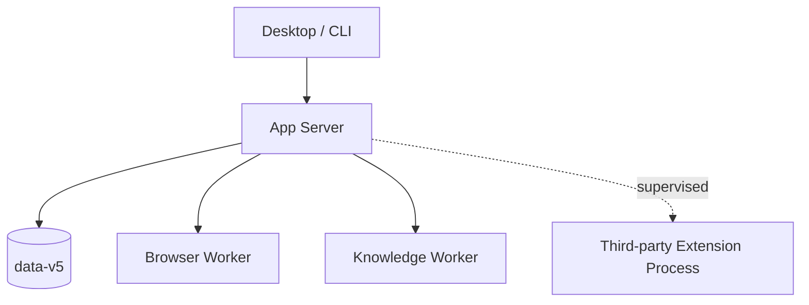

# JavaClaw 5 仓库与进程边界

仓库只保留能表达编译边界、稳定契约或独立进程的模块。业务领域不得重新进入 Turn Harness。

## Maven Reactor

| 模块 | 唯一职责 | 允许的关键依赖 |
|---|---|---|
| `javaclaw-api` | 不可变 Core、安全与 Sandbox 契约 | JDK |
| `javaclaw-protocol` | JSON-RPC 2.0、Protocol v2、Schema、framing、共享 codec | `api`、`extension-spi`、Jackson |
| `javaclaw-extension-spi` | Bundle、贡献点、编排、定时、ViewSchema 契约 | `api` |
| `javaclaw-agent-runtime` | 单 Turn Thin Harness | `api`、日志门面 |
| `javaclaw-model-adapters` | Spring AI 与 Provider 原生扩展 | `api`、`agent-runtime`、`extension-spi`、Provider SDK |
| `javaclaw-builtin-contracts` | 内置扩展公开 DTO 与 schema | `api` |
| `javaclaw-builtin-extensions` | Plan、Loop、Workflow、SDD、Schedule、Memory、Knowledge、Skill、Site | contracts、SPI、隔离依赖 |
| `javaclaw-app-server` | 唯一组合根、H2、RPC、安全、Extension Host、生命周期 | 平台实现模块 |
| `javaclaw-native-hosts` | FFM、Sandbox、PTY、登录启动与本地传输原语 | `api`、`protocol`、SPI |
| `javaclaw-browser-service` | 进程外 Browser Worker | Worker 所需契约与 Playwright |
| `javaclaw-knowledge-worker` | 进程外文档解析 Worker | contracts、PDFBox、POI |
| `javaclaw-client` | SDK、CLI、连接恢复、扩展 typed facade | `api`、`protocol`、`extension-spi`、contracts |
| `javaclaw-desktop` | JavaFX 壳、SDK ViewModel、ViewSchema renderer | `client`、共享契约、`native-hosts`、JavaFX |
| `javaclaw-packaging` | jlink、发行组装和启动监督 | 产品运行时模块 |

`agent-runtime` 禁止依赖 Jackson、Spring AI、H2、Quartz、PDFBox、POI 和 JavaFX。`app-server` 不直接依赖
Spring AI；Provider 类型不得越过 `model-adapters`。内置扩展只通过 SPI port 访问平台能力。

`javaclaw-builtin-extensions` 中的复杂领域使用显式资源、Repository、状态机和 ViewSchema 组件组合；Plan、Loop、
Workflow、SDD、Schedule、Memory、Knowledge、Skill 与 Site 不共享通用文档或自动化抽象基类。可恢复执行统一通过
Extension Job port 取得 intent/checkpoint 能力，但领域状态和校验仍由各扩展拥有。

`javaclaw-client` 的连接层持续接收服务端通知，只把强类型 `ServerNotification` 交给上层；Desktop 的通知协调器对
`extension/event` 合并失效并重新读取权威状态。Desktop 页面不得从通知 payload 推导业务状态，也不得访问 Server
实现包。Desktop 在编译期可直接复用 `api`、`protocol`、`builtin-contracts` 与 `extension-spi` 的不可变契约，并为
Windows 本地传输依赖 `native-hosts`；这些依赖不能用于绕过 SDK 与 App Server 通信。

## 进程

App Server 是唯一 H2 owner。Browser、Knowledge Worker 与第三方扩展不得获得 JDBC、App Server classpath 或 JavaFX。
Browser Worker 无 HOME、Workspace 与原始网络权限，Chromium 的请求只能通过 App Server Broker 回调得到响应；
Service Worker、WSS 与下载均拒绝。Knowledge Worker 无网络，只通过有界二进制 framing 接收 Attachment 内容并
返回解析结果；PDFBox 与 POI 不进入 App Server、内置扩展或 Turn Runtime 的 module path。
第三方扩展只允许使用 namespaced document/blob API；虚线表示它始终位于进程与 Sandbox 信任边界之外。

## 根目录

- `config/`：Checkstyle 与格式化规则，不放业务配置。
- `docs/`：只描述 5.0 当前目标、事实、威胁与验收，不保存旧版本叙事。
- `.run/`：共享 IDEA App Server、Desktop 与 Compound 调试配置；不保存凭据。
- `.javaclaw/data-v5/`：本机数据库、Blob、Worktree 和日志；始终忽略。
- `.javaclaw/idea/data-v5/`：共享 IDEA Compound 配置使用的隔离开发数据根；与发行数据互不读取。
- `docs/images/screenshots/settings-center/macos-reference/`：54 张设置中心生产 Scene 参考图及哈希清单。
- `target/`、`*/target/`：可再生构建输出。
- `.github/workflows/javaclaw-v5.yml`：唯一 CI / release workflow。

`javaclaw-packaging/target/distribution` 是展开后的本地发行目录；其中主应用位于 `runtime/` 与 `lib/`，Browser、
Knowledge、Skill 的隔离 image 位于 `workers/`。`target/release-evidence` 保存 SBOM 与许可证清单，`target/release`
只保存可发布 ZIP、原生安装包、签名和外层哈希清单。这些目录均可由源码重新生成。

模块使用 Maven 标准 `src/main/java`、`src/main/resources`、`src/test/java`。固定 schema 与 prompt 属于源码，
不得由格式化或测试重写。测试临时文件只能进入 JUnit 临时目录或 `target/`。
