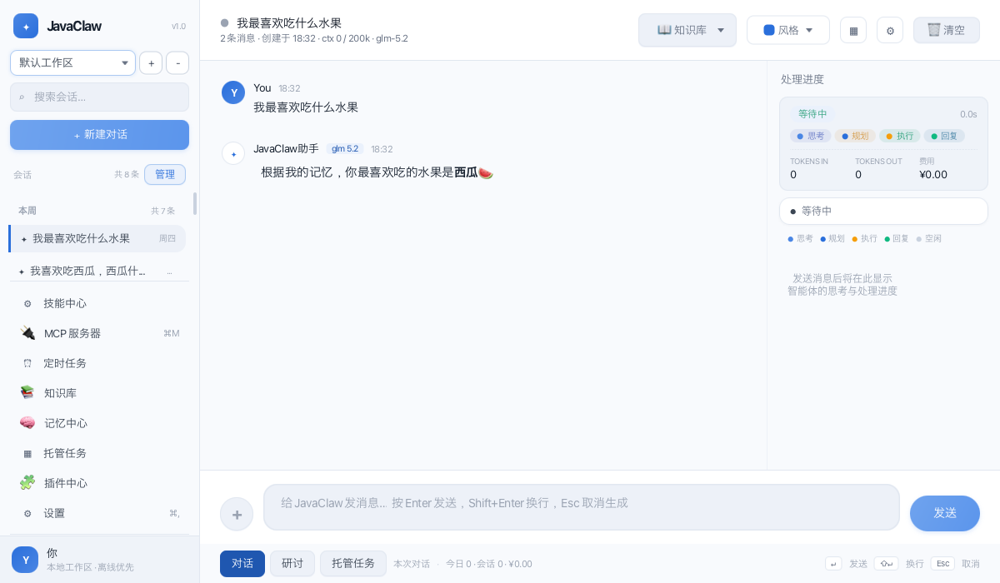
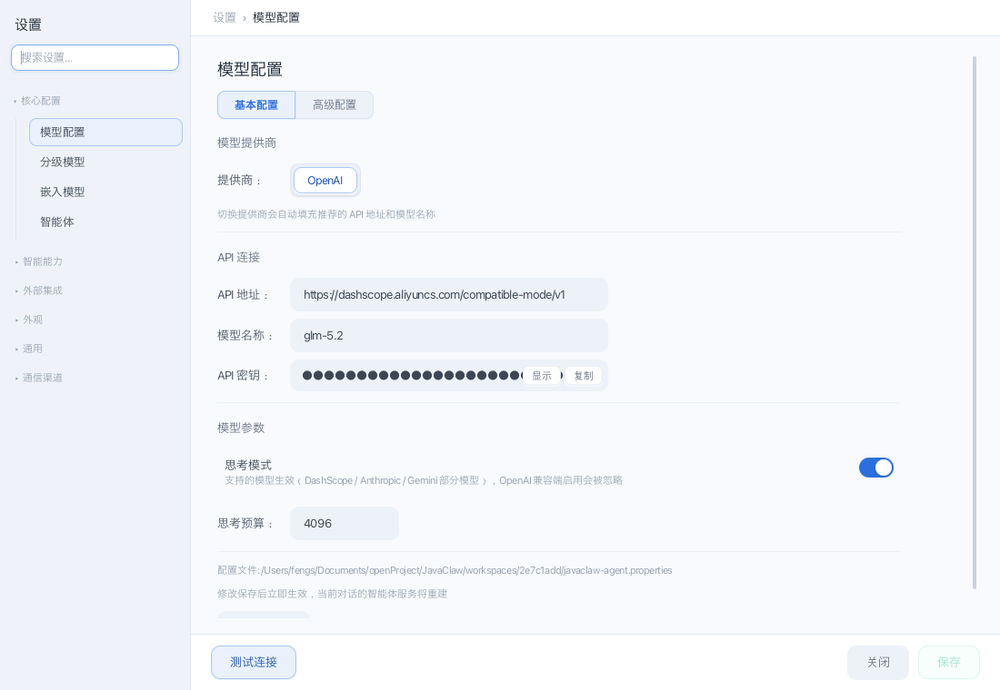
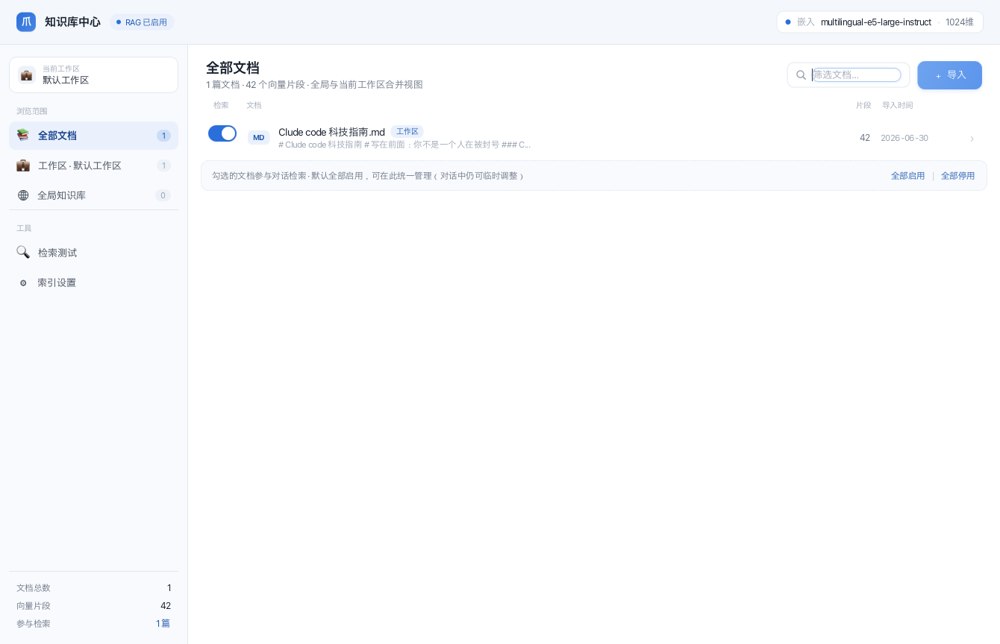
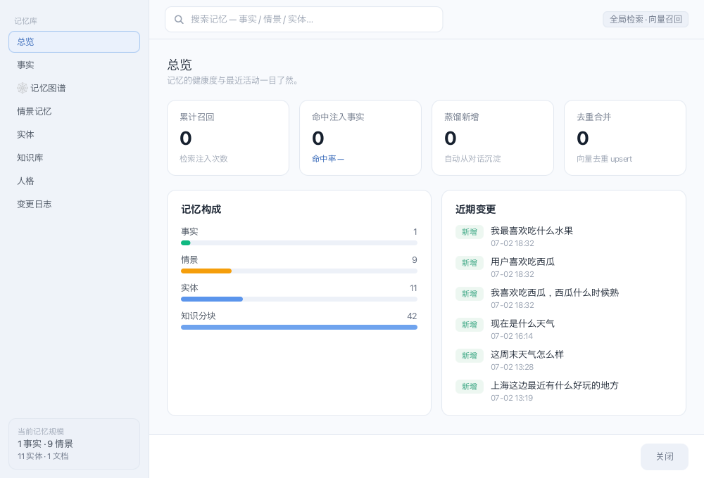
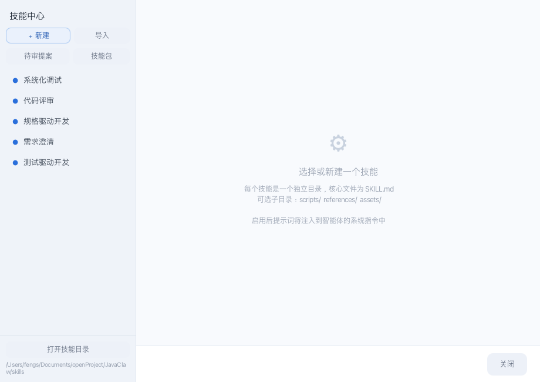
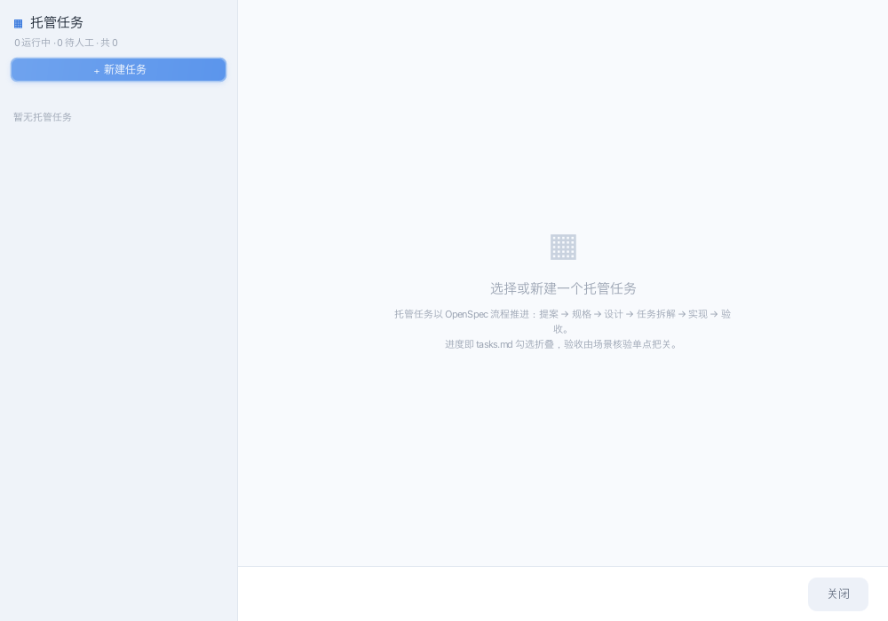
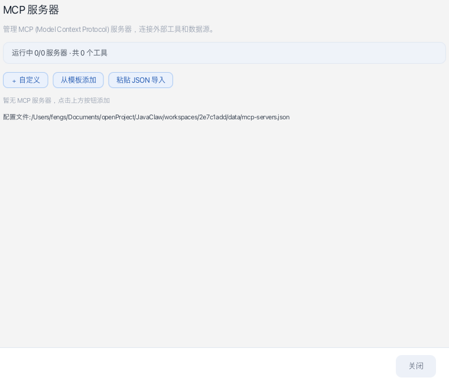
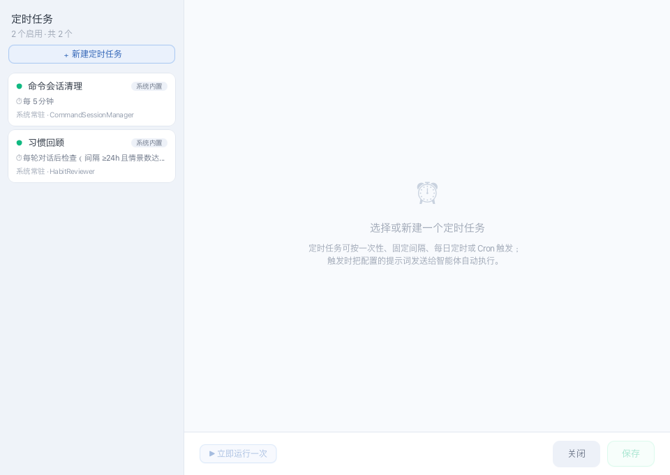
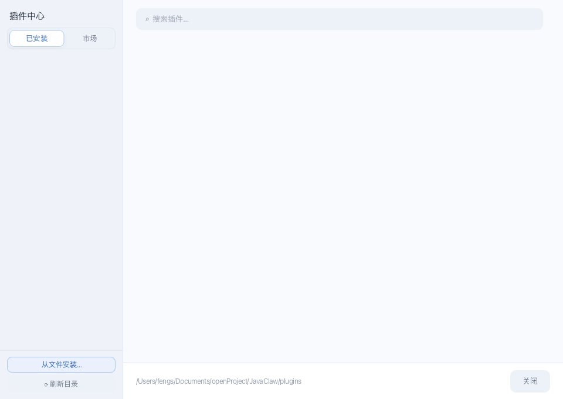

# JavaClaw UI 设计基线与回归审查规范（509f197）

状态：冻结历史基线；v4 经审阅扩展见 [UI 回归审查报告](ui-regression-review-v4.md)
基线提交：`509f1970e3a569a6da76e0525312d2b10041675e`（2026-08-26）
文档日期：2026-08-30
适用范围：以该提交为起点的 Desktop 架构迁移、重构与后续 UI 回归审查

## 1. 目的与结论

本轮修改是技术架构迁移，不另建产品视觉语言。回归审查的目标不是确认“页面能打开”或“按钮还在”，
而是确认修改后的界面继续保持 `509f197` 的设计令牌、组件气质、视觉层级、状态反馈、交互和可访问性语义。
v4 可以重新组织信息架构、密度与响应式布局，但每项有意扩展都必须在审查报告中说明原因和证据。

除非另有经过审阅的产品设计决策，候选界面必须满足以下结论：

- 主窗口在宽屏采用“左侧工作区与会话导航 + 中央对话工作区 + 右侧处理进度”的结构；标准和窄屏
  将非核心栏变为可访问抽屉，不把管理页或检查器永久嵌入对话区。
- 管理窗口仍采用固定左栏、可滚动内容区和固定页脚；新增页面复用同一表单、卡片、按钮与状态体系。
- 默认主题仍为 Emerald；九套主题通过 `-jc-*` 语义令牌整体换肤，组件不得自行建立另一套色板。
- 字体、间距、圆角、阴影和微动效保持克制、低噪声；重要状态必须同时有文字或结构提示，不能只靠颜色。
- 架构、数据源或 Controller 的变化不能改变初始化顺序、保存边界、取消语义和用户确认步骤。

## 2. 基线证据与权威顺序

### 2.1 权威顺序

发生冲突时按以下顺序判定旧版设计意图：

1. `509f197` 中的 CSS、FXML、窗口工厂、`ThemeManager`、`FontManager`、`UiMotion` 和 UI 行为测试。
2. 本文记录的结构、令牌、尺寸、组件状态与交互契约。
3. 仓库内九张历史截图，用于观察整体气质和页面构成，不作为无条件的逐像素 Golden。

历史源码可用 `git show 509f197:<旧路径>` 读取。迁移后的十份 CSS 位于
`javaclaw-desktop/src/main/resources/css/`；本文编写时，它们与旧路径中的基线文件逐字节一致。

### 2.2 CSS 冻结清单

| 基线文件 | SHA-256 | 设计职责 |
|---|---|---|
| `chat.css` | `bf6a431e8ce2ab0f7e795a8dcb7784f82d80b5a095c040017e902eb61fdb68e3` | 全局令牌、原生控件、主聊天、通用弹窗和管理骨架 |
| `controls.css` | `32f620aec3e529f32e7a1ffb80a47ac6830a572fba66aed0c827fefea713c62b` | ToggleSwitch、WindowToast |
| `knowledge-center.css` | `5181cc3b3a367d6c5696c28b4fb986061832b661b0ae3dd824dd0559b8b2f658` | 知识库中心 |
| `mcp-settings.css` | `b6a4f8d02954465c09546a6bdeb636539cafff1c3fa9f5633f057a7fadebe178` | MCP 管理与编辑 |
| `memory-center.css` | `6a12b9ac98fefbaaee8745041b6fa3dbb8c106617d065c6dc672327c135b23f5` | 记忆中心 |
| `plugins.css` | `4cd2ae16c6b275fddfe4b38f5730aa9a48b64fb7a18deab833a4488e442d1034` | 插件、权限与服务插件配置 |
| `schedule.css` | `2129226de45c84b82aa4093b9d00a50806611132837b89bdd0982cdab0b530e9` | 定时任务 |
| `sdd-task.css` | `722d4b2a4cc16be1ade61e879bf936b27ffd473b05c5c0c5a036de7e3fdb7a9a` | SDD 托管任务 |
| `skill-center.css` | `21760b1496da373041aa82ce45ae716567a1f3e6837248738f753b69c833a914` | 技能中心 |
| `workflow-center.css` | `9ef8ab792ad99fbe264ea3317fc88c0047ec46fb58d746697d30dfefe18bdab2` | 工作流画布、检查器与运行区 |

CSS 哈希相等能证明令牌和旧规则未被改写，但不能证明新 FXML 使用了正确的样式类，也不能证明布局、
状态和交互等价。因此哈希校验只是第一道门禁。

### 2.3 历史截图的使用边界

九张截图最初随 `e8dfcd314e19c0d1e57139077b9143e64ff2e7ce` 于 2026-07-07 加入仓库，
早于本基线提交。旧导出器会读取工作区持久化主题和实时业务数据，并在打开窗口后等待 900–1300 ms
直接对 JavaFX Scene 根节点做 snapshot。它没有锁定主题、字体、显示缩放或固定数据夹具。

因此：

- 截图呈现的冷蓝外观与 Sapphire 令牌一致，但这是根据画面与令牌作出的判断；导出流程没有记录主题 ID。
- 文案、计数、时间、模型名、文件路径和列表内容属于当时数据，不是视觉契约。
- `07-mcp-servers.png` 为 `760×650`，而 `509f197` 的 MCP 独立窗口契约是 `960×680`、
  最小 `780×560`。审查 MCP 画布尺寸时以源码契约为准，旧图只说明视觉语言。
- 截图未覆盖 hover、focus、pressed、disabled、错误、加载、长内容、最小窗口和全部深色主题。

## 3. 产品视觉语言

JavaClaw Studio 的基调是“现代极简 × 专业冷静”：使用低饱和页面与面板色、单一品牌强调色、
细边框、柔和圆角和少量阴影建立层级。信息密度可以高，但不依赖厚重卡片、强渐变或大面积高饱和色。

视觉层级按以下顺序组织：

1. 页面底 `surface-page` 承载主要工作区。
2. 侧栏和次级区域使用 `surface-panel`，输入、筛选和沉陷容器使用 `surface-sunken`。
3. 卡片、浮层、选中分段和固定页脚使用 `surface-card`，配合 1 px `border`。
4. 品牌色只用于主操作、选中态、焦点、当前导航和少量关键徽标。
5. 成功、危险、警告和处理阶段使用固定语义色，不随主题任意改变含义。

界面文案以简洁中文为主，保留 Agent、MCP、Token、Workflow 等产品术语。图标以轻量文本符号或现有
产品图标为主；不要在同一功能中混用不同风格、粗细和基线的图标集。

## 4. 设计系统

### 4.1 默认 Emerald 令牌

| 类别 | 令牌和值 |
|---|---|
| Primary | `50 #EDF7F1` · `100 #D7EBDE` · `200 #AFD9BF` · `300 #86C59F` · `400 #55AD7D` · `500 #2E9A6A` · `600 #1F7E54` · `700 #166342` |
| Accent | `300 #9CD5B3` · `400 #6ABD92` · `500 #3DA574` · `600 #21855A` |
| Neutral | `50 #FAF9F4` · `100 #F3F1EB` · `200 #E8E4DB` · `300 #D3CDBF` · `400 #A19A8A` · `500 #706B5F` · `600 #555046` · `700 #3B382F` · `800 #27251F` · `900 #15130E` |
| Text | title `#27251F` · body `#4F4B40` · muted `#706B5F` · hint `#A19A8A` |
| Surface | page `#FBFAF6` · card `#FFFFFF` · panel `#F4F2EC` · sunken `#F3F1EB` |
| Border | normal `#E8E4DB` · strong `#D3CDBF` |
| Semantic | success `#10B981/#ECFDF5` · danger `#EF4444/#FEF2F2` · warning `#F59E0B/#FFFBEB` |
| Pipeline | thinking `#6B7CC7` · planning `#D49A47` · executing `#2FA17C` · replying `#4B87A8` |

组件应引用 `-jc-*` 语义令牌。除基线中明确固定的危险色、成功色、文件类型装饰色和状态徽标外，
不得在迁移适配 CSS 中新增十六进制颜色、`rgb()` 或另一套变量前缀。

### 4.2 Sapphire 截图对照令牌

历史截图的主要表面与以下 Sapphire 令牌一致。使用旧图做同平台对照时，应先切换到 Sapphire：

| 类别 | 值 |
|---|---|
| Primary | `50 #EAF1FC` · `100 #CADDF7` · `200 #A9C8F1` · `300 #7FABE8` · `400 #5B95EC` · `500 #2A6FDB` · `600 #1F57B0` · `700 #17418A` |
| Text | title `#16202E` · body `#3C4654` · muted `#677183` · hint `#9AA3B2` |
| Surface | page `#F8FAFD` · card `#FFFFFF` · panel `#EFF3F9` · sunken `#EDF1F8` |
| Border | normal `#E1E7F0` · strong `#C9D2DF` |

### 4.3 九套主题

| ID | 名称 | 类型 | Primary 500 | Page | Card |
|---|---|---|---|---|---|
| `emerald` | 翡翠 Emerald | 浅色、默认 | `#2E9A6A` | `#FBFAF6` | `#FFFFFF` |
| `midnight` | 午夜 Midnight | 深色 | `#3DA574` | `#15130E` | `#1E1C16` |
| `carbon` | 碳黑 Carbon | 深色 | `#4F9DF0` | `#0F141A` | `#171D25` |
| `sapphire` | 蓝宝石 Sapphire | 浅色 | `#2A6FDB` | `#F8FAFD` | `#FFFFFF` |
| `ocean` | 海洋 Ocean | 浅色 | `#0E8C8C` | `#F6FAFA` | `#FFFFFF` |
| `plum` | 梅紫 Plum | 浅色 | `#7E57C2` | `#FAF8FC` | `#FFFFFF` |
| `terracotta` | 陶土 Terracotta | 浅色 | `#C9613B` | `#FCF8F4` | `#FFFFFF` |
| `honey` | 蜂蜜 Honey | 浅色 | `#C68A1E` | `#FCFAF4` | `#FFFFFF` |
| `graphite` | 石墨 Graphite | 浅色 | `#3F3B33` | `#FAF9F5` | `#FFFFFF` |

主题切换由 Scene 根节点的 `theme-{id}` class 重定向令牌完成。回归时至少覆盖默认 Emerald、
历史截图对应的 Sapphire，以及 Midnight、Carbon 两套深色主题。

### 4.4 字体与排版

默认 UI 字体栈为：

```text
"SF Pro Text", "Segoe UI", "Inter", "PingFang SC", "Microsoft YaHei", "Noto Sans SC", sans-serif
```

等宽字体栈为：

```text
"SF Mono", "JetBrains Mono", "Cascadia Code", "Consolas", "Menlo", monospace
```

| 用途 | 基线规格 |
|---|---|
| 全局控件和正文 | 13 px；普通字重 |
| 元数据、快捷键、Token、表头 | 10–11.5 px；必要时等宽 |
| 提示、导航和小按钮 | 12–12.5 px |
| 小标题、字段和值 | 13–14 px；500/600 字重 |
| 模块或弹窗标题 | 15–16 px；600 字重 |
| 页面分区标题 | 18 px；600 字重 |
| 首次启动主标题 | 20 px；bold |

聊天正文密度提供三档：紧凑 `13.5 px / 1.55`、适中 `14.5 px / 1.65`、宽松
`15.5 px / 1.80`，默认是适中。回归截图必须记录密度选项；字体变化导致的换行不能误判为布局改版。

### 4.5 间距、圆角和阴影

- 基础间距节奏为 4、6、8、10、12、16、20、24、28、32 px；表单和卡片内部优先 8–16 px，
  页面或固定栏边距优先 20–24 px。
- 圆角体系为 6、8、10、14、18 px 和 `999 px` 胶囊；卡片通常 12 px，字段和按钮通常 8–10 px。
- 轻阴影：`rgba(0,0,0,0.04)`、模糊 8、Y 2；中阴影：`0.06`、模糊 12、Y 3；
  重浮层阴影：`0.18`、模糊 24、Y 8。
- 阴影只用于浮层、选中分段、主按钮和临时强调。常规页面层级优先使用表面色与 1 px 边框。
- 滚动条宽 6 px，圆形 thumb，隐藏增减按钮；不要恢复 JavaFX Modena 的粗滚动条外观。

### 4.6 微动效

| 语义 | 时长和行为 |
|---|---|
| hover/focus、交叉淡入 | 150 ms |
| 面板切换、消息出现 | 240 ms；从下方 8 px 淡入 |
| 工作区切换等大动作 | 400 ms |
| 成功 | 150 ms 放大到 `1.08` 后恢复 |
| 错误 | 80 ms、水平 6 px、往返 3 次 |
| 吸引注意 | 600 ms，在不透明度 `1.0 ↔ 0.7` 间呼吸一次 |
| 按下反馈 | 80 ms 缩放到 `0.95`，松开恢复 |

标准缓动为 `cubic-bezier(0.16, 1, 0.3, 1)` 对应的 JavaFX spline。动画不能阻塞输入、改变最终布局，
也不能在重复触发后叠加到错误状态。

## 5. 布局与窗口契约

### 5.1 主窗口

| 区域 | 结构与尺寸 |
|---|---|
| Window | 首选 `1200×700`，最小 `600×500` |
| 左侧栏 | 首选 240 px，最小 200 px，最大 280 px |
| 中央区 | 顶部会话标题与全局动作；中部消息流；底部附件、输入框和模式栏 |
| 右侧处理进度 | 首选 280 px，最小 240 px，最大 320 px |
| 响应式断点 | `≥1180 px` 同时显示左右栏；`960–1179 px` 保留左栏、进度改为抽屉；`<960 px` 左右栏均为可访问抽屉 |
| 输入框 | 初始/最小高度 56 px，最大 240 px；附件区出现时在输入框上方扩展 |

主窗口使用 BorderPane 层级，不使用 SplitPane 把管理导航或通用检查器永久塞入中央对话区。
右侧处理进度是对话执行状态的一部分，可以按产品状态显隐。

### 5.2 管理窗口骨架

管理窗口以固定宽度左栏、弹性内容区和固定页脚为共同骨架：

- 左栏使用 `surface-panel`，右边 1 px 分隔线；标题 15 px，分组 11 px，导航 12.5 px。
- 当前导航使用 `primary-50` 底和 `primary-600` 文本；未保存状态显示 6 px 警告色圆点。
- 内容区使用 `surface-page`，长表单在内容区滚动，不把“保存/关闭/取消”等动作卷走。
- 页脚使用白色 `surface-card`、顶部 1 px 边框、`12×22 px` 内边距。
- 加载态使用覆盖内容区的 loading overlay；不能在数据尚未就绪时允许误操作。

### 5.3 首选窗口尺寸

| 页面 | 推荐窗口 | 最小窗口 | 左栏 |
|---|---:|---:|---:|
| 主聊天 | `1200×700` | `600×500` | 左 240；右 280 |
| 设置 | `1100×760` | `900×680` | 左 210 |
| Agent Studio | `1100×760` | `900×680` | 232 |
| 记忆中心 | `1000×680` | `820×600` | 212 |
| 知识中心 | `1340×864` | `1040×680` | 252 |
| 技能中心 | `920×650` | `780×560` | 232 |
| 自动化 | `1240×800` | `960×680` | 258 |
| 定时任务 | `960×680` | `780×560` | 264 |
| 插件 | `960×680` | `780×560` | 228 |
| MCP | `960×680` | `780×560` | 224 |
| 站点管理 | `1080×740` | `860×620` | 232 |
| 项目约定 | `1000×700` | `820×600` | 232 |
| 工作树恢复 | `1100×740` | `900×620` | 252 |

推荐值用于首次打开；用户调整后在当前进程内按页面记忆尺寸。所有最小尺寸都必须保证内容可滚动、
固定操作栏可达且主操作不截断。

## 6. 通用组件契约

| 组件 | 基线规格 | 必须覆盖的状态 |
|---|---|---|
| 主按钮 | 品牌渐变、`on-brand` 前景、10 px 圆角、`9×20 px` 内边距、轻品牌阴影 | default、hover、pressed、disabled、focus；Honey 使用深色前景 |
| 柔和按钮 | `primary-50` 底、`primary-600` 字、`primary-200` 边框 | hover 加深一级 |
| 幽灵按钮 | `surface-sunken` 或透明底、muted 字 | hover 使用 neutral-200、title 字 |
| 保存按钮 | 固定成功色浅底、绿字、绿边框 | 未修改时禁用；成功后有明确反馈 |
| 危险按钮 | 高对比陶土浅底、深陶土字和边框 | hover 保持可读；执行前使用同语义确认，不回落为普通主按钮 |
| 小按钮 | 12 px 字、8 px 圆角、`5×12 px` 内边距 | 与普通按钮语义一致 |
| 输入框 | sunken 底、10 px 圆角、13 px 字；必要 placeholder 使用 muted | focus 切 card 底并显示至少 3:1 的边界 |
| 分段控件 | 9 px sunken 容器、3 px 内边距；选中项为 card 白片 | selected、hover、focus |
| 卡片 | card 底、1 px border、12 px 圆角 | 可点击卡片需 hover/focus；静态卡片不伪装可点 |
| Badge | 11.5 px/600、`3×10 px`、胶囊 | running、starting、failed、stopped、soft 等语义不混用 |
| ToggleSwitch | 轨道 `38×22`、thumb `18×18`、胶囊；on 为 primary-500 | on、off、focus、disabled（0.45 opacity） |
| Tooltip | card 底、8 px 圆角、`6×12 px`、12 px 字、细边框与轻阴影 | 不遮挡触发控件的后续操作 |
| ContextMenu | card 底、12 px 圆角、1 px 边框、`6×0 px` 内边距 | focused、danger、separator |
| Dialog | 最大 `720×680`，且不超过屏幕可视区的 `88%×82%`；14 px 圆角 | 长正文内部滚动、页脚固定、Esc/取消可达；危险确认按钮保持 danger 语义 |
| WindowToast | 底部居中、card 底、10 px 圆角、`10×18 px`、12.5 px 字 | 鼠标穿透、自动消失、跨主题可读 |
| 空状态 | 低对比图标 + 15 px 标题 + 12 px 说明 + 明确下一步 | 不能只留大块空白或用错误态代替 |

所有可交互控件都应有清晰 focus 态。禁用不能只取消事件，还要降低视觉权重并保持文字可辨认。
进度、成功、失败、警告和当前选中项都要有文字、图标、位置或结构上的第二重提示。

## 7. 页面视觉基线

### 7.1 主聊天



审查重点：

- 左栏从品牌与工作区选择开始，接新建/搜索、最近会话和知识、记忆、技能、自动化、定时任务、插件、
  MCP、设置等直接入口；Agent Studio、站点、项目约定和工作树归入“更多管理”。
- 顶栏左侧显示响应式侧栏按钮、状态点、标题和元数据；右侧为进度抽屉、会话操作、主题、快捷键帮助和设置。
  压缩、分支、归档与删除属于会话操作，不混入功能导航。
- 消息区是主要视觉焦点。用户、助手、计划、执行、交互和错误使用同一组件气质但有明确结构语义；
  助手正文限制可读行宽，执行块默认紧凑且可查看完整内容。
- 输入区固定在底部：附件在左、可增长输入框居中、发送在右；下一行展示模式、审核和键盘提示。
- 右侧处理进度使用状态卡、阶段胶囊、Token 指标与动态步骤，不用高饱和整栏背景表达执行状态。

### 7.2 设置



审查重点：固定 210 px 左栏、外观/云模型/连接诊断分组、对象列表、独立滚动内容和固定页脚。字段按
“分区标题 → 说明 → 标签/控件 → 必要 hint”排列；Provider 模型端点与凭据独立成卡，状态明确区分
运行中、成功、校验错误和服务端失败。切换页面或关闭时不能静默丢弃未保存内容。

### 7.3 知识库中心



审查重点：独立顶部栏、252 px 来源列表、导入/检索/刷新入口、详情摘要、正文 Markdown 卡和固定操作栏。
正文不使用巨大灰色 TextArea 冒充只读内容；文档状态、修订和重建语义必须清楚。空列表、检索降级和
加载失败不能都显示为同一种空白状态。

### 7.4 记忆中心



审查重点：212 px 领域导航、顶部全局检索、总览统计卡、构成分布和近期变更。事实、情景、实体、知识、
人格、纠错与日志沿用同一导航语言；编辑、固定、纠错和删除属于不同语义，不能只用同一普通按钮表示。

### 7.5 技能中心



审查重点：232 px 技能列表、创建/导入、待审提案、技能包、目录动作和右侧编辑内容。未选中时使用居中空状态；
选中后编辑器、脚本、资源和状态复用通用表单与固定页脚。启用、保存、提案采纳和删除必须有独立状态反馈。

### 7.6 SDD 托管任务



审查重点：264 px 任务栏、94 px 固定任务单元、新建主操作、详情区和固定动作栏。任务阶段、进度、预算、
等待人工、失败和终态必须可区分；终态降低视觉权重，但仍可打开查看产物与验收结果。

### 7.7 MCP 服务器



该图只用于观察按钮、文字、表面和留白语言。`509f197` 的独立窗口已经采用 `960×680` 的管理骨架：
224 px 左栏提供状态筛选与新增/模板/导入动作，右侧提供概览、工具栏、服务器卡片、空状态和固定页脚；
嵌入设置时隐藏独立窗口的左栏与页脚。回归时不得按旧图的 `760×650` 画布反向缩小新版窗口。

### 7.8 定时任务



审查重点：264 px 左栏、92 px 任务单元、创建入口、详情表单与固定页脚。启用状态、触发类型、下一次运行、
跳过/失败和历史记录必须有文字语义；保存与立即运行是不同动作，禁用条件不能互相混淆。

### 7.9 插件中心



审查重点：228 px 左栏、已安装/市场/Agent 扩展/服务插件导航、搜索、卡片网格、安装/刷新动作和固定路径页脚。
权限、签名、工作区启用、进程健康与配置属于不同层次；危险卸载不能与普通停用使用同一视觉语义。

### 7.10 工作流中心与其他次级界面

工作流没有纳入历史九图，但仍属于 `509f197` 设计基线。其首选窗口为 `1320×820`：左侧 258 px
工作流列表，中间为标题工具栏和画布，右侧为画布检查器，下方为运行区和固定页脚。撤销、重做、复制草稿、
添加节点、校验、发布和测试运行的主次关系必须保持。

首次启动、Agent 设置、站点凭据、诊断、图片查看、确认/选择/Secret 对话框等次级界面复用相同令牌和骨架。
首次启动使用 20 px 主标题和可选择 Provider 卡片；图片查看器可缩放/拖拽；Secret 默认遮罩；长对话框正文
内部滚动。它们不能引入 Web 管理后台式的新导航、不同字体或另一套圆角与按钮。

## 8. 交互与可访问性契约

### 8.1 主窗口快捷键

| 动作 | macOS | Windows/Linux |
|---|---|---|
| 新建会话 | `⌘N` | `Ctrl+N` |
| 打开设置 | `⌘,` | `Ctrl+,` |
| 显示/隐藏侧栏 | `⌘\` | `Ctrl+\` |
| 聚焦输入框 | `⌘K` | `Ctrl+K` |
| 打开 MCP | `⌘M` | `Ctrl+M` |
| 快捷键帮助 | `⌘/` 或 `⌘⇧/` | `Ctrl+/` 或 `Ctrl+Shift+/` |
| 发送/换行 | `Enter` / `Shift+Enter` | `Enter` / `Shift+Enter` |
| 停止当前任务 | `Esc` | `Esc` |

`Esc` 只在当前 Turn 活动时请求停止，否则不产生破坏性副作用；v4 不伪造已经不存在的旧清空语义。
独立管理窗口继续提供 Esc 关闭或取消当前临时操作；含保存语义的窗口若提供 `⌘/Ctrl+S`，必须与可见
保存按钮走同一状态机。

### 8.2 可访问性

- 稳定交互控件需要稳定 `fx:id`、非空 `accessibleText` 和可键盘到达的 focus 顺序。
- 纯装饰图标不能抢占 focus；图标按钮需要 Tooltip 或可访问名称。
- 列表、消息、工作区、Profile、主题、附件、发送、停止和管理入口必须能由键盘完成核心流程。
- 文字放大或系统字体替换后，不得截断主操作、状态、错误原因和安全确认。
- 深色主题下不能继承 Modena 的近黑文字；所有 Label、字段、菜单和弹窗必须继续解析主题文本令牌。

## 9. 回归审查流程

### 9.1 截图前置条件

1. 记录候选提交、操作系统、JDK/JavaFX 版本、显示缩放、主题、UI 字体、等宽字体和聊天密度。
2. 在同一平台对照时，分别使用 Emerald 和 Sapphire；深色专项使用 Midnight、Carbon。
3. 使用第 5.3 节的首选尺寸，再逐页验证最小尺寸或常见 1366×768 可视区域。
4. 使用固定夹具生成同名工作区、会话、消息、状态、列表项和错误；动态时间、耗时、动画帧和绝对路径
   在像素对比中用独立 `.png.mask` 声明，但仍人工检查对齐与溢出。费用未知显示“—”，不伪造零费用。
5. 等待数据加载、CSS layout 和动画稳定。候选导出器在目标窗口尺寸生效后至少等待两个 JavaFX pulse；
   尺寸不符直接失败，固定延时只作超时兜底。
6. 截取 Scene 根节点，不包含操作系统窗口边框和阴影；同组图片保持相同像素比与色彩配置。

### 9.2 分层审查

| 层级 | 检查内容 | 通过条件 |
|---|---|---|
| 资源 | 十份 CSS、加载顺序、适配 CSS | 基线 CSS 哈希一致；适配 CSS 只使用 `-jc-*` 令牌 |
| 信息架构 | 主窗口三区、管理窗口三段、页面导航 | 区域职责、主次操作和滚动边界一致 |
| 几何 | 窗口、固定栏、padding、gap、圆角、边框 | 同平台稳定区域无肉眼可见漂移；最小尺寸不重叠/截断 |
| 主题 | Emerald、Sapphire、Midnight、Carbon | 无硬编码浅色面、低对比文字或错误的语义色 |
| 排版 | 字号、字重、行高、换行、等宽元数据 | 层级一致；长中文、英文 ID 和路径不破版 |
| 组件状态 | default/hover/focus/pressed/selected/disabled/loading/error | 每个状态可识别、可恢复，且不只依赖颜色 |
| 交互 | 保存、取消、确认、切换、快捷键、响应式 | 与可见控件走同一状态机，无静默丢失或重复副作用 |
| 可访问性 | accessibleText、focus、Tooltip、键盘 | 核心流程可达，读屏名称不为空、不泄漏 Secret |

### 9.3 像素差异口径

- 同操作系统、同字体、同缩放、同尺寸时，页面表面、分隔线、固定栏、卡片边界和控件外框应做严格对照；
  稳定几何区域原则上只允许 1 px 的抗锯齿或取整差异。
- 自动门禁先做 1 px 邻域平滑，单通道差异不超过 16 时忽略；总变化面积超过 0.5%，或最大连续变化区域
  超过 0.1%，均阻断合并。基准图与候选图像素尺寸必须完全一致。
- 字体栅格、Emoji、系统原生控件内部像素和阴影边缘应单独设遮罩，不能用大面积模糊阈值掩盖布局偏移。
- 跨平台不做整屏逐像素等价声明，改为核对语义令牌、尺寸约束、层级、换行可用性和全部交互状态。
- 历史九图含实时数据且主题未锁定，只可用于人工并排、半透明叠图或分区比较；新的自动 Golden 必须由固定夹具生成。

### 9.4 差异分级

| 等级 | 示例 | 结论 |
|---|---|---|
| 阻断 | 页面区域缺失、主次操作颠倒、Secret 明文、保存/取消语义改变、最小尺寸不可用、键盘流程中断 | 不通过 |
| 严重 | 使用新色板、主题失效、固定页脚被卷走、选中/危险/错误状态混淆、明显字号或间距漂移 | 原则上不通过，需设计决策 |
| 一般 | 单个次要控件 1–2 px 对齐、非关键 Tooltip 或图标基线差异 | 修复或记录后复审 |
| 可忽略 | 同平台字体/阴影边缘的轻微抗锯齿差异，且不改变几何与可读性 | 可通过并记录 |

### 9.5 审查记录模板

| 页面/状态 | 基线图 | 候选图 | 差异区域 | 结构/视觉/交互 | 是否有意 | 结论与跟进 |
|---|---|---|---|---|---|---|
| 示例：主聊天/Sapphire/1200×700 | `01-main-chat.png` | 待填 | 输入栏 | 视觉 | 否 | 修复后复审 |

任何有意改变必须附带产品原因、影响页面与主题、前后截图、可访问性结果和审阅结论，并同步更新本文；
“新架构更方便实现”本身不是改变产品外观或交互的充分理由。

## 10. 基线截图清单

| 文件 | 像素尺寸 | SHA-256 |
|---|---:|---|
| [01-main-chat.png](images/screenshots/01-main-chat.png) | `1200×700` | `c249c41e36abe6126aa369ad1e85773210a233b2b196d830e641a1a7494a63c8` |
| [02-settings.png](images/screenshots/02-settings.png) | `1100×760` | `3b5804cb90b92de2d1926c5f8e64949298a78c795ad7bf850252710c35477c15` |
| [03-knowledge-center.png](images/screenshots/03-knowledge-center.png) | `1340×864` | `f2b607a3ad92a4c25e43fe660fc96f48c8953017c2aee094feedeb54e2b98cb7` |
| [04-memory-center.png](images/screenshots/04-memory-center.png) | `1000×680` | `5da72022db165b04194fca0414f6388673c11e35cdea283e727c3d3af8e2690a` |
| [05-skill-center.png](images/screenshots/05-skill-center.png) | `920×650` | `1a3a7d77285a8c02214422525d0b36388f92972c7359be44fdb7b81ec735490f` |
| [06-task-center.png](images/screenshots/06-task-center.png) | `1000×700` | `1776e254d4306d8e005b43589681be7bc365eb767a6c5a145f383305286843e5` |
| [07-mcp-servers.png](images/screenshots/07-mcp-servers.png) | `760×650` | `3985bf88049453f60c2baac7479fe7ea813edbec6d33a93694c12abc6d9940f2` |
| [08-schedule-center.png](images/screenshots/08-schedule-center.png) | `960×680` | `86339880cb518744c0c7bc0a8ad1b90a2959e44deb6f6c09df1005721302e18e` |
| [09-plugin-center.png](images/screenshots/09-plugin-center.png) | `960×680` | `039998a1affa566f76e496b81e0c314f43478c4837ba68078e94e07fa3d9c3fd` |

## 11. 当前门禁与真实限制

- 历史九图仍不是固定夹具产物，只用于人工理解 `509f197`；v4 的 45 张 macOS/JDK 25 固定夹具 Golden
  位于 `javaclaw-packaging/src/test/resources/visual/macos/`，覆盖九主题、主窗口三尺寸、12 个管理页的
  推荐/最小尺寸，以及加载、成功、校验错误和危险确认。
- 自动视觉契约冻结全部十份历史 CSS 摘要、九主题、响应式三栏、页面规格、样式路由、稳定控件 ID、
  可访问名称、反馈严重级别和危险确认语义。
- macOS 截图记录 JavaFX Scene，因此 PNG 高度不含 28 px 系统标题栏；导出器先精确校验 Stage 的计划窗口
  尺寸，再精确校验 Scene snapshot 自身尺寸。不能把两者混为尺寸漂移。
- Windows/Linux 继续执行结构门禁并上传截图；macOS 的像素结果不能代替跨平台字体回退、显示缩放、
  窗口可视区和原生控件验证。
- 固定夹具使用本地合成 Provider 和隔离数据目录，不调用付费模型；它不代替真实用户数据的长内容探索测试。
- 本文冻结的是产品视觉与交互语言，不要求恢复旧 Runtime、Spring 工作区 Context 或旧数据读取链。
