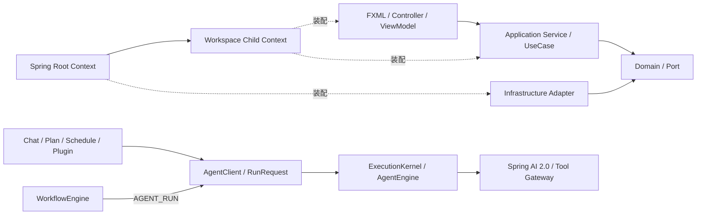

# JavaClaw 3.0 升级说明

JavaClaw 3.0 是一次集中架构升级。主要界面布局、CSS、快捷键、托盘和窗口行为保持不变，内部则
统一了 UI、业务入口、对象生命周期、数据访问、并发执行和插件接口。

## 版本概览

| 项目 | JavaClaw 3.0 |
|---|---|
| 项目版本 | `3.0.0-SNAPSHOT` |
| 运行环境 | JDK 25、JavaFX 25 |
| 对象管理 | Spring Framework 7.0.8，不使用 Spring Boot/WebMVC |
| Agent 底座 | Spring AI 2.0.0 + JavaClaw Agent Framework API 2.0 |
| 默认数据目录 | `data/`，格式标记 `.javaclaw-format` 的内容为 `3` |
| Plugin API | 3.0，`plugin.json.apiVersion` 必填 |
| UI 架构 | FXML + Controller + ViewModel |
| 业务架构 | Presentation → Application → Domain/Port ← Infrastructure |
| 并发模型 | 虚拟线程为主，CPU、浏览器和进程使用独立资源配额 |

## 功能升级

### 桌面界面

- 所有生产页面、弹窗、设置分区、复用控件和 Cell 使用 FXML 描述静态结构；
- 聊天页拆分为 Composer、Session、Stream、Mode、Sidebar 和 Workspace 等协作 Controller；
- 页面状态由 ViewModel 的 JavaFX Property 表达，统一处理 loading、选择、校验和错误；
- Markdown、Thinking Panel、图形和 Canvas 继续动态渲染，但只填充 FXML 声明的容器；
- 页面关闭时显式销毁主 Controller 和嵌套 Controller，避免监听器与后台任务泄漏。

### 业务能力

- Chat、Plan、Schedule、Plugin、Loop、SDD、Workflow 和 SubAgent 统一提交 `RunRequest`；
- 全系统只保留一个 `AgentEngine`，ReAct、工具调用、暂停恢复、预算、权限和事件存储不再按功能复制；
- Memory、GEPA、Knowledge、Skill、Plan 和 SubAgent 改为内置系统扩展，辅助模型调用统一经过 `ModelTaskGateway`；
- Agent/Profile 通过 Schema 驱动的 Agent Studio 编辑、校验和发布，扩展能力安装后自动出现配置面板；
- Chat、Workspace、Settings、Memory、Knowledge、Skill、MCP、Schedule、Workflow、Plugin 等入口
  统一为 Application Service/UseCase；
- JavaFX、Shell、Agent Tool 和定时任务共享同一业务入口，不再各自调用 Manager；
- 对话处理改为有序 `TurnPipeline`，组合视觉、纠错、路由、RAG、上下文、流式、记忆和技能阶段；
- 工具调用统一经过来源、能力授权、风险确认、审计、执行、异常和结果映射；
- 可预期失败统一为校验、不存在、冲突和拒绝四类应用异常。

### 数据与插件

- 3.0 数据目录增加格式标记，非空旧格式目录会在启动基础设施前被拒绝；
- H2 访问统一使用 DataSource、JdbcTemplate 和事务管理器，schema 在根 Context 启动时幂等初始化；
- Plugin API 升级到 3.0，任务统一返回 `TaskHandle<T>`；
- 插件任务接收只读 `TaskContext`，支持任务 ID、协作取消、状态和完成结果；
- 周期任务使用语义明确的 `scheduleAtFixedRate`，插件卸载会回收全部在途任务和资源。

## 优化内容

### 并发与资源

| 负载 | 执行方式 | 默认限制 |
|---|---|---:|
| IO | virtual-thread-per-task | 256 |
| CPU | `max(1, CPU-1)` 个平台线程，有界队列 | 256 |
| Browser | 虚拟线程，同一 Playwright 对象串行 | 4 |
| Process | 虚拟线程 | 8 |

- `ManagedTaskExecutor`、`TaskScope` 和 `TaskHandle` 统一状态、超时、取消、登记和关闭回收；
- 调度线程只负责触发，任务正文进入对应 workload；
- 工作区关闭和插件卸载先拒绝新任务，再取消并等待在途任务；
- `ProcessRunner` 统一输出限制、超时、中断和进程树清理；
- `HttpGateway` 复用 HTTP 客户端，只对幂等请求自动重试；
- `FxDispatcher` 是通用 FX 调度入口，`UiAsyncAction` 丢弃页面关闭后的迟到结果。

### 代码质量与可维护性

- Spring 根 Context 管理进程级对象，工作区子 Context 管理工作区运行时对象；
- 显式 `@Configuration(proxyBeanMethods=false)` 与 `@Bean` 取代宽泛扫描和静态全局取 Bean；
- 抽取 JSON、HTTP、进程、原子存储、对话框、事件和工具调用等稳定复用能力；
- 删除静态数据库与工作区单例访问，依赖改为构造注入；
- 大型 Controller 和业务类按稳定职责拆分，避免通用 `BaseManager` 或 `BaseCrudView`；
- 增加 ArchUnit、FXML 完整性、源码规模、线程边界、源码卫生和 JaCoCo 门禁。

### Agent 上下文、工具与用量

- Chat/Plan 使用本地确定性意图路由，只披露当前动作需要的小工具包；工具组与精确工具名由同一个 `ToolAccessPolicy` 同时约束 schema、对象创建和执行；
- 技能使用 L0 目录、L1 `SKILL.md`、L2 单份参考资料三级披露；同一 Run 固定技能目录、正文和 reference 文件清单，但 reference 内容从磁盘读取最新版本。256 KiB 以上文件必须先搜索定位，单次最多扫描 64 MiB；
- Chat/Plan 历史超过 16 条或 8,000 估算 Token 后增量压缩，持久摘要不删除原始消息，模型可见历史保持在 8,000 Token 内；
- 工具结果由契约声明普通、大结果或自限类型，配置上限和单 Run 累计上限由统一后处理器执行；完整结果仍保存在持久事件中；
- 主模型与辅助模型的 usage v3 事件先持久化，再按稳定 `modelCallId` 幂等投影到 Run 账本、助手消息和每日统计；投影回执与每日增量在同一事务提交，启动时自动补偿缺少回执的新事件。Anthropic 展示用输入包含缓存读取和创建，后台价格仍沿用原始输入；实时 Relay 只转发已提交事件，后台蒸馏不归入已完成的助手气泡；
- Thinking Panel、消息元信息和状态栏只展示输入、输出、缓存读写、推理及 token 命中率，不展示金额或模型调用次数；后台价格、调用次数和成本预算字段保持不变。

## 架构变迁



| 升级前 | 3.0 | 收益 |
|---|---|---|
| Controller 构造布局并混合业务 | FXML + Controller + ViewModel | 页面职责清晰，结构和行为可独立测试 |
| Manager 与静态单例跨层访问 | Application Service/UseCase + Port | 多入口复用业务，依赖方向可约束 |
| 手工创建全局和工作区对象 | Spring 根 Context + 子 Context | 生命周期、关闭顺序和切换回滚统一 |
| 分散原始 JDBC | JdbcTemplate + 事务管理器 | 连接、事务和异常语义一致 |
| 多套线程池和任务句柄 | 统一托管执行模型 | 配额、取消、超时和资源回收一致 |
| Controller 直接切换 FX 线程 | FxDispatcher + UiAsyncAction | 页面状态与迟到回调行为一致 |
| 各工具自行授权和格式化 | ToolInvocationPipeline | 风险、审计和结果格式统一 |
| 对话流程集中在大型服务 | TurnPipeline + TurnStage | 阶段可组合、替换和测试 |
| 多套 Agent/Task Runtime | 唯一 AgentEngine + 两级 Workflow 编排 | 新能力只增加扩展、Schema 和测试 |

启动流程也调整为明确的所有权顺序：

1. `Launcher` 验证 `data/` 格式并抢占单实例锁；
2. `JavaClawApp.init()` 创建 Spring 根 Context；
3. 根 Context 初始化数据、执行器和全局基础设施；
4. 工作区工厂创建当前工作区子 Context；
5. `SpringFxmlLoader` 加载主页面和全部嵌套 Controller；
6. 退出时按页面、工作区、根 Context 的反序释放资源。

## 技术变迁

| 领域 | 3.0 技术选择 | 变化 |
|---|---|---|
| Java | JDK 25 | 使用正式虚拟线程能力和现代语言/runtime 特性 |
| UI | JavaFX 25 + FXML | 从 Java 布局集中切换为声明式 MVC |
| 依赖管理 | Spring Framework 7.0.8 | 引入 `spring-context`，不引入 Spring Boot |
| 数据访问 | Spring JDBC/Tx + H2 2.3.232 | 从分散 JDBC 转为共享模板与事务边界 |
| Agent | Spring AI 2.0.0 + JavaClaw Agent Framework 2.0 | 统一 ReAct、Advisor、Tool Gateway、Run 事件和扩展快照 |
| 并发 | Virtual Threads + 有界平台线程池 | 按 IO、CPU、Browser、Process 分类限流 |
| UI 异步 | FxDispatcher + UiAsyncAction | 替代 Controller 内的直接线程和 FX 调度 |
| 插件 | Plugin API 3.0 | 描述符强校验、统一任务句柄和取消协议 |
| 架构测试 | ArchUnit 1.4.2 | 固化分层和依赖方向 |
| 覆盖率 | JaCoCo 0.8.14 | 支持 JDK 25，并建立三组覆盖率门禁 |

## 升级方式

### 从 2.x 升级

1. 完全退出 JavaClaw；
2. 将旧 `data/` 和外部 `plugins/` 完整备份到项目目录之外；
3. 将旧 `data/` 移出默认路径；旧框架 Checkpoint 和专用 Runtime 资产不迁移，现有自定义 Agent 只会转为 Agent Studio 草稿，需重新校验发布；
4. 切换到 3.0 并运行 `mvn clean -Pui-test verify`；
5. 运行 `mvn javafx:run`，让应用创建新的格式 3 数据目录；
6. 重新配置模型、工作区、知识、记忆和 Plugin API 3.0 插件。

不要通过手工创建 `.javaclaw-format` 来让 3.0 打开旧目录，也不要只复制 `javaclaw.mv.db`；知识、
记忆、技能等文件资产必须与数据库保持一致。

### 从早期 3.0 开发版本升级

早期开发版本曾使用 `data-v3/`。如果其中 `.javaclaw-format` 的内容为 `3`，可在应用完全退出后
把整个目录重命名为 `data/`。

### 本构建的一次性历史重置

本构建首次打开现有 3.0 数据目录时，会在 Schema DDL 完成后、Agent 和工作流恢复前执行一次
不可恢复的干净重置。它不迁移、不回填，也不建立历史统计基线：

- 清空 Agent Run、执行计划、扩展状态、Outbox、工作流 Run/Checkpoint/Thread、usage 每日统计和投影回执；
- 保留聊天正文与附件，但把既有消息的 token、模型调用次数和耗时字段设为 `NULL`；
- 保留 Agent 定义、Run Profile、工作流定义、插件、Skill、定时任务和其他业务配置；
- 删除与固定 `app_state` 完成标记在同一事务提交，失败全部回滚；成功后后续启动不会再次清理新数据。

重置前只记录各表受影响行数，不复制或备份被清理内容。需要旧运行历史时，请在首次启动本构建前自行归档整个数据目录。

### 插件升级

`plugin.json` 必须包含：

```json
{
  "id": "example-plugin",
  "name": "示例插件",
  "version": "1.0.0",
  "apiVersion": "3.0",
  "main": "com.example.ExamplePlugin",
  "capabilities": ["CHAT"]
}
```

仓库不提供 Plugin API 2.x 适配器。缺少 `apiVersion` 或主版本不是 3 的插件会在创建类加载器前
被拒绝。

### 服务插件声明式配置界面

服务插件可以在 `plugin.json` 中声明由 JavaClaw 渲染的配置页。当前只支持
`configurationUi.schemaVersion = 1`，最多 8 个页面、合计 24 个区块：

```json
{
  "configurationUi": {
    "schemaVersion": 1,
    "pages": [
      {
        "id": "models",
        "title": "模型",
        "description": "模型配置",
        "sections": [
          {
            "id": "catalog",
            "type": "INFERENCE_CATALOG"
          }
        ]
      },
      {
        "id": "service",
        "title": "服务",
        "sections": [
          {"id": "runtime", "type": "SERVICE_RUNTIME"},
          {"id": "console", "type": "INFERENCE_SERVICE"}
        ]
      }
    ]
  }
}
```

标准区块类型如下：

| 类型 | 用途 | 前置声明 |
|---|---|---|
| `INFO` | 显示标题和说明文本 | 无 |
| `SCHEMA_FORM` | 编辑 `configurationSchema` 中列出的字段 | `configurationSchema.properties` |
| `EXTERNAL_ENDPOINTS` | 编辑宿主管理的监听、TLS、密钥和限额 | `service.externalEndpoints` |
| `INFERENCE_MODELS` | 模型导入、档案参数、探测、加载和工作区档位 | `inference` |
| `INFERENCE_API` | OpenAI 路由、别名、TLS、API Key、白名单和限额 | `inference` 与外部端点 |
| `INFERENCE_CATALOG` | Hugging Face 在线目录和插件内本地模型资产 | `inference` |
| `INFERENCE_SERVICE` | 模型加载、发布、OpenAI 接口、示例及合并日志 | `inference` 与外部端点 |
| `SERVICE_RUNTIME` | 子进程状态、启停及折叠的资源预算 | `service` |

`x-javaclaw-hidden` 和 `x-javaclaw-host-managed` 字段不能出现在 `SCHEMA_FORM.fields`
中，后端也拒绝修改。未声明 `configurationUi` 时，宿主根据 Schema、端点和推理能力生成通用页。
声明式界面未包含 `SERVICE_RUNTIME` 时，宿主仍追加兼容的“运行与日志”页；一旦插件声明该区块，
进程状态和资源设置就嵌入插件指定页面，不再生成独立标签。整个界面最多声明一个
`SERVICE_RUNTIME` 区块。

配置界面契约是严格白名单：不得声明 Controller 类、FXML、CSS、字体、颜色、内联样式、脚本、
图片 URL 或外部页面；未知版本、区块或字段会在注册前拒绝。插件 JAR 不得包含宿主 UI 类，Desktop
也不会加载服务插件类来渲染界面。所有控件只使用 JavaClaw 标准样式类和 `-jc-*` 设计令牌，自动
继承当前主题、UI 字体与等宽字体，并在运行时切换后立即更新。

## 兼容性与验证

保持不变：主窗口默认 1200×700、现有布局和 CSS class、主要文案、快捷键、主题、托盘和窗口
行为。H2 固定使用与数据目录单实例协调器配套的 embedded 文件模式；诊断工具只在 JavaClaw
停止后访问数据库。macOS 托盘退出 watchdog 保持不变。

不兼容：2.x 数据自动迁移、Plugin API 2.x、静态 Manager 单例、生产 Controller 中的 Java 布局、
直接线程创建和直接 FX 调度。

完整验证命令：

```bash
mvn clean -Pui-test verify
```
